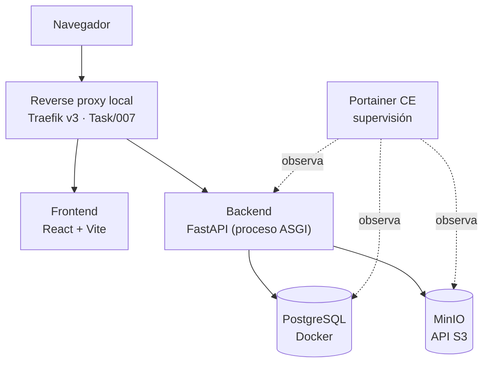
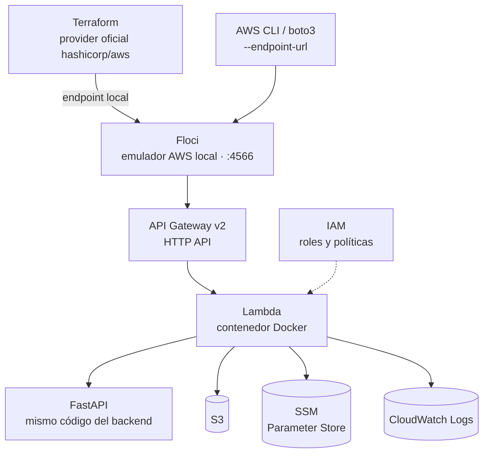
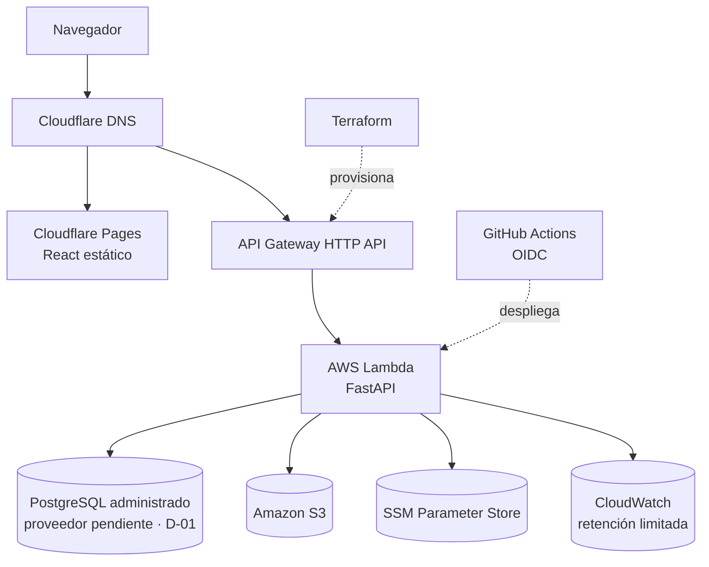
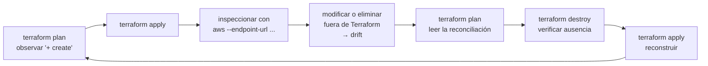
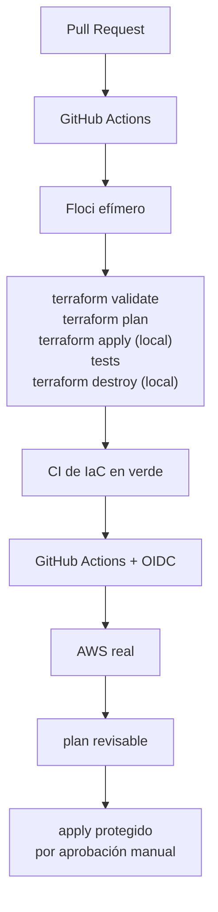

# AWS Local Parity — estrategia de IaC local con Floci

| Campo | Valor |
| --- | --- |
| **Estado** | **Vigente** ✔ — aprobado en `Task/005.2-Documentar-Estrategia-Floci-IaC-Local` (2026-08-15) |
| **Fecha** | 2026-08-15 |
| **Tipo** | Documento canónico de estrategia de infraestructura |
| **Repositorio** | `personal-blog-infra` |
| **ADR asociado** | [ADR-006 — Paridad AWS local con Floci](../adr/ADR-006-local-aws-parity-with-floci.md) — **Aceptada** ✔ |
| **Se implementa en** | ETAPA 08 (`Task/023`–`Task/026`), se valida contra AWS real en ETAPA 10 |
| **Verificación de Floci** | 2026-08-15, sobre fuentes oficiales del proyecto (§5) |

> Este documento es la **fuente única** de la estrategia de paridad AWS local. Los demás
> documentos —roadmap, fichas de etapa, correspondencia local → nube, límites de
> seguridad, instrucciones de Claude— **lo referencian y no lo duplican**.

Relacionados: [overview.md](overview.md) ·
[local-to-cloud-mapping.md](local-to-cloud-mapping.md) ·
[security-boundaries.md](security-boundaries.md) ·
[open-decisions.md](open-decisions.md) ·
[ADR-001 — Local-first](../adr/ADR-001-local-first.md) ·
[ADR-003 — Nube serverless de bajo costo](../adr/ADR-003-serverless-low-cost-cloud.md)

---

## 1. Objetivo

> **La infraestructura AWS del proyecto debe poder desarrollarse, aprenderse,
> provisionarse y destruirse localmente con la mayor fidelidad razonable antes de gastar
> en AWS real.**

Esa frase es la meta completa. Se descompone en cuatro propósitos concretos:

| # | Propósito | Por qué importa en este proyecto |
| --- | --- | --- |
| 1 | **Aprender** AWS y Terraform de verdad, no en abstracto. | El proyecto es también un ejercicio de formación. Aprender sobre recursos reales cuesta dinero y castiga los errores. |
| 2 | **Validar** la IaC antes del primer `apply` real. | Hoy la ETAPA 08 solo se compromete a `terraform fmt` y `terraform validate`: eso comprueba sintaxis, no comportamiento. |
| 3 | **Ejercitar el ciclo completo** `apply` → inspección → *drift* → `destroy` → `apply`. | Es la única forma de saber que la infraestructura es realmente reproducible y destruible. |
| 4 | **Proteger el costo**, que es la restricción principal del proyecto ([ADR-003](../adr/ADR-003-serverless-low-cost-cloud.md)). | Cada error descubierto en local es un error que no se paga en la factura. |

## 2. Qué NO es este documento

- **No** implementa Floci, ni Terraform, ni ningún recurso.
- **No** fija una versión de Floci (§5.4).
- **No** resuelve **D-01** (proveedor de PostgreSQL administrado, `Task/029`).
- **No** resuelve **D-06** (backend de estado de Terraform, `Task/025`).
- **No** sustituye la arquitectura objetivo de producción, que sigue siendo la de
  [ADR-003](../adr/ADR-003-serverless-low-cost-cloud.md) y la del diagrama
  `images/Infraestructura.png`.
- **No** promete paridad completa con AWS. Ninguna afirmación de paridad de este documento
  está probada todavía: la matriz de §7 nace entera en estado *No evaluada*.

---

## 3. Las tres vistas de la arquitectura

El proyecto pasa a tener **tres** vistas, no dos. No son tres arquitecturas: son tres
materializaciones de la misma arquitectura lógica.

### 3.1 Modo A — Entorno local de desarrollo de aplicación

Es el entorno vigente desde `Task/003`. **No se elimina, no se sustituye y no se degrada.**



**Para qué sirve:** desarrollo rápido, TDD del backend
([BACKEND_TESTING_STRATEGY](../project-management/BACKEND_TESTING_STRATEGY.md)), lógica de
negocio, integración ordinaria. Es donde se pasa la mayor parte del tiempo.

**Qué NO hace:** no enseña AWS, no valida Terraform, no ejercita IAM ni el empaquetado
Lambda.

### 3.2 Modo B — AWS Local Parity Lab

Es lo que este documento propone añadir. Se levanta cuando hace falta trabajar
infraestructura; **no** es el entorno de trabajo diario.



**Para qué sirve:** aprender AWS y Terraform, validar la IaC de verdad, ejercitar
`plan`/`apply`/`destroy`, provocar *drift* controlado y observar la reconciliación, probar
el artefacto Lambda, y hacerlo todo **sin cuenta AWS y sin costo**.

**Qué NO hace:** no reemplaza al Modo A y **no es la autoridad final** sobre el
comportamiento de AWS.

### 3.3 Modo C — AWS real (arquitectura objetivo de producción)

Es la arquitectura que ya está acordada y dibujada. La representación canónica es el
diagrama versionado del usuario:

**[`images/Infraestructura.png`](../../images/Infraestructura.png) — arquitectura objetivo
AWS / producción.**

Ese diagrama **no se modifica, no se regenera, no se mueve y no se reemplaza** por este
trabajo. Floci **no lo sustituye**: Floci añade la vista del Modo B, que es un
*laboratorio*, no un destino.



### 3.4 Relación entre los tres modos

| | Modo A — Desarrollo | Modo B — Parity Lab | Modo C — AWS real |
| --- | --- | --- | --- |
| **Orquestación** | Docker Compose | Floci + Terraform | Terraform |
| **Entrada HTTP** | Traefik v3 | API Gateway v2 emulado | API Gateway HTTP API |
| **Cómputo** | Proceso ASGI / contenedor | Lambda emulada (Docker) | AWS Lambda |
| **Objetos** | MinIO | S3 emulado | Amazon S3 |
| **Configuración** | `.env` | SSM emulado | SSM Parameter Store |
| **Base de datos** | PostgreSQL Docker | Fuera del alcance inicial (§8) | PostgreSQL administrado |
| **Costo** | 0 | 0 | Variable, con presupuesto |
| **Autoridad sobre el comportamiento** | Ninguna sobre la nube | **Ninguna sobre AWS** | **Final** |
| **Se usa cuando** | Se desarrolla el producto | Se desarrolla o se aprende la infraestructura | Se despliega de verdad |

Regla: **AWS real es siempre la autoridad final.** Un comportamiento observado en Floci es
una hipótesis hasta que la ETAPA 10 lo confirma.

---

## 4. Portabilidad de Terraform

### 4.1 El principio

> **Una sola definición de infraestructura. Un solo grafo de recursos. La diferencia entre
> local y nube vive en la configuración, no en el diseño.**

Lo que **no** queremos:

```
terraform/
  local/     ← recursos inventados para Floci
  aws/       ← otra infraestructura distinta para AWS
```

Eso son dos infraestructuras que divergen en cuanto una cambia, y la validación local deja
de significar nada.

Lo que **sí** queremos, conceptualmente:

```
terraform/
  modules/          ← módulos compartidos por ambos destinos
  main.tf
  providers.tf
  variables.tf
  outputs.tf
  environments/
    local/          ← configuración del destino local
    production/     ← configuración del destino AWS real
```

> La estructura concreta la fija `Task/025`. Aquí se fija el **principio**, no el árbol de
> archivos. **En `Task/005.2` no se crea ningún archivo `.tf`.**

### 4.2 La aplicación no depende de Floci

Regla dura, sin excepciones:

- El backend habla con **AWS SDK / boto3**, nunca con una API propia de Floci.
- Las herramientas usan **AWS CLI** y el **provider oficial `hashicorp/aws`** de Terraform.
- Floci es un **destino** de esas interfaces estándar, igual que AWS lo es.
- El acceso a objetos sigue pasando por la interfaz `ObjectStorage` (`Task/010`), como ya
  establece [software-architecture.md](software-architecture.md).

Si algo solo funciona hablando con Floci de una forma que AWS no entiende, ese algo está
mal diseñado y no entra en el proyecto.

### 4.3 No se promete «cero cambios»

Decir *«solo hay que cambiar un `tfvars`»* es una aspiración demasiado estricta y sería
falso comprometerse con ella. El backend de estado, por ejemplo, **no se configura con
variables**: se configura en `terraform init`.

La meta correcta, y la que este documento adopta, es:

> **No cambiar el diseño esencial ni duplicar el grafo principal de recursos Terraform al
> pasar de Floci a AWS.**

### 4.4 Diferencias legítimas y dónde se confinan

| # | Diferencia | Dónde vive | Estado |
| --- | --- | --- | --- |
| 1 | Endpoints del provider (bloque `endpoints`) | `providers.tf` + variable de entorno | Legítima |
| 2 | Flags locales del provider (`skip_credentials_validation`, `skip_metadata_api_check`, `skip_requesting_account_id`, `s3_use_path_style`) | `providers.tf`, condicionadas por entorno | Legítima |
| 3 | Credenciales: ficticias en local · OIDC/SSO real en AWS | Fuera de Git, siempre | Legítima |
| 4 | **Backend de estado de Terraform** | `terraform init -backend-config=...` | Legítima — decisión **D-06**, abierta |
| 5 | Región | `tfvars` | Legítima |
| 6 | Nombres y prefijos por ambiente | `tfvars` | Legítima |
| 7 | Dominios y DNS | Solo existen en AWS real (`Task/035`) | Legítima |
| 8 | Capacidad: memoria, timeout, concurrencia, retención | `tfvars` (**D-11**, **D-12**) | Legítima |
| 9 | Recursos sin fidelidad suficiente en Floci | Aislados y anotados en la matriz de §7 | Legítima, **con registro obligatorio** |
| 10 | Restricciones propias de AWS (cuotas, límites de cuenta, validaciones del servicio) | Se descubren en ETAPA 10 | Legítima |

Cualquier diferencia que **no** encaje en esta tabla es una señal de que se están creando
dos infraestructuras. Se trata como defecto de diseño, no como configuración.

### 4.5 Backend de estado — **D-06 sigue abierta**

El backend de Terraform es la diferencia estructuralmente más incómoda, porque no se
resuelve con un `tfvars`. La experiencia futura será **conceptualmente**:

```bash
# LOCAL
terraform init  -backend-config=environments/local/backend.hcl
terraform apply -var-file=environments/local/local.tfvars

# AWS REAL
terraform init  -backend-config=environments/production/backend.hcl
terraform apply -var-file=environments/production/production.tfvars
```

Esto es **ilustrativo**. Ninguno de esos archivos se crea en `Task/005.2`, y la elección
del backend definitivo —local, S3 con bloqueo, u otra— **sigue perteneciendo a `Task/025`
como decisión D-06**, sin resolver. Que Floci soporte un backend `s3` local no decide qué
backend usará producción; solo demuestra que la vía es practicable en el laboratorio.

---

## 5. Floci — verificación en fuentes oficiales

### 5.1 Alcance y método de la verificación

| Campo | Valor |
| --- | --- |
| **Fecha de verificación** | **2026-08-15** |
| **Fuentes** | Únicamente el repositorio y la documentación oficiales |
| **Repositorio** | `https://github.com/floci-io/floci` |
| **Sitio de documentación** | `https://floci.io/floci/` |
| **Documentos consultados** | `README.md`, `docs/services/*`, `docs/configuration/*`, `CHANGELOG.md`, `docker-compose.yml`, `compatibility-tests/compat-terraform/*`, listado de *releases* |
| **Fuentes de terceros** | **Ninguna.** No se usaron blogs, artículos ni comparativas |
| **Licencia** | MIT |
| **Ejecución de Floci** | **Ninguna.** No se instaló, no se descargó imagen y no se levantó ningún contenedor |

### 5.2 Estado del proyecto observado

| Dato | Valor observado el 2026-08-15 |
| --- | --- |
| Descripción oficial | *«Light, fluffy, and always free — The AWS Local Emulator alternative»* |
| Creación del repositorio | 2026-02-18 |
| Última *release* estable | **1.6.0**, publicada el 2026-08-06 |
| Cadencia de *releases* observada | Publicaciones cada **3–4 días** en los meses previos (1.5.16 → 1.6.0) |
| Páginas de servicio en `docs/services/` | **74**, sin contar `index.md` |
| Puerto por omisión | **4566** (mismo que LocalStack; migración documentada) |
| Imágenes publicadas | `floci/floci:latest`, `:latest-compat` (incluye AWS CLI y boto3), `:x.y.z` fijada, `:nightly` |
| Modos de almacenamiento | `memory` (por omisión), `persistent`, `hybrid`, `wal` — vía `FLOCI_STORAGE_MODE` |
| IaC declarada como compatible | Terraform, OpenTofu y AWS CDK, con suites de compatibilidad versionadas |

### 5.3 Configuración estándar del cliente

Verificada en el README y en `compatibility-tests/compat-terraform/run.sh`:

```bash
export AWS_ENDPOINT_URL=http://localhost:4566
export AWS_DEFAULT_REGION=us-east-1
export AWS_ACCESS_KEY_ID=test
export AWS_SECRET_ACCESS_KEY=test
```

Y el `provider "aws"` de la suite oficial de compatibilidad Terraform usa el provider
**oficial** `hashicorp/aws ~> 6.0` con un bloque `endpoints` y los flags
`skip_credentials_validation`, `skip_metadata_api_check`, `skip_requesting_account_id` y
`s3_use_path_style`. Es exactamente el patrón de portabilidad descrito en §4: **mismos
recursos, distinto destino.**

### 5.4 Regla de versión — nunca `latest`

Floci evoluciona muy rápido: la cadencia observada es de una *release* cada pocos días.
Por eso **este documento no fija ninguna versión de Floci**, y establece la regla:

> Cuando llegue la tarea de implementación (`Task/025`), se seleccionará una **release
> estable concreta**, se verificará su compatibilidad con los servicios que el proyecto
> necesita, y se fijará explícitamente. **`latest` y `nightly` nunca son la versión
> reproducible del proyecto.**

Esta regla es coherente con **R-10** y **R-15**, ya vigentes: las etiquetas móviles
envejecen y hacen irreproducible el entorno.

---

## 6. Capacidades que interesan a este proyecto

Todo lo siguiente procede de la documentación oficial consultada el **2026-08-15**.
**Nada de esto se ha probado en este proyecto.** El vocabulario es deliberadamente
prudente: *soporte declarado*, *emulado*, *paridad parcial*, *requiere validación en AWS
real*. En ningún punto se afirma que algo sea «idéntico a AWS».

### 6.1 API Gateway v2 (HTTP API)

| Campo | Detalle |
| --- | --- |
| **Soporte declarado** | v1 REST, **v2 HTTP API** y v2 WebSocket |
| **Mecanismo** | Implementación propia del plano de control y del plano de datos |
| **Qué necesitamos** | HTTP API, rutas, integración `AWS_PROXY` hacia Lambda, formato de *payload* 2.0, CORS, *stages* |
| **Declarado disponible** | `AWS_PROXY` descrito como completamente implementado; `HTTP_PROXY` y `MOCK` en v2; autorizadores `REQUEST`; URL local `http://{apiId}.execute-api.localhost.floci.io:4566/{stage}/{path}`; el tag `floci:override-id` permite fijar identificadores estables |
| **Declarado ausente** | Dominios personalizados, VPC Links y certificados de cliente |
| **Riesgo de diferencia** | **Alto en red y DNS.** El direccionamiento local depende de un dominio comodín resuelto por un DNS embebido; AWS usa `execute-api` real con TLS gestionado. Sin dominios personalizados, `Task/035` no tiene ensayo local posible |
| **Quién lo valida de verdad** | `Task/025` (local) · **`Task/033` (AWS real)** |

### 6.2 Lambda

| Campo | Detalle |
| --- | --- |
| **Soporte declarado** | Sí, con ejecución en **contenedores Docker reales** basados en las imágenes oficiales de runtime de AWS Lambda |
| **Mecanismo** | Floci lanza contenedores; **requiere el socket de Docker montado** (`/var/run/docker.sock`) |
| **Qué necesitamos** | Empaquetado **ZIP** (ADR-003 excluye ECR), invocación síncrona, rol de ejecución, variables de entorno, memoria y timeout |
| **Declarado disponible** | Tipos de paquete ZIP e imagen; invocación síncrona y asíncrona; *function URLs*; versiones, alias, políticas de recurso, tags; concurrencia reservada; *event source mappings* (SQS, Kinesis, DynamoDB Streams); recarga en caliente para desarrollo |
| **Declarado ausente** | **Layers** (operaciones devuelven listas vacías), concurrencia aprovisionada, *response streaming*, *code signing* y *account settings* |
| **Riesgo de diferencia** | **Medio-alto.** El contenedor local no reproduce el arranque en frío real de AWS, ni sus límites de cuenta, ni su comportamiento de reciclado de entornos de ejecución. Las mediciones de latencia hechas en Floci **no son válidas** para dimensionar la Lambda |
| **Quién lo valida de verdad** | `Task/023`, `Task/024` (artefacto) · `Task/025` (despliegue local) · **`Task/032` (AWS real)** |

### 6.3 Amazon S3

| Campo | Detalle |
| --- | --- |
| **Soporte declarado** | Amplio |
| **Mecanismo** | Implementación propia, con almacenamiento según `FLOCI_STORAGE_MODE` |
| **Qué necesitamos** | Bucket privado, CORS, política de bucket, **URLs prefirmadas**, *lifecycle*, versionado |
| **Declarado disponible** | Multipart, versionado, tags, políticas, CORS, *lifecycle*, ACL, cifrado, *object lock*, *website hosting*, **URLs prefirmadas**, S3 Select, lecturas por rango; direccionamiento *path-style* y *virtual-hosted* |
| **Declarado ausente** | Replicación, *access logging*, *request payment*, *intelligent-tiering*, *inventory* y configuraciones de métricas. `RestoreObject` aceptado pero *stub* |
| **Riesgo de diferencia** | **Bajo-medio.** Es el servicio con paridad esperable más alta —el proyecto ya usa MinIO con la misma API—. Las diferencias probables están en el direccionamiento (DNS comodín dentro de Docker) y en el **bloqueo de acceso público a nivel de cuenta**, que es un control de AWS, no un rasgo del protocolo |
| **Quién lo valida de verdad** | `Task/010` (contrato) · `Task/025` (local) · **`Task/030` (AWS real)** |

### 6.4 SSM Parameter Store

| Campo | Detalle |
| --- | --- |
| **Soporte declarado** | Sí |
| **Mecanismo** | Implementación propia |
| **Qué necesitamos** | `String` y `SecureString`, lectura por ruta desde la Lambda, versionado |
| **Declarado disponible** | `PutParameter`, `GetParameter`, `GetParameters`, `GetParametersByPath`, versionado con historial, etiquetas de versión, tags, y los tres tipos de parámetro |
| **Declarado ausente / degradado** | **`SecureString` conserva el tipo pero el valor NO se cifra en reposo.** No hay protección equivalente a KMS |
| **Riesgo de diferencia** | **Alto en seguridad, bajo en funcionalidad.** El código no notará la diferencia; la protección real sí. Consecuencia operativa directa: **nunca se guarda un secreto real en el SSM emulado** (§9) |
| **Quién lo valida de verdad** | `Task/025` (local) · **`Task/031` (AWS real)** |

### 6.5 IAM

| Campo | Detalle |
| --- | --- |
| **Soporte declarado** | API de gestión amplia: usuarios, grupos, roles, políticas gestionadas y en línea, *attachments*, perfiles de instancia, claves de acceso, proveedores OIDC, simulación de políticas |
| **Mecanismo** | Implementación propia. Catálogo de ~50 políticas gestionadas de AWS pre-cargadas, **todas con comodines permisivos** |
| **Qué necesitamos** | Rol de ejecución de la Lambda con **mínimo privilegio**, y el rol OIDC de GitHub Actions (`Task/028`) |
| **Declarado disponible** | Creación y gestión de roles, políticas de confianza, adjuntar políticas, tags |
| **Declarado ausente / degradado** | **La aplicación de políticas está DESACTIVADA por omisión.** La documentación oficial es explícita: por defecto se aceptan cualesquiera credenciales y **todas las peticiones pasan, independientemente de las políticas adjuntas**. Existe un modo opcional de *enforcement* que evalúa políticas con las reglas de precedencia de AWS, pero con exenciones (la clave `test`, credenciales desconocidas, peticiones no autenticadas y acciones no mapeadas) |
| **Riesgo de diferencia** | **El más alto de todos.** Una política IAM puede aplicarse con éxito en local y **no significar nada**. Un rol con permisos insuficientes funcionará en el laboratorio y fallará en AWS. Lo contrario también: un rol excesivamente permisivo pasará desapercibido |
| **Regla derivada** | El laboratorio valida que las políticas **se crean y se adjuntan**, no que **autorizan correctamente**. La verificación de mínimo privilegio es **AWS-only** |
| **Quién lo valida de verdad** | `Task/025` (creación) · **`Task/028` y `Task/032` (autorización real)** |

### 6.6 CloudWatch Logs

| Campo | Detalle |
| --- | --- |
| **Soporte declarado** | Sí |
| **Qué necesitamos** | Grupo de logs de la Lambda, **retención explícita** (nunca infinita), lectura para diagnóstico |
| **Declarado disponible** | Grupos y flujos, `PutLogEvents`, `GetLogEvents`, retención, tags, `FilterLogEvents` y un subconjunto de Logs Insights (`fields`, `filter`, `sort`, `dedup`, `limit`) |
| **Declarado ausente / degradado** | Los **filtros de suscripción se almacenan pero NO se entregan** al destino (Lambda, Kinesis, Firehose no están conectados). Logs Insights **degrada en silencio**: la sintaxis no soportada no falla, y un filtro compuesto con `and`/`or` conserva solo la primera condición, devolviendo resultados vacíos sin avisar |
| **Riesgo de diferencia** | **Medio.** La degradación silenciosa de Insights es peligrosa para una tarea de diagnóstico: una consulta puede parecer correcta y estar mintiendo |
| **Quién lo valida de verdad** | `Task/017` (formato de log) · `Task/025` (local) · **`Task/031` (AWS real)** |

### 6.7 CloudWatch Metrics y alarmas

| Campo | Detalle |
| --- | --- |
| **Soporte declarado** | Parcial |
| **Qué necesitamos** | Alarmas mínimas de error y de costo (`Task/031`, `Task/041`) |
| **Declarado disponible** | `PutMetricData`, listado y consulta de métricas, `GetMetricStatistics` / `GetMetricData` con expresiones; alarmas: creación, listado, borrado y **cambio manual de estado** vía `SetAlarmState` |
| **Declarado ausente / degradado** | No hay evidencia oficial de un **motor de evaluación** que dispare alarmas por sí mismo a partir de las métricas: el estado se fija manualmente. Los *dashboards* no aparecen documentados |
| **Riesgo de diferencia** | **Alto para el propósito real de las alarmas.** El laboratorio puede validar que la alarma **existe y está bien definida**, no que **se dispara cuando debe** |
| **Quién lo valida de verdad** | **`Task/031` y `Task/041` (AWS real)** — y las alarmas de presupuesto de `Task/027` son **AWS-only** por naturaleza |

### 6.8 Terraform, AWS CLI y SDK

| Campo | Detalle |
| --- | --- |
| **Terraform** | Compatibilidad declarada y **verificada por una suite versionada en el repositorio** (`compatibility-tests/compat-terraform`), que usa el provider oficial `hashicorp/aws ~> 6.0` y un backend `s3` local con bloqueo en DynamoDB |
| **Cobertura observada de esa suite** | S3 (bucket y versionado), SQS, SNS, DynamoDB, **IAM** (roles, políticas, *attachments*, catálogo gestionado, tags), **SSM** (`String` y `SecureString`), Secrets Manager, RDS PostgreSQL, Cognito, **alarma métrica de CloudWatch**, VPC/EC2, Route53, Firehose, Application Auto Scaling y SES |
| **Hueco observado — importante** | La suite oficial de compatibilidad Terraform **no incluye** `aws_lambda_function`, **ni** recursos `aws_apigatewayv2_*`, **ni** `aws_cloudwatch_log_group`. Es decir: **el camino crítico exacto de este proyecto —API Gateway v2 → Lambda → CloudWatch Logs, definido con Terraform— no está cubierto por la suite oficial.** Los servicios están documentados individualmente; su combinación con Terraform no está demostrada por el proyecto upstream |
| **Consecuencia** | Esa combinación es **precisamente** lo que `Task/025` tiene que demostrar. Si no se logra, se documenta como limitación y esos recursos pasan a *AWS-only* en la matriz — no se inventa un sustituto local |
| **AWS CLI / boto3 / SDK** | Compatibilidad declarada mediante `AWS_ENDPOINT_URL` o `--endpoint-url`. Existen suites `sdk-test-awscli`, `sdk-test-python`, `sdk-test-node`, `sdk-test-go` y `sdk-test-java` en el repositorio. La imagen `:latest-compat` incluye AWS CLI y boto3 |
| **Riesgo de diferencia** | Bajo para la mecánica de invocación; el riesgo real está en el comportamiento del servicio, no en el cliente |

### 6.9 RDS PostgreSQL — solo como posibilidad futura

| Campo | Detalle |
| --- | --- |
| **Soporte declarado** | Sí, con **motores reales**: contenedores Docker `postgres:16-alpine`, `mysql:8.0` y `mariadb:11`, expuestos por un rango de puertos proxy (7001–7099) |
| **Declarado disponible** | Instancias y clústeres, grupos de subred y de parámetros, listado de *snapshots*, *DB proxies* con esquema de autenticación IAM, tags |
| **Declarado ausente / degradado** | El plano de datos de **DB Proxy** es solo metadatos de plano de control: sin *pooling* real, *timeouts*, TLS ni *session pinning* |
| **Postura del proyecto** | **Ninguna.** Ver §8: que Floci soporte RDS **no** decide **D-01** |

---

## 7. Matriz de paridad

Matriz **canónica y evolutiva**. Es el único lugar donde el proyecto declara qué grado de
paridad tiene cada servicio.

**Estados admitidos:**

| Estado | Significado |
| --- | --- |
| `No evaluada` | Nadie lo ha probado en este proyecto. **Estado inicial de todo.** |
| `Compatible local` | Funciona en el laboratorio, con evidencia registrada. |
| `Paridad parcial` | Funciona en local con diferencias conocidas y anotadas. |
| `Requiere adaptación` | Necesita configuración distinta entre local y AWS. |
| `AWS-only` | No se puede validar localmente con fidelidad suficiente. |
| `Validada en AWS` | Confirmada contra AWS real, con evidencia. |

**Estado inicial — 2026-08-15.** Todo está en `No evaluada` porque **no se ha ejecutado
nada**. Las columnas *Local Floci*, *Terraform local* y *AWS real* se rellenan con evidencia
real, nunca con expectativas.

| Servicio | Local Floci | Terraform local | AWS real | Paridad | Diferencias conocidas a vigilar | Se evalúa en |
| --- | --- | --- | --- | --- | --- | --- |
| **S3** | Pendiente | Pendiente | Pendiente | `No evaluada` | Direccionamiento *path-style* vs *virtual-hosted*; bloqueo de acceso público es control de cuenta AWS | `Task/025` → `Task/030` |
| **SSM Parameter Store** | Pendiente | Pendiente | Pendiente | `No evaluada` | `SecureString` **sin cifrado real** en local | `Task/025` → `Task/031` |
| **IAM** | Pendiente | Pendiente | Pendiente | `No evaluada` | ***Enforcement* desactivado por omisión**: las políticas se crean pero no autorizan | `Task/025` → `Task/028`, `Task/032` |
| **Lambda** | Pendiente | Pendiente | Pendiente | `No evaluada` | Docker local vs entorno de ejecución AWS; sin *layers*; arranque en frío no comparable | `Task/024`, `Task/025` → `Task/032` |
| **API Gateway v2 (HTTP API)** | Pendiente | Pendiente | Pendiente | `No evaluada` | DNS comodín local vs `execute-api`; **sin dominios personalizados**; TLS | `Task/025` → `Task/033` |
| **CloudWatch Logs** | Pendiente | Pendiente | Pendiente | `No evaluada` | Filtros de suscripción no entregan; Logs Insights **degrada en silencio** | `Task/025` → `Task/031` |
| **CloudWatch Metrics / alarmas** | Pendiente | Pendiente | Pendiente | `No evaluada` | Estado de alarma manual; sin motor de evaluación documentado | `Task/025` → `Task/031`, `Task/041` |
| **Terraform (`plan`/`apply`/`destroy`)** | Pendiente | Pendiente | Pendiente | `No evaluada` | Backend de estado (**D-06**); combinación APIGWv2+Lambda+Logs no cubierta upstream (§6.8) | `Task/025` → ETAPA 10 |
| **AWS CLI / boto3** | Pendiente | — | Pendiente | `No evaluada` | Solo cambia el endpoint | `Task/025` → ETAPA 10 |
| **PostgreSQL** | **Decisión pendiente** | — | Pendiente | — | Fuera del alcance del laboratorio inicial | **`Task/029` (D-01)** |
| **Cloudflare Pages / DNS** | **No aplica** | — | Pendiente | `AWS-only` (fuera de AWS) | Floci no emula Cloudflare | `Task/034`, `Task/035` |
| **Presupuestos y alarmas de costo** | **No aplica** | — | Pendiente | `AWS-only` | No tiene sentido emular facturación | `Task/027`, `Task/041` |

**Reglas de mantenimiento de la matriz:**

1. Se actualiza durante la **ETAPA 08** con evidencia local y durante la **ETAPA 10** con
   evidencia real de AWS.
2. Una celda solo cambia de estado **con evidencia registrada en el reporte de la tarea**.
3. **Nunca se marca «paridad completa».** Ese estado no existe en esta matriz, a propósito.
4. Si Floci deja de soportar algo tras una actualización, la celda **retrocede** y se
   registra el motivo.

---

## 8. PostgreSQL — **D-01 sigue abierta**

Floci soporta RDS con motores PostgreSQL reales (§6.9). **Eso no decide nada.**

> **La disponibilidad de un emulador no es un criterio de arquitectura de datos.**

La elección del PostgreSQL administrado sigue siendo íntegramente de
**`Task/029-Seleccionar-PostgreSQL-Administrado`** (decisión **D-01**), y sus criterios
siguen siendo los ya registrados en [open-decisions.md](open-decisions.md): costo mensual
real, *pooling* o proxy de conexiones, backups y restauración, TLS, límite de conexiones
concurrentes, compatibilidad con el patrón de conexión efímera de Lambda y operación.

Las dos ramas posibles quedan escritas de antemano:

| Si `Task/029` elige… | Entonces… |
| --- | --- |
| **AWS RDS PostgreSQL** | Se **evaluará** RDS de Floci como paridad local adicional, y solo si aporta algo real al aprendizaje o a la validación. |
| **Un proveedor externo** (no AWS) | **No** se usará RDS local. Emular RDS solo para «parecerse a AWS» sería aprender un servicio que el proyecto no va a usar. |

Nota práctica: el **Modo A** ya tiene PostgreSQL real en Docker desde `Task/003`. El
laboratorio de paridad **no necesita** base de datos para su propósito inicial, que es
Terraform + IAM + Lambda + API Gateway + S3 + SSM + Logs.

---

## 9. Seguridad

Floci se clasifica como **infraestructura local privilegiada**, en la misma categoría que
Portainer (**C-09** en [security-boundaries.md](security-boundaries.md)), y por la misma
razón: **acceso al socket de Docker**.

### 9.1 Por qué es privilegiado

La ejecución de Lambda en Floci se apoya en contenedores Docker reales, y el
`docker-compose.yml` oficial monta `/var/run/docker.sock` dentro del contenedor. Quien
controla el socket de Docker **controla el host**: puede crear, modificar y destruir
contenedores, redes y volúmenes de cualquier proyecto de la máquina, incluidos los
volúmenes del entorno local del blog.

Esto agrava el escenario ya descrito en **R-09**: pasaría a haber **más de un componente**
con capacidad administrativa sobre el mismo demonio de Docker.

### 9.2 Controles obligatorios

| # | Control | Detalle |
| --- | --- | --- |
| S-01 | **Publicación solo en `localhost`** | El endpoint de Floci se publica en `127.0.0.1` cuando el host lo necesite. |
| S-02 | **Nunca exponer 4566 a internet** | Sin excepciones, en ningún entorno. |
| S-03 | **Evitar exposición innecesaria a la LAN** | Ni el puerto 4566 ni los rangos auxiliares (proxies RDS, buscadores) se ofrecen a la red local. |
| S-04 | **Credenciales ficticias, exclusivamente locales** | `test` / `test` o equivalentes. Su valor es público por diseño y no protege nada. |
| S-05 | **Nunca usar credenciales AWS reales contra Floci** | Prohibido sin excepción: expone una credencial real a un servicio local que no la necesita y que no la protege. |
| S-06 | **Ningún secreto se versiona** | Regla ya vigente del proyecto, sin cambios. |
| S-07 | **Ningún secreto real en el SSM emulado** | `SecureString` **no cifra** en Floci (§6.4). Solo valores ficticios. |
| S-08 | **El socket / control de Docker es privilegio de host** | Su compromiso es un incidente de **nivel host**, no de nivel aplicación. Mismo tratamiento que Portainer. |
| S-09 | **Revisar el *networking* de Docker antes de implementar** | Redes, alias y DNS embebido se revisan en `Task/025` antes de levantar nada. |
| S-10 | **Versión fijada, nunca `latest`** | Ver §5.4. Una etiqueta móvil en infraestructura reproducible es un defecto. |
| S-11 | **Verificar release y dependencias antes de actualizar** | Una actualización de Floci es un cambio de infraestructura: se revisa el CHANGELOG y se vuelve a validar la matriz de §7. |

### 9.3 Protección contra AWS real accidental — **fail-closed**

> **Un comando pensado para Floci no debe poder terminar hablando con AWS real por
> olvidar un endpoint.**

Ese es el fallo más caro posible del laboratorio: un `terraform apply` —o peor, un
`terraform destroy`— que, al faltar el endpoint, resuelve contra AWS de verdad.

La implementación futura **debe** incluir guardas *fail-closed*. Conceptualmente:

| # | Guarda | Idea |
| --- | --- | --- |
| G-01 | **Entorno explícito** | El destino se declara (`local` \| `production`). Sin declaración, no se ejecuta nada. |
| G-02 | **Endpoint explícito** | Para el destino local, ausencia de endpoint = **abortar**, nunca «continuar con el valor por omisión». |
| G-03 | **Verificación de cuenta** | Comprobar que el *account id* observado es el ficticio esperado antes de `apply` o `destroy`. |
| G-04 | **Credenciales ficticias** | Detectar y rechazar credenciales con forma de credencial real en el flujo local. |
| G-05 | **Validación del destino previa a `apply` y `destroy`** | Un paso de comprobación que se ejecuta **antes**, no un aviso posterior. |

**Nada de esto se implementa en `Task/005.2`.** Queda registrado como **requisito** para:

- **`Task/025-Terraform-Cloud`** — las guardas técnicas.
- **`Task/026-Runbooks-de-Despliegue`** — el procedimiento escrito que las ejerce.

Es coherente con la regla ya vigente de que **ninguna automatización ejecuta
`terraform destroy`** ([security-boundaries.md](security-boundaries.md) §3).

---

## 10. Infrastructure Learning Loop

El propósito del laboratorio **no** es que un agente genere Terraform y el usuario nunca
vea qué ocurrió. Es lo contrario: que cada recurso se entienda.

Cada bloque relevante de infraestructura de la ETAPA 08 debe dejar explicado:

| # | Pregunta que debe quedar respondida |
| --- | --- |
| 1 | Qué recurso se está creando. |
| 2 | Por qué existe —qué problema resuelve. |
| 3 | De qué depende y qué depende de él. |
| 4 | Qué ARN o identificador produce. |
| 5 | Qué permisos necesita, y quién se los concede. |
| 6 | Qué muestra `terraform plan` y cómo se lee. |
| 7 | Qué registra el estado de Terraform. |
| 8 | Cómo se inspecciona con AWS CLI o SDK. |
| 9 | Qué ocurre si se modifica fuera de Terraform (*drift*). |
| 10 | Cómo se destruye. |
| 11 | Cómo se reconstruye desde cero. |
| 12 | **Qué diferencia tiene respecto a AWS real.** |

Ciclo pedagógico previsto (**ilustrativo — no se ejecuta en `Task/005.2`**):



La pregunta 12 es la que impide que el laboratorio se convierta en una falsa sensación de
dominio: **aprender Floci no es aprender AWS**.

---

## 11. Encaje en el roadmap

Este documento **no añade tareas**. El roadmap sigue teniendo exactamente **41 tareas** y
ninguna se renumera. Lo que cambia es el **alcance futuro** de tareas ya existentes.

### 11.1 ETAPA 08 — Preparación Cloud + AWS Local Parity

El objetivo de la etapa se reformula de *«listos y validados en seco»* a **«preparación
cloud y paridad AWS local, sin cuentas ni recursos reales»**. Sigue sin crearse ninguna
cuenta AWS y sin gastarse nada.

| Tarea | Alcance futuro ampliado (los IDs y nombres **no cambian**) |
| --- | --- |
| **`Task/023-Compatibilidad-FastAPI-Lambda`** | Adaptador FastAPI → Lambda, ejecutable localmente; se prepara además para ejecutarse **bajo Lambda emulada en el laboratorio**. |
| **`Task/024-Artefacto-ZIP-Lambda`** | ZIP reproducible; el artefacto pasa a ser **validable en el laboratorio local**, no solo medido. |
| **`Task/025-Terraform-Cloud`** | Terraform **portable** con provider oficial AWS: configuración local → Floci, configuración real → AWS; módulos compartidos; `plan`/`apply`/`destroy` **ejecutados localmente**; S3, SSM, IAM, Lambda, API Gateway v2 y CloudWatch **cuando el soporte y la fidelidad lo permitan**; matriz de paridad rellenada con evidencia; guardas *fail-closed* (§9.3); **cero recursos AWS reales**. **D-06 se resuelve aquí, no antes.** |
| **`Task/026-Runbooks-de-Despliegue`** | Runbooks que incluyen: levantar Floci, **validar el destino**, `init`/`plan`/`apply`, inspección, *drift* controlado, `destroy`, reconstrucción, *troubleshooting*, transición futura a AWS y **qué hacer cuando Floci no tenga paridad suficiente**. |

### 11.2 ETAPA 10 — AWS real

`Task/030`–`Task/033` **no reinventan recursos Terraform**. La expectativa explícita es:

> **Utilizar los módulos construidos y validados localmente en `Task/025` y materializarlos
> contra AWS real.**

Durante la etapa se documenta, recurso a recurso:

- Qué funcionó **sin cambios**.
- Qué necesitó **configuración distinta**.
- Qué necesitó **adaptación** de diseño.
- Qué **no se podía validar** en Floci.
- Diferencias reales de **IAM, red, cuotas, DNS y servicios**.

Esa evidencia **retroalimenta la matriz de §7**, que pasa a tener celdas
`Validada en AWS`.

### 11.3 ETAPA 11 — `Task/039-Automatizar-Terraform`

Intención futura, **sin crear ningún workflow ahora** y **sin desplazar ni duplicar** las
responsabilidades ya asignadas a `Task/020`, `Task/037`, `Task/038` y `Task/039`:



Regla que **no** cambia: **ningún workflow ejecuta `terraform destroy` contra AWS real.**
El `destroy` automático solo tiene sentido contra un Floci efímero de CI, que se tira
entero al terminar el *job*.

---

## 12. Criterios de éxito futuros de la ETAPA 08

Objetivo a demostrar **sin cuenta AWS y sin gastar nada**. **Nada de esto se ejecuta en
`Task/005.2`.**

| # | Criterio |
| --- | --- |
| 1 | Floci levantado localmente, con versión fijada. |
| 2 | `terraform init` correcto. |
| 3 | `terraform validate` correcto. |
| 4 | `terraform plan` legible y comprendido. |
| 5 | `terraform apply` contra Floci, correcto. |
| 6 | Terraform crea los servicios requeridos **que tengan soporte suficiente**. |
| 7 | API Gateway local invoca a la Lambda local. |
| 8 | La Lambda ejecuta el backend FastAPI real del proyecto. |
| 9 | La Lambda accede a S3 y a SSM según corresponda. |
| 10 | Los logs son observables. |
| 11 | AWS CLI / SDK pueden inspeccionar los recursos creados. |
| 12 | `terraform destroy` elimina el entorno. |
| 13 | Se verifica la **ausencia** de los recursos tras el `destroy`. |
| 14 | `terraform apply` reconstruye todo. |
| 15 | Se introduce al menos un **drift controlado** y se observa la reconciliación. |
| 16 | Todo sin credenciales AWS reales. |
| 17 | Todo sin crear un solo recurso AWS real. |

Los criterios 6 y 7 llevan la salvedad de §6.8 a propósito: si la combinación
Terraform + API Gateway v2 + Lambda no resulta viable con la fidelidad necesaria, **se
documenta como limitación y esos recursos pasan a `AWS-only`**. No se fabrica un sustituto
local que finja lo que no existe.

---

## 13. Transición a AWS real

La validación final en AWS (ETAPA 10) debe comparar **explícitamente**, recurso a recurso:

| Dimensión | Qué se compara |
| --- | --- |
| Recurso | ¿Existe el mismo recurso, con el mismo módulo? |
| Configuración | ¿Se necesitó cambiar algún atributo? |
| Comportamiento | ¿Responde igual ante la misma petición? |
| Permisos | ¿La política que «funcionaba» en local autoriza realmente en AWS? |
| Red | DNS, TLS, `execute-api`, orígenes CORS. |
| Logs | ¿Aparecen los mismos eventos, con el mismo formato? |
| Outputs | ¿Coinciden ARN, IDs y URLs en forma y contenido? |
| Diferencias | Todo lo que Floci no reprodujo. |

Cada hallazgo se clasifica en una de estas cinco categorías y se vuelca en la matriz de §7:

1. **Funcionó sin cambios.**
2. **Cambio de configuración.**
3. **Adaptación necesaria.**
4. **No simulable localmente.**
5. **AWS-only.**

---

## 14. Riesgos

Riesgos introducidos por esta estrategia. Están **abiertos y vigentes** desde la aprobación
de `Task/005.2` el 2026-08-15, y se registran en
[STATUS.md](../project-management/STATUS.md).

| # | Riesgo | Impacto | Mitigación | Tarea que lo valida |
| --- | --- | --- | --- | --- |
| **R-19** | El comportamiento de Floci difiere del de AWS en detalles que solo aparecen en producción. | Medio | La matriz de §7 nace en `No evaluada`; AWS real es la autoridad final; toda diferencia se registra. | `Task/025` → ETAPA 10 |
| **R-20** | **Falsa sensación de paridad**: un laboratorio verde convence de que la nube funcionará. | **Alto** | Prohibido el estado «paridad completa»; el vocabulario obligatorio distingue *emulado* de *validado*; la pregunta 12 del *learning loop* es obligatoria. | ETAPA 10 |
| **R-21** | Una actualización de Floci rompe la compatibilidad ya validada. | Medio | Versión fijada, nunca `latest` (§5.4); actualizar es un cambio de infraestructura que exige revalidar la matriz. | `Task/025`, `Task/026` |
| **R-22** | Floci necesita **acceso al socket de Docker**: privilegio de nivel host, junto a Portainer. | **Alto** | Tratamiento idéntico al de **R-09**: solo local, nunca expuesto, compromiso = incidente de nivel host. Revisión del *networking* antes de implementar. | `Task/025`, `Task/018` |
| **R-23** | El endpoint local (4566 y rangos auxiliares) queda expuesto a la LAN o a internet por descuido. | **Alto** | Controles S-01 a S-03 (§9.2); verificación de publicación en los runbooks de `Task/026`. | `Task/025`, `Task/026` |
| **R-24** | Un comando pensado para Floci acaba ejecutándose **contra AWS real** por falta de endpoint, o se usan credenciales reales contra Floci. | **Alto** | Guardas *fail-closed* G-01 a G-05 (§9.3), obligatorias antes del primer `apply`; S-05 prohíbe credenciales reales. | `Task/025`, `Task/026` |
| **R-25** | El camino crítico del proyecto —**Terraform + API Gateway v2 + Lambda + CloudWatch Logs**— **no está cubierto por la suite oficial de compatibilidad Terraform** de Floci (§6.8). | **Alto** | Es el objetivo explícito de `Task/025`; si no se logra con fidelidad suficiente, esos recursos pasan a `AWS-only` y se documenta, sin fabricar sustitutos. | `Task/025` |
| **R-26** | Acumular condicionales por entorno acaba creando **dos IaC distintas** disfrazadas de una. | Medio | Tabla cerrada de diferencias legítimas (§4.4); cualquier diferencia fuera de ella es defecto de diseño, no configuración. | `Task/025`, revisión del usuario |
| **R-27** | Dependencia excesiva del emulador: se aplaza indefinidamente la validación real. | Medio | El laboratorio es una **puerta**, no un destino: la ETAPA 10 sigue siendo obligatoria y sus criterios de salida no se relajan. | ETAPA 10 |
| **R-28** | **IAM no aplica políticas por omisión** en Floci: un rol puede validarse en local y ser incorrecto —insuficiente o excesivo— en AWS. | **Alto** | El laboratorio valida **creación y adjunción**, nunca autorización; la verificación de mínimo privilegio queda declarada **AWS-only** (§6.5). | `Task/028`, `Task/032` |

---

## 15. Criterio de revisión y de abandono

Esta estrategia **no es irreversible**. Se revisa o se abandona si ocurre alguna de estas
condiciones:

| # | Condición | Consecuencia |
| --- | --- | --- |
| 1 | `Task/025` no consigue desplegar localmente **API Gateway v2 + Lambda + S3 + SSM + Logs** con Terraform y fidelidad suficiente. | Se reduce el alcance del laboratorio a los servicios que sí funcionen y el resto pasa a `AWS-only`. La ETAPA 08 vuelve a `fmt` + `validate` para esa parte. |
| 2 | El costo de mantener el laboratorio (versiones, roturas, tiempo) supera al beneficio de aprendizaje y validación. | Se abandona Floci. La IaC **no cambia**: es portable por diseño (§4), así que perder el destino local no obliga a reescribir nada. |
| 3 | Aparece una diferencia de comportamiento que hace **engañosa** la validación local. | Se degrada el estado de ese servicio en la matriz y se anota la advertencia. |
| 4 | El proyecto Floci se archiva, cambia de licencia o deja de recibir mantenimiento. | Se evalúa un emulador alternativo o se abandona el Modo B, sin tocar la definición de infraestructura. |

Que abandonar Floci **no** obligue a reescribir la IaC es, de hecho, el principal
argumento a favor de la regla de portabilidad de §4.

---

## 16. Referencias

**Del proyecto:**

- [ADR-006 — Paridad AWS local con Floci](../adr/ADR-006-local-aws-parity-with-floci.md) — **Aceptada**
- [ADR-001 — Local-first](../adr/ADR-001-local-first.md)
- [ADR-003 — Nube serverless de bajo costo](../adr/ADR-003-serverless-low-cost-cloud.md)
- [Arquitectura — visión general](overview.md)
- [Correspondencia local → nube](local-to-cloud-mapping.md)
- [Límites de seguridad](security-boundaries.md)
- [Decisiones diferidas](open-decisions.md) — **D-01** y **D-06** abiertas; **D-14 Resuelta**
- [ETAPA 08 — Preparación Cloud + AWS Local Parity](../stages/STAGE-08-cloud-ready.md)
- [ETAPA 10 — Despliegue Cloud](../stages/STAGE-10-cloud-deployment.md)
- [ETAPA 11 — Automatización de Despliegues](../stages/STAGE-11-deployment-automation.md)
- `images/Infraestructura.png` — arquitectura objetivo AWS / producción

**Oficiales de Floci, consultadas el 2026-08-15:**

- Repositorio: `https://github.com/floci-io/floci`
- Documentación: `https://floci.io/floci/`
- `README.md`, `CHANGELOG.md`, `docker-compose.yml`
- `docs/services/` — 74 páginas de servicio
- `docs/configuration/`
- `compatibility-tests/compat-terraform/`
- Listado de *releases* del repositorio
