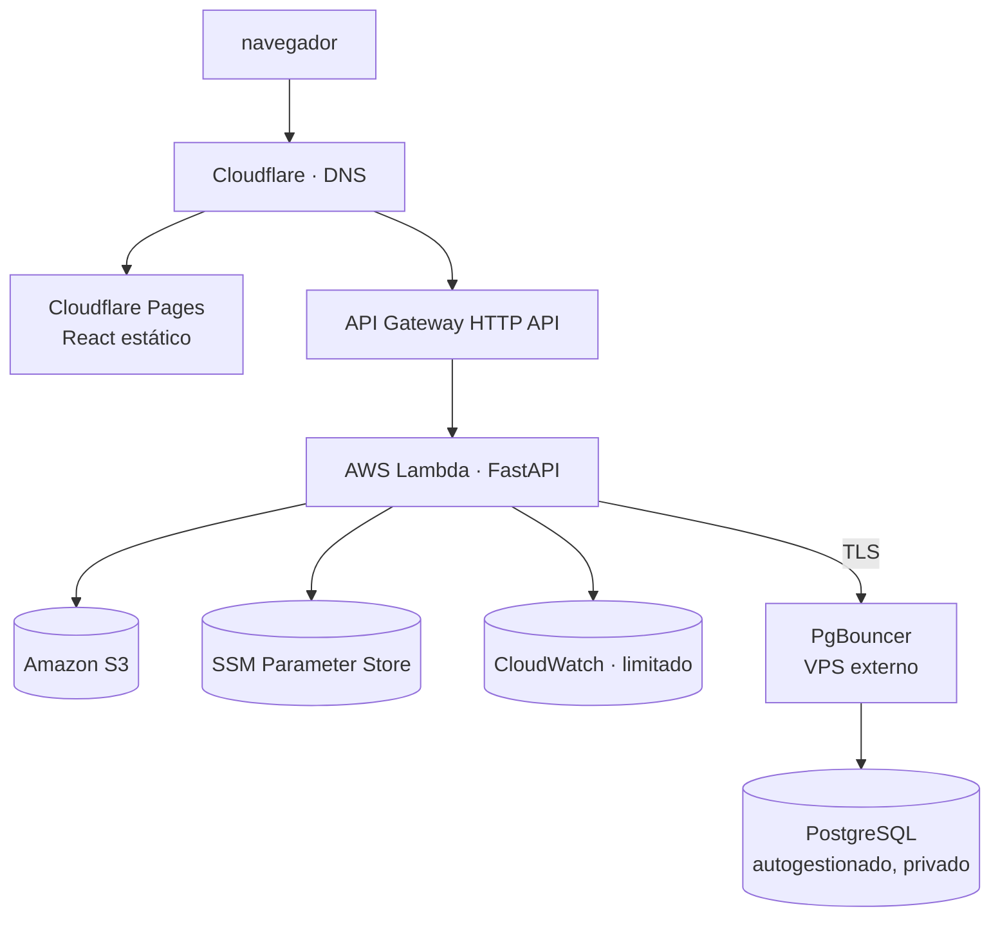

# Arquitectura — Visión general

**Última actualización:** 2026-08-15
**Estado:** vigente. Detallada en `Task/002-Definir-MVP-y-Arquitectura`.

> Este documento es la **vista de conjunto**. El detalle vive en:
> [software-architecture.md](software-architecture.md) (organización del código),
> [api-contracts.md](api-contracts.md) (convenciones de API),
> [non-functional-requirements.md](non-functional-requirements.md),
> [security-boundaries.md](security-boundaries.md) y
> [open-decisions.md](open-decisions.md).
> El alcance del producto está en [MVP_SCOPE.md](../product/MVP_SCOPE.md).

---

## 1. Qué es este sistema

Un blog personal con sitio público y panel administrativo propio, construido con
estrategia **local-first**: todo funciona y se valida en local antes de existir en la
nube ([ADR-001](../adr/ADR-001-local-first.md)).

Secciones previstas del blog:

| Sección | Contenido |
| --- | --- |
| Inicio | Presentación y contenido destacado. |
| Quién soy | Perfil personal y profesional. |
| Artículos | Publicaciones técnicas y personales. |
| Reviews de libros | Reseñas con valoración. |
| Videos y explicaciones | Contenido audiovisual referenciado. |
| Proyectos y laboratorio | Trabajos y experimentos. |
| Contacto y enlaces | Formas de contacto y redes. |
| Panel administrativo | Gestión de todo el contenido anterior. |

---

## 2. Componentes

| Componente | Responsabilidad |
| --- | --- |
| **Frontend** | Sitio público y panel administrativo. React + TypeScript + Vite. |
| **Backend** | API pública y administrativa, dominio, autenticación. FastAPI. |
| **Base de datos** | Persistencia relacional del contenido. PostgreSQL. |
| **Almacenamiento de objetos** | Imágenes y archivos. MinIO en local, S3 en la nube. |
| **Entrada HTTP** | Enrutado y TLS. Reverse proxy en local, API Gateway en la nube. |
| **Supervisión** | Portainer CE en local. CloudWatch en la nube. |
| **Pool de conexiones** | No aplica en local. **PgBouncer** delante de PostgreSQL en producción (`Task/005.3`). |

---

## 3. Arquitectura local

```
                    ┌──────────────────────────┐
   navegador  ────► │   Reverse proxy local    │
                    └───────────┬──────────────┘
                                │
                  ┌─────────────┴─────────────┐
                  ▼                           ▼
        ┌──────────────────┐        ┌──────────────────┐
        │ Frontend         │        │ Backend          │
        │ React + Vite     │        │ FastAPI          │
        └──────────────────┘        └────────┬─────────┘
                                             │
                              ┌──────────────┴──────────────┐
                              ▼                             ▼
                    ┌──────────────────┐         ┌──────────────────┐
                    │ PostgreSQL       │         │ MinIO (S3 API)   │
                    └──────────────────┘         └──────────────────┘

        Todo orquestado con Docker Compose y supervisado con Portainer CE.
```

Portainer **no forma parte del camino de la petición**: es solo un panel de supervisión
de Docker (contenedores, logs, healthchecks, volúmenes, redes).

---

## 4. Arquitectura cloud objetivo



Justificación de estas elecciones:
[ADR-003](../adr/ADR-003-serverless-low-cost-cloud.md) — cómputo, entrada HTTP y servicios
AWS — y [ADR-007](../adr/ADR-007-production-postgresql-on-vps.md) (**Aceptada**) — capa de
datos en VPS externo. Detalle:
[production-postgresql-vps.md](production-postgresql-vps.md).

> **Sobre el diagrama versionado.** [`images/Infraestructura.png`](../../images/Infraestructura.png)
> representa la **arquitectura objetivo inicial, anterior a `Task/005.3`**, cuando PostgreSQL
> administrado todavía era la vía prevista. Se conserva como registro histórico y **no se
> modifica**. La arquitectura vigente de la capa de datos es la de este apartado.

---

## 4.1 AWS Local Parity Lab — tercer entorno

Desde `Task/005.2` (**aprobada** el 2026-08-15) el proyecto tiene un **tercer entorno**,
intermedio entre los dos anteriores: un **laboratorio local de infraestructura** donde la
**misma definición de Terraform** se aplica contra un emulador AWS local, sin cuenta y sin
costo.

| | Local (§3) | **Parity Lab** | Cloud objetivo (§4) |
| --- | --- | --- | --- |
| **Para qué** | Desarrollar el producto | Desarrollar y aprender la **infraestructura** | Producción real |
| **Orquesta** | Docker Compose | Floci + Terraform | Terraform |
| **Costo** | 0 | 0 | Variable |
| **Autoridad** | — | **Ninguna sobre AWS** | **Final** |

**No sustituye a ninguno de los otros dos**, y **no reemplaza** el diagrama
`images/Infraestructura.png`: añade una vista lógica distinta. **Nada de este entorno está
probado todavía**: se implementa en `Task/025` y el grado real de paridad vive en la
[matriz de paridad](aws-local-parity.md) §7, hoy entera en `No evaluada`.

Estrategia completa: [aws-local-parity.md](aws-local-parity.md) — **Vigente** ·
[ADR-006](../adr/ADR-006-local-aws-parity-with-floci.md) — **Aceptada**.

---

## 5. Principios de diseño

1. **Local-first.** Nada se despliega antes de estar validado en local.
2. **Paridad local–nube por interfaz, no por servicio.** El código habla con
   abstracciones (`ObjectStorage`), no con MinIO ni con S3 directamente.
3. **Costo como restricción de diseño.** Se evita **todo costo fijo mensual innecesario**:
   la arquitectura escala a cero y no se paga por capacidad ociosa. La única excepción es
   **consciente, acotada y presupuestada** — el **VPS de PostgreSQL** de producción
   ([ADR-007](../adr/ADR-007-production-postgresql-on-vps.md), **Aceptada**), cuyo costo se
   asume a cambio de control operativo y de un gasto más predecible que el de una base
   administrada. *(Corregido en `Task/005.7`: aquí se leía «Sin servicios de costo fijo
   mensual», un absoluto que ADR-007 dejó de cumplir.)*
4. **Configuración fuera del código.** `.env` en local, SSM Parameter Store en la nube.
5. **Sin credenciales permanentes donde esté demostrado.** GitHub Actions accede a AWS
   mediante OIDC (`Task/028`). **No es todavía una propiedad global**: cómo se autentica el
   **VPS** hacia AWS para sus backups sigue abierto (**D-16**, `Task/029`), y Cloudflare y
   el proveedor del VPS pueden exigir otro mecanismo (`Task/039`).
6. **Contenido primero.** El modelo de datos y la API pública se diseñan para el
   contenido que el blog realmente publicará.
7. **Reproducibilidad.** El entorno completo se reconstruye desde cero siguiendo un
   runbook escrito.
8. **Una sola definición de infraestructura** (`Task/005.2`, 2026-08-15). Terraform es la
   fuente de verdad del cloud; local y AWS son dos **destinos** de la misma definición, no
   dos infraestructuras. Las diferencias se confinan a la configuración
   ([aws-local-parity.md](aws-local-parity.md) §4).

---

## 6. Límites entre repositorios

| Repositorio | Contiene | No contiene |
| --- | --- | --- |
| `personal-blog-frontend` | UI pública y panel, cliente HTTP, estilos, tests de UI. | Lógica de dominio, acceso a base de datos, secretos. |
| `personal-blog-backend` | API, dominio, persistencia, migraciones, autenticación. | UI, Terraform, definición del entorno. |
| `personal-blog-infra` | Planificación, Docker Compose, Terraform, runbooks, ADR. | Código de aplicación. |

Razones y costos de esta separación:
[ADR-002](../adr/ADR-002-three-repositories.md).

---

## 7. Correspondencia local → nube

Ver [local-to-cloud-mapping.md](local-to-cloud-mapping.md).

---

## 8. Qué definió `Task/002`

> `Task/002-Definir-MVP-y-Arquitectura` fue **aprobada** el 2026-07-26. Lo siguiente es
> decisión firme del proyecto.

| Tema | Documento |
| --- | --- |
| Alcance del MVP y lo que queda fuera | [MVP_SCOPE.md](../product/MVP_SCOPE.md) |
| Flujos públicos y administrativos | [USER_FLOWS.md](../product/USER_FLOWS.md) |
| Modelo conceptual de dominio | [CONTENT_MODEL.md](../product/CONTENT_MODEL.md) |
| Organización de backend y frontend | [software-architecture.md](software-architecture.md) |
| Convenciones de API, paginación y errores | [api-contracts.md](api-contracts.md) |
| Requisitos no funcionales (**57** en 7 categorías) | [non-functional-requirements.md](non-functional-requirements.md) |
| Límites de seguridad | [security-boundaries.md](security-boundaries.md) |
| Estilo arquitectónico | [ADR-004](../adr/ADR-004-modular-monolith.md) |
| Formato del contenido | [ADR-005](../adr/ADR-005-markdown-content.md) |

## 9. Qué falta decidir

Registro completo y vivo: [open-decisions.md](open-decisions.md) — **13 decisiones
abiertas** (**D-05** resuelta el 2026-07-29; **D-14** y **D-01** el 2026-08-15), cada una
con la tarea en que se resuelve, la información necesaria y las partes del sistema
afectadas. Entre las principales:

- Proveedor de VPS para la base de datos de producción (**D-01**, `Task/029`). El **modelo**
  —autogestionado en VPS— lo **resolvió** `Task/005.3`, **aprobada** el 2026-08-15.
- **Topología lógica de dominios** y política de cookies/CORS (**D-15**, `Task/011`).
- **Identidad del VPS hacia AWS** para los backups (**D-16**, decisión en `Task/029`).
- Mecanismo concreto de autenticación (`Task/011`).
- Biblioteca de componentes visuales (`Task/013`).
- Backend de estado de Terraform (`Task/025`).
- Dominio definitivo (`Task/035`).
- Presupuesto mensual objetivo (`Task/027`).
- Emulador AWS local para la estrategia de IaC (**D-14**) — **Resuelta** el 2026-08-15 con
  **Floci**, en `Task/005.2`.
