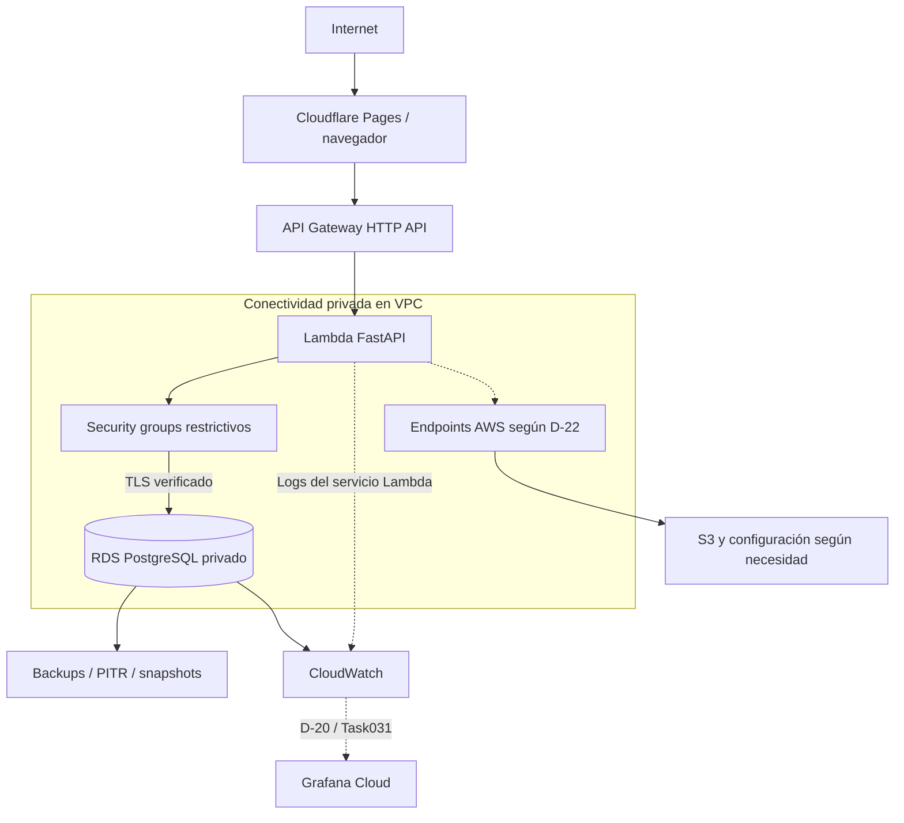

# PostgreSQL productivo en Amazon RDS

| Campo | Valor |
| --- | --- |
| Estado | **Vigente** ✔ — aprobado el 2026-09-27 mediante `approved: Task/028.2-Reconsiderar-PostgreSQL-Produccion-RDS`. **No autoriza recursos**: cada uno exige su tarea propietaria y la autorización del usuario |
| Fecha | 2026-09-27 |
| ADR | [ADR-010](../adr/ADR-010-production-postgresql-on-rds.md), **Aceptada** |
| Historia | [Modelo VPS](production-postgresql-vps.md), conservado; sustitución pendiente |
| Próxima tarea | `Task/029-Preparar-PostgreSQL-Produccion-en-RDS` — **Lista para validación** el 2026-09-27 |
| Instancia concreta | [Paquete de decisiones de `Task/029`](production-postgresql-rds-decisions.md) — **Propuesta, pendiente de aprobación**. Resuelve D-22, D-23, D-24 y D-10 con precios y capacidades del 2026-09-27 |

> **Enmienda de `Task/029`, 2026-09-27 — pendiente de aprobación.** Este documento sigue
> siendo el canónico y **no cambia de fondo**: `Task/029` lo **instancia**. Las decisiones
> concretas —región, versión, clase, almacenamiento, red, TLS, KMS, secretos, canal
> privado, recuperación, conexiones y costo— viven en
> [production-postgresql-rds-decisions.md](production-postgresql-rds-decisions.md) para no
> duplicar la fuente de verdad. Dos resultados de esa tarea afectan al fondo de este
> documento y están marcados abajo: el **gate de D-13 no se cumple** (§6.1) y el **plan de la
> cuenta la cierra sola y pierde los datos** (§6.2). **Cero recursos creados.**
>
> **Ronda del usuario del 2026-09-27, en la misma tarea.** Región **us-east-2**, excepción
> acotada **EX-029-D13** al sublímite AWS —techo global intacto—, créditos verificados
> (**USD 120**, límite **2027-03-15**) y **el plan gratuito se conserva**: el Paid Plan **no**
> es prerrequisito de `Task/031`. Consecuencia obligatoria: **D-10 incorpora una vía de salida
> fuera de la cuenta**, porque los *backups* administrados no sobreviven a su cierre. Todo en
> §6.2.

## 1. Alcance y topología

PostgreSQL privado administrado por Amazon RDS. FastAPI continúa en Lambda,
API Gateway HTTP API en el borde, Cloudflare Pages en frontend y S3 en medios.
No hay selección de región, clase, versión, tamaño, AZ, retención, Proxy ni endpoint
concreto en este mantenimiento. Tampoco infraestructura creada.

El DB subnet group requiere subnets en al menos dos AZ aun para una instancia
Single-AZ; eso no selecciona Multi-AZ. Se decide disponibilidad según RPO/RTO y
costo. No hay PostgreSQL público ni acceso desde el navegador. API Gateway invoca
Lambda por el servicio AWS; no necesita una ruta pública hacia sus ENI.

## 2. Inventario Lambda / VPC / egress

Inspección estática de código versionado de backend y frontend, sin leer `.env`
reales ni credenciales. Las rutas son relativas a `personal-blog-backend`.

| Clase | Destino / evidencia | Ruta candidata y responsable |
| --- | --- | --- |
| A — intra-VPC | PostgreSQL: `app/shared/database/session.py`, SQLAlchemy/psycopg; `/ready` usa una conexión independiente | SG de Lambda a SG de RDS, puerto SQL elegido, TLS; Task/031 red y Task/032 cliente |
| B — AWS mediante endpoints | S3: adaptador boto3 y `app/shared/storage/s3_compatible.py`. `PutObject`, `GetObject`, `HeadObject`, `DeleteObject` y la sonda `ListObjectsV2` de `/ready` requieren red; firmar una URL prefirmada es local | Gateway endpoint S3 candidato, rutas/política mínima; Task/029 decide, Task/031 red, Task/030 bucket |
| B — AWS mediante endpoints | SSM: previsto por arquitectura, **lector runtime todavía no implementado** | Interface endpoint SSM con DNS privado y SG TLS si se lee en runtime; Task/029 diseña, Task/031 provee, Task/032 implementa wiring y caché/rotación |
| B — condicional | Secrets Manager | Solo si D-23 lo adopta y el runtime lo consulta; endpoint, permisos y precio evaluados juntos |
| B — condicional | KMS, STS, CloudWatch Logs/metrics llamados explícitamente por SDK desde el código | No hay esas llamadas directas hoy; si se añaden, justificar endpoint o ruta y políticas en Task/029/032 |
| C — AWS sin endpoint del runtime | Logs estándar stdout/stderr de Lambda; entrega de credenciales del execution role; invocación API Gateway; métricas/backup administrados de RDS | Operaciones del servicio, fuera del tráfico de aplicación en la VPC; permisos siguen siendo necesarios |
| C — AWS sin endpoint adicional KMS | SSM `GetParameter` con descifrado | Parameter Store invoca KMS; requiere autorización KMS apropiada, no una llamada KMS directa desde Lambda por ese solo hecho |
| D — público externo | Ninguna API externa requerida por el backend actual | URLs de perfiles/videos son contenido o recursos del navegador; no prueba de egress desde Lambda |
| E — no utilizado en runtime | API Cloudflare, API Grafana, proveedor de host, emulador Floci, registry de imágenes, SMTP | Cloudflare corresponde al navegador/despliegue; Grafana consume telemetría vía integración D-20; builds/CI tienen red distinta |

**Conclusión de diseño, no evidencia desplegada:** el candidato sin NAT es viable
para el inventario actual. Task/029 repite inventario sobre el commit que prepare;
Task/032 demuestra SQL, S3, carga/rotación de configuración y logs reales desde
Lambda sin egress innecesario. Task/040 repite con el producto completo.

Una subnet pública no asigna IP pública a Lambda. NAT Gateway solo sería una
solución para salida IPv4 pública demostrada y requiere nueva decisión explícita.
IPv6 requiere destinos compatibles, subnets dual-stack y rutas/controles adecuados;
no se presupone ni se adopta como sustituto universal. Los interface endpoints
cobran por AZ/hora y datos; el gateway endpoint S3 no añade tarifa de endpoint.
La política del bucket debe preservar el canal de URLs prefirmadas del navegador:
un Deny global por `SourceVpce` podría bloquearlo. Validar D-08 en Task/030.

## 3. Decisiones que entrega Task/029

Cada decisión incluye alternativas, fuente/fecha, costo bruto, resultado y prueba
posterior. D-22 a D-24 son nuevas, abiertas el 2026-09-27; D-10/11/12 mantienen sus IDs.

> **Estado de entrega tras `Task/029`, 2026-09-27 — Propuesta, pendiente de aprobación.**
> Las cuatro decisiones **están resueltas con datos de la fecha** en el
> [paquete de decisiones](production-postgresql-rds-decisions.md), que es donde viven los
> valores concretos. Resumen de lo elegido, sin duplicar la argumentación:
>
> | Decisión | Resultado propuesto | Detalle |
> | --- | --- | --- |
> | **D-22** | Región **us-east-2** *(requiere confirmación del usuario)* · PostgreSQL **17.11**, la misma que local y el CI del backend · **db.t4g.micro** · **gp3 20 GiB** con *autoscaling* a 50 · IOPS y *throughput* **no aprovisionables** bajo 400 GiB · **Single-AZ**, con **R-29** aceptado por escrito · VPC `10.40.0.0/16`, **2 subnets privadas en 2 AZ**, sin IGW · 3 security groups por **referencia de grupo** · *parameter group* propio con `rds.force_ssl = 1` explícito | [§3](production-postgresql-rds-decisions.md#3-d-22--red-topología-y-capacidad--propuesta) |
> | **D-23** | **`verify-full`** con bundle de CA **dentro del ZIP** · CA `rds-ca-rsa2048-g1` con rotación automática · cifrado en reposo con **clave gestionada por AWS** · **tres identidades SQL** separadas, `blog_app` **sin DDL** · **SSM `SecureString`**, sin migrar a Secrets Manager · entrega del secreto **en despliegue** · **IAM DB auth descartada**: exige 300–1000 MiB extra sobre 1 GiB de instancia | [§5](production-postgresql-rds-decisions.md#5-d-23--tls-kms-secretos-y-autenticación-sql--propuesta) |
> | **D-24** | **Lambda ejecutora dedicada** en subnets privadas, invocada por el plano de control, concurrencia reservada **= 1**. Alternativas descartadas con motivo: *runner* público **no alcanza** la VPC; EC2 y SSM Session Manager **exigen un servicio excluido**; Client VPN ≈ **73 USD/mes**. Techo de **900 s** reconocido, no disfrazado | [§8](production-postgresql-rds-decisions.md#8-d-24--canal-privado-de-administración-y-migraciones--propuesta) · [runbook](../runbooks/rds-private-administration.md) |
> | **D-10** | Retención **7 días**, PITR activo, *snapshot* manual antes de cada migración, `deletion_protection = true`, *snapshot* final obligatorio · **RPO ≤ 15 min**, **RTO ≤ 4 h** · copia entre regiones **no** se adopta ahora | [§10](production-postgresql-rds-decisions.md#10-d-10--recuperación-backups-pitr-rpo-y-rto--propuesta) |
> | **D-12** preliminar | `max_connections` derivado **112**; presupuesto de aplicación **89**; candidato **`pool_size=1`, `max_overflow=1`, RC=20** → 40 conexiones. **RDS Proxy descartado** (+22.70/mes y exige Secrets Manager) con criterio objetivo de reincorporación | [§6](production-postgresql-rds-decisions.md#6-d-12--presupuesto-preliminar-de-conexiones--propuesta) |
>
> El **inventario A–E se repitió** sobre el commit base `d96d5d5` y confirma que **la clase
> D está vacía**: el candidato **sin NAT** es viable con el código vigente. Hallazgo nuevo,
> no previsto en este canónico: **Lambda reclama la Hyperplane ENI tras 14 días de
> inactividad** y la siguiente invocación falla — relevante para un blog de tráfico bajo,
> con owner `Task/032`.

| Decisión | Entrega de Task/029 | Implementación / evidencia real |
| --- | --- | --- |
| D-22 — topología y capacidad | Región, versión soportada, clase, CPU/RAM, almacenamiento/IOPS/throughput, crecimiento y límite; VPC/CIDR, subnets, AZ, DB subnet group, DNS, rutas y endpoints. Single-AZ frente a Multi-AZ según objetivos | Task/031 provisiona y verifica acceso privado; Task/040 fallo/recuperación y carga |
| D-23 — seguridad y secretos | TLS `verify-full`, CA/hostname y rotación CA; `rds.force_ssl` explícito; KMS AWS-managed frente a CMK y permisos/custodia; credencial master separada de usuario SQL de aplicación; SSM frente a Secrets Manager; rotación; evaluar IAM DB auth | Task/031 almacenamiento/KMS/usuarios e IAM acotado; Task/032 cliente, permisos y rotación; Task/040 negativos |
| D-24 — canal privado administrativo y de migraciones | Comparar ejecutor Lambda dedicado invocable por control plane con alternativas compatibles con restricciones. Contrato de identidad, red, artefacto, bloqueo de concurrencia, duración máxima, salida saneada y recuperación | Task/031 acceso operativo para restore, Task/036 primera migración; Task/038 canal CI repetible. Un runner público no alcanza RDS solo por OIDC |
| D-10 — recuperación | RPO/RTO, backups automáticos y retención no nula, PITR, snapshots manuales/finales, borrado, restore temporal, protección frente a pérdida de cuenta/región según riesgo/costo | Task/031 primer restore con datos sintéticos, tiempos e integridad; Task/036 backup previo a migraciones; Task/040 restore reciente integral |
| D-11 — telemetría | Estimación de volumen/costo y requisitos para RDS, Lambda y API | Task/031 decide retención, métricas, logs, alarmas e integración; Task/032/033 completan señales de servicios posteriores |
| D-12 — conexiones y Lambda | Presupuesto derivado de conexiones, pool por proceso, reserva administración/migración/monitorización, concurrencia candidata; evaluar directo frente a RDS Proxy | Task/032 fija memoria/timeout/concurrencia y pool medidos; Task/040 carga, reconexión y saturación |
| Operación D-22/D-10 | Maintenance window, actualización menor, parameter group y reinicios; deletion protection y snapshot final; destroy/recreate no productivo con caducidad y costo | Task/031 runbooks, guardas y prueba segura; Task/040 DR; ninguna destrucción automática de infraestructura real en CI |
| D-13 / D-19 | Modelo económico completo, precios vigentes, créditos y Grafana dentro de límites | Gate de Task/029; seguimiento Task/041; cambio presupuestario solo por decisión explícita |

SSM `SecureString` sigue siendo el punto de partida de la configuración secreta
de Lambda según ADR-003/008. Secrets Manager no lo reemplaza automáticamente:
D-23 compara rotación, integración RDS/Proxy, costo y operación. No incluir valores
secretos en `.tfvars`, outputs, planes publicados, logs ni Git. Si un valor puede
entrar en state, documentar su custodia y acceso antes del apply; `sensitive` no lo
elimina del state. Decidir generación/carga privada en Task/031.

KMS tiene dos aplicaciones distintas: cifrado RDS (datos, backups, snapshots) y
descifrado de secretos. No confundir permiso IAM con conectividad. Elegir la clave
RDS antes de crear: su cambio no es un cambio in-place simple. Probar recuperación
sin perder acceso a la clave; no deshabilitar ni programar borrado como parte de
pruebas. IAM DB authentication es una alternativa evaluable, no una obligación;
si se adopta necesita generación/renovación de tokens, TLS, permisos y pruebas.

## 4. Conexiones, migraciones y recuperación

El backend usa `BLOG_DATABASE_URL` mediante settings, SQLAlchemy y psycopg; el
contrato lógico sigue siendo `DATABASE_URL`. No conoce proveedor de host. Los
defaults locales de pool (5 y overflow 5 por proceso) no son dimensionamiento de
producción. Un entorno Lambda caliente puede conservar el engine/pool; no asumir
una conexión total ni que todas desaparecen después de cada invocación.

Derivar conservadoramente:

`conexiones_app <= entornos/procesos activos × (pool_size + max_overflow)`

Reservar además sesiones de `/ready`, migración, administración y monitorización;
mantener margen frente a `max_connections`, churn de entornos, versiones concurrentes
y fallos/reintentos. Task/032 medirá esta aproximación y fijará concurrencia
reservada, timeouts y reciclado. Task/040 probará agotamiento y recuperación.

RDS Proxy requiere una decisión con carga, costo, límites, autenticación y pruebas
de session pinning/prepared statements/psycopg. No se instala PgBouncer por inercia.
Proxy puede quedar necesario, opcional o innecesario según evidencia; no equivale
a conexiones ilimitadas. La ausencia inicial debe justificarse, no asumirse segura.

Las migraciones Alembic mantienen esquema neutral, pero Task/029 revisa extensiones,
privilegios y versión contra RDS; Task/036 demuestra ejecución con identidad SQL
distinta de la aplicación, backup previo y plan de reversión/roll-forward. Nunca
ejecutar migraciones como efecto lateral de cada arranque Lambda. Task/038 serializa
ejecuciones y protege el entorno. Task/031 prepara el acceso privado para operación;
no hace depender el primer restore de la aplicación de Task/036.

PITR restaura a una instancia nueva. Task/031 probará backup/snapshot y PITR con
datos sintéticos, validará endpoint, SG, parameter group, KMS, integridad y tiempos,
y documentará el cambio de conexión y limpieza autorizada. Task/040 repite una
restauración reciente con el esquema de la aplicación en destino aislado y mide
RPO/RTO. Un backup administrado o un estado `available` no demuestran recuperación.
No se monta un job de backup desde host hacia S3: el backup administrado RDS y el
bucket de medios/state son responsabilidades diferentes.

## 5. Observabilidad

CloudWatch recoge métricas nativas RDS, logs seleccionados y alarmas de CPU,
memoria, espacio/IOPS, conexiones, latencia, errores, backup/restore y capacidad
burstable si aplica. Task/031 fija umbrales, destinatarios, retención y evidencia;
Task/032 añade Lambda y Task/033 API Gateway. No copiar umbrales arbitrarios.

Grafana Cloud permanece como plano central de ADR-008. D-20 en Task/031 elige e
implementa integración CloudWatch segura con principal dedicado de lectura,
alcance limitado y estimación del costo de consultas/exportación; Task/040 demuestra
señales reales y alertas. Alloy del host pierde objeto; no se instala en RDS ni se
añade egress directo a Grafana desde la app. D-19 valida límites/precio antes de
contratar y Task/041 los revisa. Enhanced Monitoring / Database Insights u otras
funciones avanzadas solo se adoptan con utilidad y costo justificados; no se asume
un tier perpetuo. Redactar secretos/PII y evitar payloads SQL sensibles.

## 6. Costos y créditos

D-13 continúa **Resuelta**: USD 5/mes AWS y USD 20/mes global. Budgets excluye
Credit/Refund; el costo bruto no se esconde detrás del crédito. Task/029 entregará
una estimación reproducible por región/fecha y escenarios base, carga, restore y
posterior al crédito, con precio unitario, cantidad y supuestos.

| Partida | Incluir |
| --- | --- |
| Base de datos | Instancia/horas, almacenamiento, IOPS, throughput, exceso de burst CPU si aplica, Single/Multi-AZ |
| Recuperación | Backup excedente, snapshots retenidos/finales, instancia y almacenamiento temporal de restore, transferencia/copia |
| Red y seguridad | Interface endpoints por AZ/hora/datos, transferencia, KMS, Secrets Manager si procede; NAT solo con decisión previa |
| Conexión y telemetría | Proxy si procede, logs/retención/consultas/alarmas, métricas avanzadas, Grafana |
| Proyecto completo | Lambda/API/S3/state, Cloudflare/dominio y reserva para incidentes |

Separar **costo bruto**, **crédito elegible consumido**, **desembolso real** (incluye
partidas no cubiertas/impuestos según cuenta), **saldo y vencimiento** verificados
privadamente y **costo tras agotamiento/vencimiento**. No publicar datos privados de
facturación. Revisar restricciones del Free Plan y efectos de su finalización antes
de comprometer continuidad. No cambiar plan ni presupuesto en este mantenimiento.

Si no cabe en D-13, registrar una nueva decisión explícita como gate de Task/029;
no pasar al primer apply de aplicación con esa incompatibilidad. Parar RDS no es
una garantía de costo cero: conserva almacenamiento/backups y tiene reinicio
automático; no basar el presupuesto en apagado indefinido.

### 6.1 Resultado del gate — `Task/029`, 2026-09-27

**El gate previsto se activó: no cabe.** Con la lista de precios de AWS publicada el
**2026-09-24**, el mínimo absoluto —la instancia más pequeña de generación actual, en la
región más barata, con el almacenamiento mínimo y **todas** las opciones de pago
descartadas— es:

| Concepto | USD/mes |
| --- | --- |
| `db.t4g.micro` Single-AZ en us-east-2 · 0.016 × 730 | 11.68 |
| gp3 20 GiB · 20 × 0.115 | 2.30 |
| IOPS, *throughput*, *backup*, KMS, secretos, *endpoints*, NAT, CloudWatch | 0.00 |
| **RDS bruto** | **13.98** |
| Resto de AWS estimado | ≈ 1.50 |
| **Subtotal AWS** frente al **sublímite de 5.00** | **≈ 15.48 — 3,1×** |
| **Total del proyecto** frente al **techo global de 20.00** | **≈ 16.48 — cabe, margen ≈ 3.52** |

> **No existe configuración de RDS que quepa en el sublímite AWS de USD 5/mes.** El techo
> global de USD 20 **sí** se sostiene. `Task/029` **no cambió D-13 por su cuenta**: registró
> la incompatibilidad y la elevó al usuario, que es exactamente lo que esta sección preveía.

### 6.2 Decisión del usuario del 2026-09-27 y excepción EX-029-D13

El usuario resolvió el gate el mismo día. **Propuesta pendiente de aprobación** junto con
`Task/029`.

| Punto | Decisión |
| --- | --- |
| **Región** | **us-east-2** aceptada como región objetivo |
| **Presupuesto** | Se acepta que el **costo bruto de AWS supere los USD 5/mes** durante la etapa experimental financiada con créditos, **sin maquillar** la estimación de ≈ 15.48/mes. Se formaliza como **EX-029-D13**: suspende **solo** el sublímite AWS, **conserva íntegro el techo global de USD 20/mes**, vence con los créditos o el **2027-03-15** —lo que ocurra primero— y **no autoriza ningún recurso** |
| **Créditos** | Verificados por el usuario: **USD 120.00**, límite **2027-03-15**, sin restricciones de servicio observadas. El agente **no lee facturación** |
| **Plan de la cuenta** | **No** se pasa a Paid Plan y **no** es prerrequisito de `Task/031`. Se conserva el plan gratuito mientras existan créditos y dentro del periodo mostrado por AWS |

**Hallazgo del cálculo: manda la fecha, no el saldo.** USD 120 a 15.48/mes durarían 7,75
meses, pero solo quedan 5,55 hasta el límite: **caducarían ≈ USD 34 sin usar**. No hay que
optimizar para estirar el saldo; el recurso escaso es el tiempo. Eso **no** justifica acelerar
`Task/030` ni saltarse el gate de **D-06**.

**Desembolso de AWS durante el periodo: 0.00**, porque el Free Plan no genera cargos — y el
mecanismo que lo garantiza es precisamente el que **cierra la cuenta** al terminar.

**El escenario poscrédito deja de ser un costo y pasa a ser una decisión fechada.** Antes del
agotamiento o del 2027-03-15: **A** pagar y continuar, o **B** desmontar, migrar o preservar.
Ninguna se presume, y si nadie decide el resultado por defecto es **perder la cuenta y sus
datos**.

**Consecuencia de diseño obligatoria.** La opción B no era ejecutable: los *backups*
administrados, los *snapshots* y el bucket **viven dentro de la cuenta**. `Task/029` añade por
eso una **vía de salida** a **D-10** —exportación lógica por el canal privado a S3 y descarga
a la estación del autor, **sin NAT, sin servicio nuevo y sin binario añadido**—, cuyo criterio
de salida es que `Task/040` **restaure desde ella**. **R-47** queda reformulado: ya no exige
cambiar de plan, sino que la decisión se tome **a tiempo y con la salida probada**.

Detalle:
[§7.5](production-postgresql-rds-decisions.md#75-ex-029-d13--excepción-acotada-al-sublímite-aws),
[§7.7](production-postgresql-rds-decisions.md#77-la-decisión-fechada-que-sustituye-al-escenario-poscrédito),
[§10.1](production-postgresql-rds-decisions.md#101-vía-de-salida-exportación-fuera-de-la-cuenta)
y [§11](production-postgresql-rds-decisions.md#11-decisiones-del-usuario--h-1-a-h-4-resueltas).

## 7. Propietarios, dependencias y evidencia

Se amplía **explícitamente** Task/031: antes SSM/CloudWatch, ahora red/RDS además de
SSM/CloudWatch, porque es la tarea de servicios AWS previa a Lambda. La precede
Task/030 para satisfacer D-06. Es una decisión de gobierno de Task/028.2, aprobada el
2026-09-27, no una afirmación de que el roadmap anterior ya le asignara RDS.

| Task | Depende de | Entrega verificable |
| --- | --- | --- |
| 029 | 027, 028 y mantenimiento 028.2 cerrado | Decisiones y contratos, costo, plan de pruebas/runbooks; **cero recursos**, sin criterio que exija Lambda/RDS/S3 real |
| 030 | 029 | Bootstrap separado del bucket de estado y backend S3 `use_lockfile = true`, versionado/cifrado/permisos/recuperación; reconciliación custodia OIDC por procedimiento autorizado; S3 medios y D-08. Estado aprobado antes del primer apply de aplicación |
| 031 | 030 | Módulos compartidos red/RDS/SG/endpoints elegidos; secretos/config, KMS/IAM mínimo; CloudWatch (D-11) y D-20 implementada tras verificar D-19; acceso privado operativo (D-24); restore sintético y PITR con integridad y tiempos; ampliar inventarios/guardas/runbooks y matriz de paridad para recursos nuevos |
| 032 | 030, 031 | Lambda ZIP, execution role propio, VPC, TLS, entrega de secretos según D-23 (backend participa si exige lector en *runtime*) y pool; pruebas reales de egress, SQL, S3 y logging; D-12 medida; señales de Lambda con la política D-11 |
| 033 | 032 | API Gateway, integración, CORS/throttling, TLS y señales del borde |
| 034 | 033 | Pages y configuración API por entorno; sin acceso DB |
| 035 | 034 | DNS/dominio/TLS y topología D-15; sin DB pública |
| 036 | 035 | Primeras migraciones/seed controlado mediante D-24 privado, backup previo, prueba de aplicación y recuperación; recuperación del administrador (R-43) y purga/retención (R-44) según el diseño de 029 |
| 037 | 036 | Despliegue frontend automatizado |
| 038 | 036 | Rol backend distinto, artefacto y despliegue; migraciones privadas serializadas y reversión probada; branch protection previa |
| 039 | 037, 038 | Rol Terraform distinto, workflow AWS/Cloudflare, state aprobado, guardas de cuenta/región/entorno/plan y protección; no destroy real automático |
| 040 | 039 | End-to-end, negativos de IAM/SG/TLS, carga/conexiones, restore reciente/RPO/RTO, observabilidad/alertas, DR y rollback |
| 041 | 040 | Costos reales/brutos/créditos, caducidad, D-19 y operación continua |

D-06 no se reabre. El bootstrap temporal privado de Task/028 pertenece solo a
OIDC; **EX-028-C7 no autoriza RDS ni otro recurso de aplicación**. El bootstrap
separado de Task/030 tiene que crear/proteger el bucket antes de usarlo, con su
procedimiento explícito y recuperación. La **custodia** de EX-028-C7 quedó cerrada en
Task/028; la **excepción** sigue acotada al root OIDC y su **extinción** es de Task/030,
antes del primer apply de aplicación. No se extiende.

Matriz de propietarios por materia —state, red, RDS, S3, Lambda, API, secretos, KMS,
IAM, CloudWatch, migraciones, restore, carga, roles, seguridad, DR y validación
integral—: [ROADMAP, mapa transversal](../project-management/ROADMAP.md#enmienda--adr-010-aprobada-el-2026-09-27).

Identidades separadas: validación OIDC existente sin políticas; ejecución Lambda;
despliegue backend; Terraform; migración; administración humana; integración Grafana.
El provider GitHub puede compartirse, los permisos no. Task/031 requiere identidad
humana/operativa mínima explícitamente autorizada para su provisión manual; no depende
del rol CI que llegará en Task/039 ni promueve el rol de validación.

## 8. Paridad y límites

ADR-006 permanece. PostgreSQL local valida SQL y lógica; no prueba RDS, IAM, KMS,
VPC, SG, backups administrados ni failover. Task/025 no contiene red/RDS productivos
y no se reabre. Nuevas filas **No evaluadas** en la matriz; Task/031 incorpora módulos
sin duplicar grafo local/cloud. Si Floci carece de una capacidad, registrar AWS-only
con evidencia, no simularla como aprobada. Task/026 conserva sus runbooks del grafo
existente; Task/031 los extiende antes de operar recursos nuevos.

## 9. Fuentes primarias

Consulta documental: 2026-09-27. Task/029 vuelve a verificar compatibilidad y precios.

> **Verificación de `Task/029`, 2026-09-27.** Compatibilidad y precios **re-verificados**
> contra fuentes primarias, no heredados de esta lista. Los precios unitarios provienen de
> la **AWS Price List API** (`pricing.us-east-1.amazonaws.com`, publicación
> **2026-09-24T21:10:11Z** para RDS) y no de las páginas comerciales, que se renderizan por
> JavaScript y no exponen cifras al recuperarlas. Fuentes añadidas que este canónico no
> listaba y que resultaron decisivas:
> [calendario de versiones](https://docs.aws.amazon.com/AmazonRDS/latest/PostgreSQLReleaseNotes/postgresql-release-calendar.html)
> —versiones `NO_CREATE` y fin de soporte—,
> [almacenamiento RDS](https://docs.aws.amazon.com/AmazonRDS/latest/UserGuide/CHAP_Storage.html)
> —línea base gp3 y umbral de 400 GiB—,
> [CA y rotación](https://docs.aws.amazon.com/AmazonRDS/latest/UserGuide/UsingWithRDS.SSL.html),
> [planes del Free Tier](https://docs.aws.amazon.com/awsaccountbilling/latest/aboutv2/free-tier-plans.html)
> —cierre automático de la cuenta— y
> [precios de Systems Manager](https://aws.amazon.com/systems-manager/pricing/)
> —parámetros estándar sin cargo—. Tabla completa con fechas de publicación:
> [paquete de decisiones §1](production-postgresql-rds-decisions.md#1-fuentes-primarias-y-trazabilidad-de-los-números).

- [Lambda en VPC e IPv6](https://docs.aws.amazon.com/lambda/latest/dg/configuration-vpc.html).
- [Operaciones Lambda fuera del entorno de ejecución](https://docs.aws.amazon.com/lambda/latest/dg/permissions-source-function-arn.html).
- [RDS y DB subnet groups](https://docs.aws.amazon.com/AmazonRDS/latest/UserGuide/USER_VPC.WorkingWithRDSInstanceinaVPC.html).
- [S3 gateway endpoints](https://docs.aws.amazon.com/vpc/latest/privatelink/vpc-endpoints-s3.html).
- [SSM SecureString y KMS](https://docs.aws.amazon.com/systems-manager/latest/userguide/secure-string-parameter-kms-encryption.html).
- [TLS PostgreSQL](https://docs.aws.amazon.com/AmazonRDS/latest/UserGuide/PostgreSQL.Concepts.General.SSL.html).
- [Cifrado RDS](https://docs.aws.amazon.com/AmazonRDS/latest/UserGuide/Overview.Encryption.html).
- [PITR y nueva instancia](https://docs.aws.amazon.com/AmazonRDS/latest/UserGuide/USER_PIT.html).
- [Lambda y RDS/Proxy](https://docs.aws.amazon.com/lambda/latest/dg/services-rds.html).
- [Autenticación Proxy](https://docs.aws.amazon.com/AmazonRDS/latest/UserGuide/rds-proxy-secrets-arns.html).
- [Session pinning](https://docs.aws.amazon.com/AmazonRDS/latest/UserGuide/rds-proxy-pinning.html).
- [IAM DB authentication](https://docs.aws.amazon.com/AmazonRDS/latest/UserGuide/UsingWithRDS.IAMDBAuth.html).
- [Monitoreo RDS](https://docs.aws.amazon.com/AmazonRDS/latest/UserGuide/MonitoringOverview.html).
- [Precios RDS](https://aws.amazon.com/rds/postgresql/pricing/), [Proxy](https://aws.amazon.com/rds/proxy/pricing/) y [PrivateLink](https://aws.amazon.com/privatelink/pricing/).
- [Condiciones de créditos](https://aws.amazon.com/awscredits/) y [planes Free Tier](https://docs.aws.amazon.com/en_en/awsaccountbilling/latest/aboutv2/free-tier-plans.html).
- [Limitaciones al detener RDS](https://docs.aws.amazon.com/AmazonRDS/latest/UserGuide/USER_StopInstance.html).
