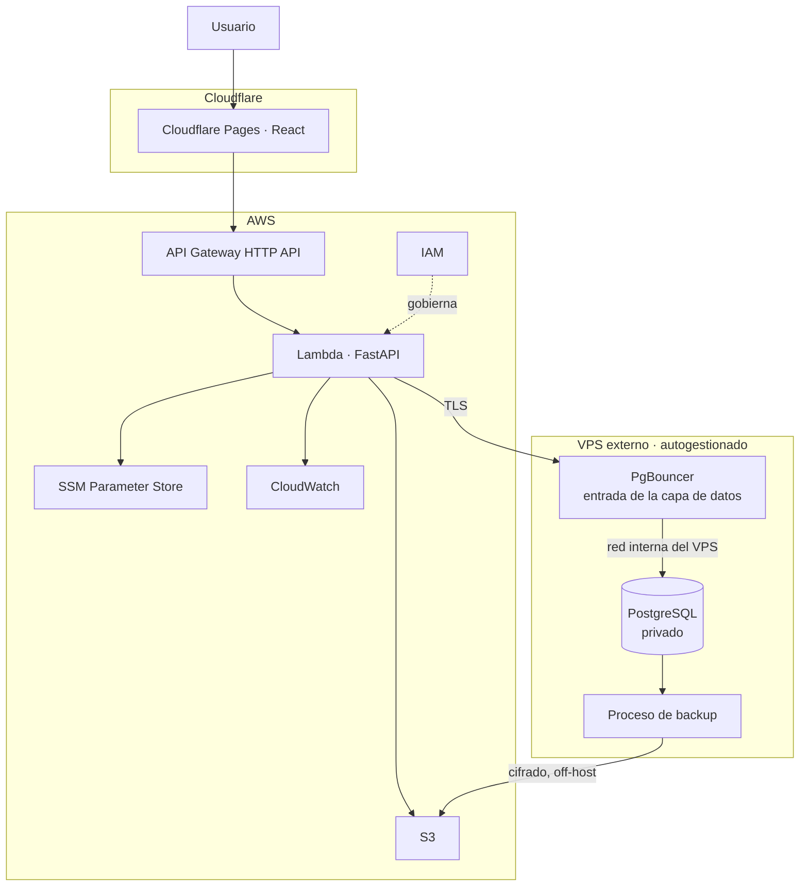
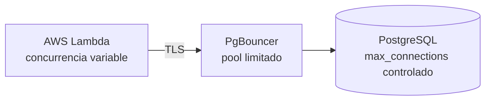
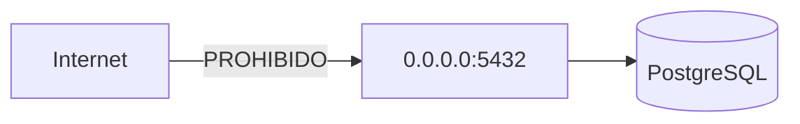
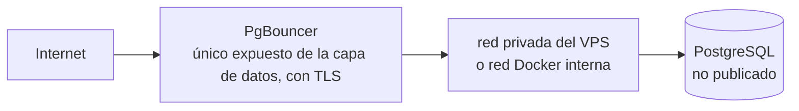
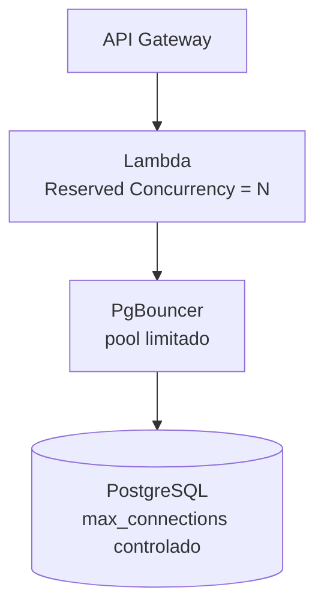
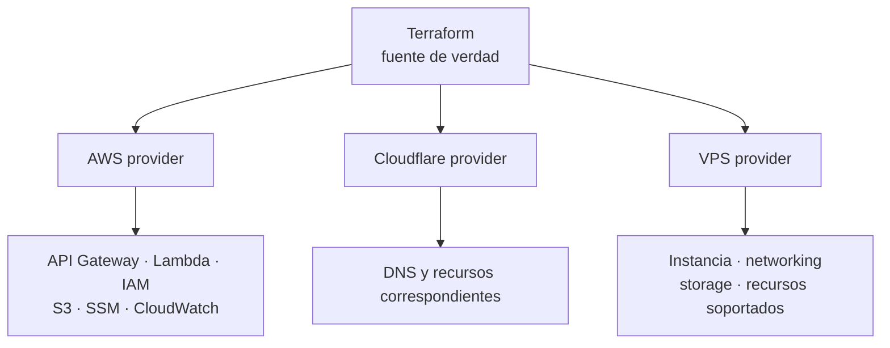
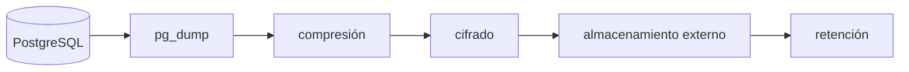

# PostgreSQL de producción en VPS externo

| Campo | Valor |
| --- | --- |
| **Estado** | **Vigente** ✔ — aprobado en `Task/005.3-Definir-PostgreSQL-Produccion-en-VPS` (2026-08-15) |
| **Fecha** | 2026-08-15 |
| **Tipo** | Documento canónico de arquitectura de la capa de datos de producción |
| **Repositorio** | `personal-blog-infra` |
| **ADR asociado** | [ADR-007 — PostgreSQL de producción en VPS](../adr/ADR-007-production-postgresql-on-vps.md) — **Aceptada** ✔ |
| **Decisión que resuelve** | **D-01** — **Resuelta** en cuanto al **modelo**; proveedor pendiente de `Task/029` |
| **Se implementa en** | `Task/029-Preparar-PostgreSQL-Produccion-en-VPS` (ETAPA 09) y ETAPA 10 |

> Este documento es la **fuente única** de la estrategia de la capa de datos de producción.
> Los demás documentos —roadmap, fichas de etapa, correspondencia local → nube, límites de
> seguridad, paridad AWS local, instrucciones de Claude— **lo referencian y no lo
> duplican**.

Relacionados: [overview.md](overview.md) · [local-to-cloud-mapping.md](local-to-cloud-mapping.md) ·
[security-boundaries.md](security-boundaries.md) · [open-decisions.md](open-decisions.md) ·
[aws-local-parity.md](aws-local-parity.md) ·
[ADR-003 — Nube serverless de bajo costo](../adr/ADR-003-serverless-low-cost-cloud.md) ·
[ADR-006 — Paridad AWS local con Floci](../adr/ADR-006-local-aws-parity-with-floci.md)

---

## 1. Contexto y motivación

El proyecto persigue varios objetivos a la vez, y hasta ahora uno de ellos estaba en
tensión con los demás:

| Objetivo | Estado |
| --- | --- |
| Mantener el costo de operación bajo y **predecible** | Restricción principal ([ADR-003](../adr/ADR-003-serverless-low-cost-cloud.md)) |
| Aprender AWS, serverless y Terraform | Motivo explícito del proyecto |
| Aprender operación real de infraestructura | Objetivo de formación |
| Servir como portafolio | Objetivo personal |
| Evitar infraestructura desproporcionada para el tráfico esperado | Restricción de diseño |

[ADR-003](../adr/ADR-003-serverless-low-cost-cloud.md) ya identificaba el punto débil y lo
dejaba escrito:

> «La base de datos administrada es el **único componente con costo fijo** de la
> arquitectura.»

Esa excepción se aceptó cuando no había datos. Hoy la valoración es distinta: para un blog
personal de tráfico bajo e irregular, una base de datos administrada tiende a **dominar la
factura mensual** y a costar más que todo el resto de la arquitectura junta —que, siendo
serverless, escala a cero.

Además, pagar por que un proveedor gestione la base de datos **elimina precisamente el
aprendizaje operacional** que el proyecto busca: sistema operativo, PostgreSQL, seguridad,
backups y recuperación.

### 1.1 Lo que **no** se quiere hacer

Abandonar AWS **no** es la respuesta. La arquitectura serverless sigue siendo deseada, por
costo y por aprendizaje. Mover FastAPI a un VPS eliminaría el motivo principal del
proyecto.

---

## 2. Objetivo

> **PostgreSQL de producción será autogestionado en un VPS económico, independiente de AWS,
> mientras el backend FastAPI permanece en AWS Lambda.**

Es un cambio **acotado a la capa de datos**. Todo lo demás de la arquitectura permanece
intacto.

---

## 3. Arquitectura objetivo



Puntos que el diagrama debe dejar claros:

1. **PgBouncer es el único endpoint de la capa de datos que la aplicación puede alcanzar
   desde fuera del VPS.** El acceso administrativo por **SSH** existe, pero es un canal
   **separado** y **ajeno a la capa de datos**; sus reglas están en
   [security-boundaries.md](security-boundaries.md) §9.
2. **PostgreSQL es privado**: solo acepta conexiones desde dentro del VPS y su puerto **no
   se publica** en la interfaz pública.
3. El tramo **Lambda → PgBouncer va cifrado con TLS**.
4. Los backups **salen del VPS**; S3 es el destino natural porque ya está en la
   arquitectura.

### 3.1 Reparto de responsabilidades por *boundary*

| *Boundary* | Responsabilidades |
| --- | --- |
| **Cloudflare** | Pages (React estático), DNS y CDN cuando corresponda. |
| **AWS** | API Gateway, Lambda, IAM, S3, SSM, CloudWatch. Toda la lógica de aplicación y su configuración. |
| **VPS** | Sistema operativo, runtime/Docker cuando corresponda, **PgBouncer**, **PostgreSQL**, almacenamiento persistente, backups y herramientas operativas necesarias. |

---

## 4. Qué **no** cambia

Esta decisión está deliberadamente acotada. **No** implica:

| No implica | Sigue igual |
| --- | --- |
| Mover FastAPI al VPS | El backend se ejecuta en **AWS Lambda** |
| Abandonar API Gateway | **API Gateway HTTP API** sigue siendo la entrada |
| Convertir el proyecto en arquitectura VPS | Solo la **capa de datos** vive en el VPS |
| Eliminar S3 | **Amazon S3** sigue siendo el almacenamiento de objetos |
| Eliminar SSM | **SSM Parameter Store** sigue siendo la configuración |
| Eliminar CloudWatch | **CloudWatch** sigue siendo logs y métricas |
| Eliminar Terraform | **Terraform** sigue siendo la fuente de verdad de la infraestructura |
| Eliminar Floci | [ADR-006](../adr/ADR-006-local-aws-parity-with-floci.md) sigue **Aceptada** y vigente |
| Cambiar el frontend | **Cloudflare Pages** sin cambios |
| Cambiar el entorno local | PostgreSQL en Docker sigue siendo el destino de desarrollo |

La responsabilidad del VPS es **la capa de datos de producción** y los componentes
directamente ligados a su operación. Nada más.

---

## 5. Lo que el proyecto asume al autogestionar

Elegir un VPS es aceptar **deliberadamente** un conjunto de responsabilidades que un
servicio administrado resolvería. Se listan por honestidad, no como advertencia:

| Responsabilidad asumida |
| --- |
| Administración del sistema operativo |
| *Hardening* del host |
| Actualizaciones y parches |
| Elección y actualización de la versión de PostgreSQL |
| Persistencia y almacenamiento |
| Monitoreo |
| Backups |
| Restore |
| Seguridad |
| TLS y gestión de certificados |
| Capacidad y dimensionamiento |
| Mantenimiento |
| Recuperación ante fallos |

### 5.1 Beneficios buscados

- **Menor costo fijo** y, sobre todo, **más predecible**.
- **Aprendizaje operacional real**: Linux, PostgreSQL, seguridad, backups, recuperación.
- **Mayor control** sobre versión, configuración y *tuning*.
- **Conservar AWS serverless** al mismo tiempo: lo mejor de los dos objetivos.

> El costo no es solo dinero: es también **tiempo de operación**. Ese intercambio se acepta
> conscientemente porque el tiempo invertido **es** parte del objetivo de aprendizaje. Si
> deja de serlo, aplica el criterio de reconsideración (§17).

---

## 6. El proveedor de VPS **todavía no se selecciona**

**`Task/005.3` no elige proveedor.** Ni DigitalOcean, ni Hetzner, ni Linode/Akamai, ni
Vultr, ni OVH, ni Lightsail, ni ningún otro.

La selección pertenece íntegramente a
**`Task/029-Preparar-PostgreSQL-Produccion-en-VPS`**, que deberá usar **precios y
características actuales en el momento de ejecutarse** — nunca cifras heredadas de este
documento ni de una conversación.

Criterios mínimos de comparación para `Task/029`:

| Categoría | Criterios |
| --- | --- |
| **Costo** | Costo mensual real · costos adicionales ocultos · costo del *egress* |
| **Capacidad** | RAM · CPU · almacenamiento · tipo de almacenamiento |
| **Red** | IPv4 · IPv6 · tráfico incluido · *egress* |
| **Ubicación** | Región · proximidad a la región AWS · latencia real |
| **Operación** | Backups/snapshots del proveedor · posibilidad de ampliar recursos |
| **Confianza** | SLA · reputación · soporte |
| **IaC** | Provider de Terraform mantenido y suficiente (§13) |
| **Continuidad** | Estrategia de recuperación · portabilidad |

> **No fijar un proveedor por información histórica.** Los precios y los planes cambian.

---

## 7. Objetivo de costo

Objetivo **de arquitectura**, no compromiso:

> La capa PostgreSQL debe mantenerse en un **rango de costo pequeño y predecible**,
> apropiado para un blog personal.

Como referencia aproximada puede anotarse el orden de magnitud de **USD 5–12 mensuales**,
con estas advertencias explícitas:

- **No es un SLA.**
- **No es un precio garantizado.**
- **No debe usarse para seleccionar proveedor** sin verificar precios actuales.
- **`Task/029` debe volver a investigar los precios reales.**

La motivación arquitectónica real no es una cifra concreta, sino esta:

> **Evitar que PostgreSQL sea el componente que domine la factura mensual** de una
> arquitectura que, por lo demás, escala a cero.

---

## 8. PgBouncer

PgBouncer forma parte de la arquitectura objetivo y es **el punto de entrada de la capa de
datos**.



### 8.1 Por qué es necesario

Lambda tiene un modelo de concurrencia que castiga a las bases de datos relacionales: cada
invocación concurrente puede abrir su propia conexión, y una ráfaga de tráfico se traduce
en una ráfaga de conexiones. PostgreSQL, en cambio, asigna un proceso por conexión y tiene
un `max_connections` finito y relativamente pequeño en una máquina económica.

Es el riesgo técnico que **R-03** ya registraba desde `Task/002`.

Objetivos de PgBouncer:

- **Controlar el número de conexiones reales** a PostgreSQL.
- **Proteger PostgreSQL** frente a ráfagas de concurrencia de Lambda.
- Mantener un **pool limitado**.
- **Desacoplar** el número de clientes del número de conexiones reales.
- Permitir **tuning independiente** de la base de datos.

### 8.2 Lo que **no** se define todavía

**Ningún número.** No se fijan aquí:

`pool_size` · `max_client_conn` · `max_db_connections` · `reserve_pool_size` ·
`pool_mode` · *timeouts* definitivos.

Esos valores deben derivarse de:

- Memoria disponible y capacidad real del VPS.
- `max_connections` de PostgreSQL.
- Comportamiento real de SQLAlchemy y psycopg.
- Pruebas de carga.
- Concurrencia observada de Lambda.

Fijarlos ahora sería inventarlos.

---

## 9. PostgreSQL no se expone a Internet

**Regla obligatoria.**

Lo prohibido:



Lo correcto:



- PostgreSQL acepta **únicamente** conexiones del componente autorizado dentro del VPS.
- El puerto de PostgreSQL **no se publica** en la interfaz pública del servidor.
- El *binding* y las reglas de firewall deben hacer esto cierto **por configuración**, no
  por convención.

### 9.1 No hay *security through obscurity*

**No** cuentan como control de seguridad suficiente:

| No es un control | Por qué |
| --- | --- |
| Cambiar el puerto 5432 por otro | Un escaneo lo encuentra en segundos |
| Usar únicamente una contraseña larga | Protege la credencial, no la superficie |
| *Rate limiting* únicamente | Retrasa, no impide |
| «Nadie conoce la IP» | La IP es pública por definición |

Un puerto distinto puede usarse por razones **operativas** —reducir ruido de escaneo, por
ejemplo—, pero **nunca debe contarse como frontera principal de seguridad**. La frontera
son el firewall, el *binding* privado, TLS y la autenticación.

---

## 10. Seguridad de la conexión

El tramo **Lambda → PgBouncer** atraviesa Internet. Baseline arquitectónico:

| # | Requisito |
| --- | --- |
| 1 | **TLS obligatorio.** Sin excepción, en producción. |
| 2 | **Validación correcta del certificado del servidor** por parte del cliente. Un TLS que no valida no protege frente a un intermediario. |
| 3 | **Autenticación fuerte.** |
| 4 | **Secretos fuera del código** y fuera de Git. |

### 10.0 Ciclo de vida del certificado — *ownership*, añadido en `Task/005.5`

Declarar «TLS obligatorio» **no basta**: un certificado tiene un ciclo de vida, y su
caducidad **deja el sitio sin base de datos**. `Task/029` es propietaria de resolverlo por
completo:

| Aspecto | Qué debe quedar definido |
| --- | --- |
| **Emisión** | Quién emite el certificado y mediante qué procedimiento |
| ***Hostname*** | Con qué nombre se presenta PgBouncer, y que **ese** nombre sea el que valide el cliente |
| **CA** | Autoridad certificadora usada, y cómo confía en ella la Lambda |
| **Instalación** | Dónde viven certificado y clave en el host, y con qué permisos |
| **Renovación** | Procedimiento, automatización si la hay, y quién comprueba que ocurrió |
| **Caducidad** | **Alerta anticipada**, dentro del *baseline* de observabilidad |
| **Confianza desde Lambda** | Verificación real de que el cliente **valida** y no solo cifra |

**No se elige ahora** ACME, proveedor ni tipo de certificado: se decide en `Task/029`, con
el proveedor de VPS ya seleccionado. **`Task/040`** valida vigencia y confianza reales
**desde la Lambda**, antes del lanzamiento.

### 10.1 SCRAM-SHA-256

Queda registrado como **mecanismo preferente de autenticación** de PostgreSQL y PgBouncer
cuando la implementación final lo permita. `Task/029` debe verificar la compatibilidad real
del conjunto PgBouncer + PostgreSQL + psycopg antes de fijarlo.

### 10.2 mTLS — evaluable, **no obligatorio todavía**

TLS mutuo es una mejora de *hardening* razonable, pero **no se declara obligatorio en este
documento**. Antes de adoptarlo hay que validar:

- Rotación de certificados y su automatización.
- Impacto operativo de un certificado caducado (deja el sitio sin base de datos).
- Compatibilidad con PgBouncer, PostgreSQL y el cliente.
- Cómo se entrega el certificado de cliente a Lambda sin versionarlo.

Sin respuesta a esas cuatro preguntas, mTLS añadiría un modo de fallo nuevo a cambio de un
beneficio que TLS con validación correcta ya cubre en gran parte. Se evalúa en `Task/029`.

---

## 11. Credenciales, configuración y abstracción

> **FastAPI no debe saber que PostgreSQL vive en un VPS.**

La aplicación depende de una sola cosa: **`DATABASE_URL`**.

| Entorno | `DATABASE_URL` apunta a |
| --- | --- |
| **Desarrollo** | PostgreSQL local en Docker |
| **AWS Local Parity** | PostgreSQL local, cuando la prueba de integración lo requiera |
| **Producción** | **PgBouncer** → PostgreSQL en el VPS |

El dominio y los casos de uso **no deben depender** de: proveedor de VPS · dirección IP ·
Floci · RDS · Docker · PgBouncer. Todas esas son decisiones de **infraestructura y
configuración**, no de aplicación — coherente con la interfaz `ObjectStorage` y con el
principio de *paridad por interfaz* de [overview.md](overview.md) §5.

Consecuencia práctica: **este cambio de arquitectura no obliga a tocar una línea del
backend.**

### 11.1 Secretos

- **Nunca se versionan credenciales.** Regla ya vigente del proyecto, sin cambios.
- **SSM Parameter Store** —o el mecanismo de secretos que fije la arquitectura vigente—
  entrega la configuración a Lambda en tiempo de ejecución.
- La cadena de conexión de producción **no existe** en ningún archivo del repositorio.

---

## 12. Conectividad, concurrencia y latencia

### 12.1 La Lambda permanece fuera de VPC

**La Lambda no se conecta a ninguna VPC** en la arquitectura inicial. Con ello conserva el
acceso a Internet gestionado por Lambda y alcanza directamente el endpoint público seguro de
PgBouncer, protegido por TLS, firewall y autenticación fuerte.

#### Cómo funciona esto en AWS — precisión necesaria

Documentación oficial de AWS, consultada el **2026-08-15**:

| # | Hecho |
| --- | --- |
| 1 | Por omisión, **las funciones Lambda tienen acceso a Internet público**: *«By default, Lambda functions have access to the public internet.»* |
| 2 | **Al conectar una función a una VPC, solo puede acceder a los recursos disponibles dentro de esa VPC**, salvo que la propia VPC tenga salida a Internet configurada. |
| 3 | Para alcanzar un recurso **dentro** de la VPC —por ejemplo una base de datos privada— **NO hace falta NAT Gateway**: ese tráfico no sale a Internet. |
| 4 | **NAT Gateway aparece solo si** la función, ya dentro de la VPC, necesita **salida IPv4 a Internet**. Y ni siquiera entonces es la única vía: existen *egress-only internet gateway* para IPv6 y **VPC endpoints** para servicios AWS. |
| 5 | Conectar la función a una **subred pública no** le da acceso a Internet. |

> **Corolario, escrito para evitar un error frecuente:** **NAT Gateway no es una consecuencia
> inherente de usar RDS.** Es la consecuencia de que una Lambda *dentro de una VPC* necesite
> salida IPv4 a Internet. Confundir ambas cosas atribuiría a RDS un costo que no le
> corresponde.

#### Qué implica para esta arquitectura

Nuestra base de datos **no está en una VPC de AWS**: está en un VPS externo, alcanzable por
Internet. Por tanto, para llegar a ella la Lambda **necesita salida a Internet**, que ya tiene
por omisión mientras permanezca fuera de VPC.

Meter la Lambda en una VPC aquí sería contraproducente: perdería esa salida y habría que
reponerla con un mecanismo de *egress*. Si ese mecanismo fuese **NAT Gateway**, aparecería un
**costo fijo por hora más cargo por transferencia** que
[ADR-003](../adr/ADR-003-serverless-low-cost-cloud.md) ya excluye — y que anularía buena parte
del ahorro que motiva esta decisión.

Si más adelante aparece un **requisito real** —IP de salida fija, controles de red más
estrictos, conectividad privada, VPN o túneles— se tratará como **decisión separada**, con su
propio análisis de costo y de opciones de *egress*. **`Task/005.3` no introduce VPC ni NAT
Gateway.**

### 12.2 Reserved Concurrency como control futuro



La concurrencia reservada de Lambda es el **primer control**, aguas arriba, para proteger la
capa de datos: limita cuántas invocaciones simultáneas pueden existir, y por tanto acota la
presión sobre PgBouncer.

**No se fija `N`**, igual que no se fijan los tamaños de pool (§8.2). Los tres números
—concurrencia reservada, pool de PgBouncer y `max_connections`— forman un sistema y deben
salir de **pruebas**, no de intuición.

### 12.3 Latencia y región

Requisito futuro registrado:

> La ubicación del VPS debe seleccionarse **teniendo en cuenta la región AWS** donde se
> ejecute Lambda, para minimizar razonablemente el RTT `Lambda ↔ PgBouncer/PostgreSQL`.

Cada consulta paga ese RTT, y una petición HTTP suele hacer varias. No se fija aquí una
región AWS concreta si todavía hay una decisión pendiente. `Task/029` debe considerar:
región AWS elegida · regiones disponibles del proveedor · **RTT medido** · costo ·
disponibilidad.

> **No elegir un VPS muy lejano solo por ahorrar una cantidad pequeña al mes.** Un ahorro de
> pocos dólares que añade decenas de milisegundos a cada consulta es un mal intercambio.

---

## 13. Terraform

Esta decisión **no reduce** la estrategia de infraestructura como código. La amplía: la
arquitectura pasa a ser conceptualmente **multi-provider**.



Esto es **conceptual**. `Task/005.3` **no crea** archivos `.tf`, `.tfvars`, backend de
Terraform, providers, módulos, *state* ni recursos de VPS.

### 13.1 Provider de Terraform del VPS

`Task/029` debe **favorecer**, cuando sea razonable, un proveedor con:

- Provider de Terraform **mantenido**.
- Documentación adecuada.
- Capacidad de crear instancia, *networking*, IP y almacenamiento.
- *Outputs* necesarios para el resto de la infraestructura.

Pero **el soporte de Terraform no es el único criterio**. Si el mejor proveedor por costo,
red y operación no dispone de un provider suficientemente fiable, **la excepción debe
documentarse explícitamente** y decidirse a la vista de todo el conjunto.

> **No crear abstracciones Terraform ficticias** para esconder diferencias entre
> proveedores. Es la misma regla de portabilidad que
> [ADR-006](../adr/ADR-006-local-aws-parity-with-floci.md) aplica al emulador local: las
> diferencias se documentan, no se disfrazan.

---

## 14. Impacto en la paridad AWS local (Floci)

[ADR-006](../adr/ADR-006-local-aws-parity-with-floci.md) y
[aws-local-parity.md](aws-local-parity.md) **siguen vigentes y sin recortes**. Floci sigue
teniendo como objetivo validar los recursos **AWS** del proyecto: API Gateway, Lambda, IAM,
S3, SSM y CloudWatch.

Lo que cambia es un hecho, no una regla: **la base de datos de producción ya no forma parte
del grafo AWS**, así que tampoco forma parte de lo que el laboratorio debe reproducir.

| Entorno | Base de datos |
| --- | --- |
| **Desarrollo normal** | PostgreSQL en Docker local |
| **AWS Local Parity** | Servicios AWS emulados por Floci; **PostgreSQL sigue siendo local** cuando una prueba de integración lo requiera |
| **Producción** | AWS Lambda → **TLS** → PgBouncer → PostgreSQL en el VPS |

Reglas derivadas:

1. **Aunque Floci soporte RDS, no se usará RDS** por el mero hecho de que esté soportado.
2. **`Task/025` no debe crear recursos RDS** solo para imitar producción: producción ya no
   usa RDS.
3. La **matriz de paridad** no necesita validar PostgreSQL/RDS de producción.
4. **La investigación histórica que `Task/005.2` hizo sobre el soporte de RDS en Floci se
   conserva íntegra.** Era correcta cuando se hizo; lo que cambia es el destino elegido, no
   el hallazgo.

---

## 15. Operación de la capa de datos

### 15.1 Backups

Al abandonar el PostgreSQL administrado, el proyecto asume **responsabilidad completa**
sobre backup y restore.

> **Regla obligatoria: un backup que solo existe en el mismo VPS no es un backup de
> recuperación ante desastres.** Si se pierde el servidor, se pierden los datos y la copia
> a la vez.

Estrategia inicial candidata:



**Amazon S3** es el destino natural: ya forma parte de la arquitectura y estará gestionado
por Terraform.

#### Reparto de responsabilidades — precisado en `Task/005.5`

La cadena `PostgreSQL → dump → cifrado → almacenamiento off-host → restore` atraviesa
varias tareas. Sin un reparto explícito, `Task/029` acababa exigiendo como evidencia un
bucket que **todavía no existe** —lo crea `Task/030`—:

| Eslabón | Owner |
| --- | --- |
| Mecanismo de backup: `pg_dump`, compresión, **cifrado**, programación | `Task/029` |
| **Retención**, RPO y RTO iniciales | `Task/029` (**D-10**) |
| **Restore demostrado** contra un destino off-host disponible en ese momento | `Task/029` |
| **Bucket/prefijo de destino**, política, permisos y retención definitiva | `Task/030` |
| **Identidad con la que el VPS escribe en AWS** | **D-16**: decide `Task/029`, materializa `Task/030` |
| **Notificación de fallo del backup** | `Task/029`, dentro del *baseline* de observabilidad |
| **Backup reciente y restore vigente** antes del lanzamiento | `Task/040` |

> **Aclaración necesaria.** La frase «S3 ya tendrá credenciales y políticas definidas» era
> optimista: `Task/028` resuelve **GitHub Actions → AWS**, que **no** entrega credenciales a
> un host externo. Cómo se autentica el VPS es **D-16**, y sigue **abierta**.

**No se implementan scripts todavía** y **no se fija frecuencia ni retención definitiva**
en `Task/005.3`. Corresponde a `Task/029` y a los runbooks posteriores.

El proyecto ya tiene precedente en esto: `Task/004` produjo un runbook de backup y
recuperación **local** con restauración demostrada. La capa de producción debe alcanzar al
menos ese mismo estándar.

### 15.2 Restore test — regla obligatoria

> **Un backup no se considera validado hasta haber demostrado una restauración correcta.**

Es la misma regla que `Task/004` ya aplicó en local y que `open-decisions.md` registra en
**D-10**. La estrategia futura deberá contemplar, en este orden:

1. Creación del backup.
2. Almacenamiento externo al VPS.
3. Verificación de integridad.
4. **Restore en un entorno controlado.**
5. Documentación del procedimiento.

### 15.3 PITR y WAL archiving — futuro, no requisito del MVP

*Point-In-Time Recovery*, *WAL archiving* y técnicas equivalentes **pueden evaluarse
posteriormente**. **No** son requisito obligatorio ahora.

Prioridad correcta: **backup correcto → restore probado → procedimiento reproducible.** Un
PITR mal operado es peor que un `pg_dump` diario que sí se sabe restaurar.

`Task/029` determinará si PITR aporta suficiente valor frente a su complejidad operativa.

### 15.3.1 Observabilidad del VPS — *ownership*, añadido en `Task/005.5`

El monitoreo aparecía en la lista de responsabilidades asumidas (§5) **sin propietario**, y
algunos documentos apuntaban a `Task/017`. Es incorrecto: `Task/017-Observabilidad-Local`
cubre el **entorno local**, y `Task/031-Desplegar-SSM-y-CloudWatch` cubre **solo AWS**.
**CloudWatch no observa un host externo por defecto.**

| Regla vigente |
| --- |
| **`Task/029` define y configura el *baseline*** de observabilidad del VPS |
| **`Task/040` verifica que opera de verdad** antes del lanzamiento |
| **`Task/017` no es owner de esto.** `Task/031` tampoco |

*Baseline* mínimo que `Task/029` debe dejar cubierto:

`uptime` del host · **CPU** · **RAM** · **espacio en disco** (R-32) · estado de
**PostgreSQL** · estado de **PgBouncer** · **fallo del backup** · **caducidad del
certificado** (§10.0).

> **No se decide aquí la herramienta.** En particular, **no se adopta CloudWatch Agent por
> omisión**: instalar un agente AWS en el VPS es una decisión con costo, superficie y
> credenciales propias —relacionada con **D-16**— y corresponde a `Task/029`, con las
> alternativas sobre la mesa.

### 15.4 Disponibilidad — SPOF aceptado conscientemente

```
1 VPS  =  Single Point of Failure
```

Se acepta **de forma explícita y consciente** para la primera versión productiva.

**No se introducen anticipadamente**: segundo PostgreSQL · réplica · Patroni · etcd ·
*failover* automático · balanceador · clúster · alta disponibilidad multinodo.

Para un blog personal, la mitigación inicial es:

| Mitigación |
| --- |
| Backups fuera del host |
| Restore probado |
| Infraestructura reproducible con Terraform |
| Documentación y runbooks |
| Monitoreo |
| Procedimiento de recuperación escrito |

Añadir HA multinodo multiplicaría el costo y la complejidad operativa para proteger un blog
personal de una caída que se resuelve reconstruyendo desde un backup. Es exactamente el
tipo de sobreingeniería que [ADR-003](../adr/ADR-003-serverless-low-cost-cloud.md) evita.

### 15.5 RPO y RTO — intención, no SLA

**No se establecen compromisos empresariales.** Solo intención inicial:

| Objetivo | Intención inicial |
| --- | --- |
| **RPO** — pérdida de datos aceptable | Orden de horas, hasta aproximadamente un día para el MVP |
| **RTO** — tiempo de recuperación | Recuperación manual de algunas horas, aceptable para un blog personal |

`Task/029` y los runbooks posteriores deberán convertir esto en objetivos concretos y
medidos. **No se promete ningún SLA.**

---

## 16. Riesgos

Riesgos introducidos por esta decisión. Están **abiertos y vigentes** desde la aprobación de
`Task/005.3` el 2026-08-15, y se registran en
[STATUS.md](../project-management/STATUS.md). Están consolidados: varios problemas
relacionados comparten riesgo cuando su mitigación es la misma.

| # | Riesgo | Impacto | Mitigación | Tarea que lo valida |
| --- | --- | --- | --- | --- |
| **R-29** | **Single point of failure.** Un solo VPS: si cae el host, el blog pierde su base de datos y queda sin contenido dinámico hasta la recuperación manual. | Medio | **Aceptado conscientemente** (§15.4). Mitigado con backups off-host, restore probado, infraestructura reproducible y runbook de recuperación. No se introduce HA: su costo y complejidad no se justifican para un blog personal. | `Task/029`, `Task/026` |
| **R-30** | **Nueva superficie de ataque expuesta a Internet:** PgBouncer publicado y SSH en el host, más software (SO, PostgreSQL, PgBouncer) que envejece y acumula vulnerabilidades sin parchear. Un compromiso del VPS implica **exposición de los datos**. | **Alto** | Firewall *deny-by-default*; SSH solo por llave, sin contraseña; servicios mínimos; **PostgreSQL nunca público** (§9); TLS obligatorio y autenticación fuerte (§10); política de actualizaciones y parcheo definida en `Task/029`. Prohibido apoyarse en *security through obscurity* (§9.1). | `Task/029`, `Task/018` |
| **R-31** | **Backup inexistente, corrupto o no restaurable.** El fallo silencioso clásico: existe un archivo, nadie lo ha restaurado nunca y el día del incidente no sirve. | **Alto** | Regla obligatoria: **un backup no está validado hasta haberse restaurado** (§15.2). Verificación de integridad, restore en entorno controlado y procedimiento documentado. Mismo estándar que ya alcanzó `Task/004` en local. | `Task/029`, `Task/026` |
| **R-32** | **Pérdida del VPS o del disco**, o **agotamiento de recursos**: disco lleno que detiene PostgreSQL, memoria o CPU insuficientes. Un disco lleno puede además impedir el propio backup. | **Alto** | Backups **fuera del host** (§15.1) — una copia que solo vive en el VPS no protege de esto. Monitoreo de espacio en disco y de recursos con alertas; dimensionamiento y política de crecimiento en `Task/029`. **Owner corregido en `Task/005.5`:** `Task/017` es observabilidad **local** y no cubre el VPS. | `Task/029`, `Task/040` |
| **R-33** | **Agotamiento de conexiones**: una ráfaga de concurrencia de Lambda supera `max_connections` de PostgreSQL y las peticiones empiezan a fallar. Es la materialización de **R-03** en esta topología. | Medio | **PgBouncer** con pool limitado (§8) más **Reserved Concurrency** de Lambda aguas arriba (§12.2). Los tres números —concurrencia, pool y `max_connections`— se derivan de **pruebas**, no de intuición. | `Task/029`, `Task/032` |
| **R-34** | **Latencia `Lambda ↔ VPS`.** La base de datos deja de estar en la misma región que el cómputo; cada consulta paga el RTT y una petición HTTP suele hacer varias. | Medio | Selección de región del VPS teniendo en cuenta la región AWS, con **RTT medido**, no estimado (§12.3). Regla explícita: no elegir un VPS lejano por ahorrar poco al mes. | `Task/029`, `Task/040` |
| **R-35** | **Error humano de operación.** Sin consola administrada que ponga barreras, un comando equivocado puede borrar datos, exponer un puerto o dejar el servicio caído. | Medio | Infraestructura reproducible con Terraform; runbooks escritos para cada operación (`Task/026`); backups off-host como red de seguridad; principio ya vigente en el proyecto de no ejecutar operaciones destructivas sin autorización explícita. | `Task/026`, `Task/029` |

**Ninguno de estos riesgos se cierra en `Task/005.3`.** Son consecuencia asumida de la
decisión, no defectos a resolver antes de aprobarla.

---

## 17. Criterios para reconsiderar la decisión

Esta decisión **no es irreversible**. Se revisa si ocurre alguna de estas condiciones:

| # | Condición | Reacción probable |
| --- | --- | --- |
| 1 | El tráfico aumenta sustancialmente | Reevaluar capacidad, y si procede, servicio administrado |
| 2 | Se requiere un SLA que un solo VPS no puede sostener | Evaluar HA o servicio administrado |
| 3 | La alta disponibilidad se vuelve necesaria | Replantear la topología de datos |
| 4 | El costo del servicio administrado deja de ser relevante frente al presupuesto | Desaparece la motivación principal |
| 5 | El mantenimiento manual consume demasiado tiempo | El intercambio de §5.1 deja de compensar |
| 6 | Aparecen requisitos regulatorios | Puede exigir garantías que un VPS propio no da |
| 7 | La recuperación exigida se vuelve más estricta | RPO/RTO de §15.5 dejan de ser suficientes |
| 8 | El costo total de operar el VPS supera su beneficio | Revertir a servicio administrado |

Revertir es viable **precisamente por §11**: la aplicación solo conoce `DATABASE_URL`.
Cambiar de destino es un cambio de configuración e infraestructura, no de código.

---

## 18. Qué decide y qué **no** decide este documento

| Decide | No decide — y dónde se decide |
| --- | --- |
| **Modelo**: PostgreSQL autogestionado en VPS externo | **Proveedor** de VPS → `Task/029` |
| PgBouncer como punto de entrada de la capa de datos | Tamaño de la instancia, CPU, RAM, disco → `Task/029` |
| PostgreSQL privado, nunca expuesto a Internet | Región concreta → `Task/029` |
| TLS obligatorio en `Lambda → PgBouncer` | Valores de pool y `max_connections` → `Task/029` |
| SCRAM-SHA-256 como mecanismo preferente | Si se adopta mTLS → `Task/029` |
| Backups fuera del host y restore probado | Frecuencia y retención → `Task/029` / **D-10** |
| Sin NAT Gateway por esta decisión | Si PITR aporta valor → `Task/029` |
| Terraform multi-provider | Backend de estado de Terraform → `Task/025` / **D-06** |
| SPOF aceptado en la primera versión | Límites exactos de Lambda → `Task/032` / **D-12** |
| Que el certificado tiene un ciclo de vida con owner (§10.0) | Emisor, CA y método concretos → `Task/029` |
| Que el VPS necesita observabilidad propia (§15.3.1) | Herramienta y si se usa agente → `Task/029` |
| Que los backups salen a un destino externo | **Con qué identidad** escribe el VPS en AWS → **D-16**, `Task/029` |

> **No confundir la decisión de modelo con la selección de proveedor.** Este documento
> resuelve la primera; `Task/029` resuelve la segunda.

---

## 19. Referencias

**Del proyecto:**

- [ADR-007 — PostgreSQL de producción en VPS](../adr/ADR-007-production-postgresql-on-vps.md) — **Aceptada**
- [ADR-003 — Nube serverless de bajo costo](../adr/ADR-003-serverless-low-cost-cloud.md)
- [ADR-006 — Paridad AWS local con Floci](../adr/ADR-006-local-aws-parity-with-floci.md)
- [Arquitectura — visión general](overview.md)
- [Correspondencia local → nube](local-to-cloud-mapping.md)
- [Límites de seguridad](security-boundaries.md)
- [Paridad AWS local](aws-local-parity.md)
- [Decisiones diferidas](open-decisions.md) — **D-01**, **D-10**, **D-12**
- [ETAPA 09 — Cuentas y Seguridad Cloud](../stages/STAGE-09-cloud-accounts.md)
- [ETAPA 10 — Despliegue Cloud](../stages/STAGE-10-cloud-deployment.md)
- [Runbook de backup y recuperación local](../runbooks/local-backup-and-recovery.md) — precedente de la regla de restore

**Documentación oficial de AWS, consultada el 2026-08-15** (base de §12.1):

- *Giving Lambda functions access to resources in an Amazon VPC* —
  `https://docs.aws.amazon.com/lambda/latest/dg/foundation-networking.html`
- *Enable internet access for VPC-connected Lambda functions* —
  `https://docs.aws.amazon.com/lambda/latest/dg/configuration-vpc-internet.html`

**Nota sobre el diagrama versionado:** `images/Infraestructura.png` representa la
**arquitectura objetivo inicial, anterior a esta decisión**, cuando PostgreSQL administrado
todavía era la vía prevista. **No se modifica, no se regenera y no se reemplaza.** La
arquitectura vigente de la capa de datos es la de §3 de este documento.
