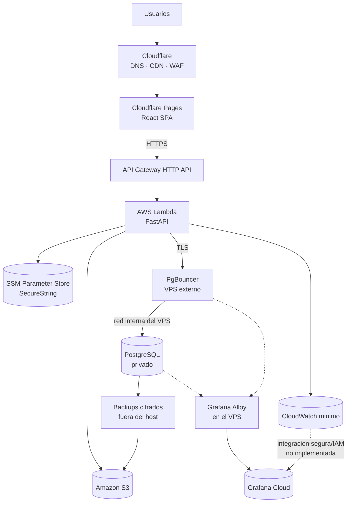

# Arquitectura objetivo de producción

| Campo | Valor |
| --- | --- |
| **Estado** | **Vigente** ✔ — aprobado en `Task/006.2-Formalizar-Arquitectura-Objetivo-Produccion` (2026-08-23) |
| **Fecha** | 2026-08-23 |
| **Tipo** | Documento canónico de arquitectura. **Mantenimiento transversal**: no cuenta en las 41 tareas |
| **Qué formaliza** | La contraparte **textual** del diagrama [`images/Infraestructura.png`](../../images/Infraestructura.png), actualizado por el usuario en `main` (commit `d08fe27`) |
| **Qué NO hace** | **No implementa nada.** 0 recursos AWS, 0 Cloudflare, 0 VPS, 0 Grafana, 0 Terraform nuevo |
| **Decisión asociada** | [ADR-008](../adr/ADR-008-observability-grafana-cloud-and-alloy.md) — **Aceptada** ✔ |

> **Vigente** desde el 2026-08-23, al aprobar el usuario `Task/006.2` con la expresión
> exacta requerida por [WORKFLOW.md](../project-management/WORKFLOW.md). Todo lo que este
> documento marca como **decisión cerrada** es de cumplimiento obligatorio. Lo que ya estaba
> **Aceptado** antes —ADR-001 a ADR-007— sigue vigente y **este documento no lo reabre**.
>
> **Vigencia no es autorización.** Este documento describe el objetivo; ejecutarlo requiere
> la tarea propietaria y la autorización explícita del usuario (§24).

Relacionados: [overview.md](overview.md) · [local-to-cloud-mapping.md](local-to-cloud-mapping.md) ·
[production-postgresql-vps.md](production-postgresql-vps.md) ·
[aws-local-parity.md](aws-local-parity.md) ·
[security-boundaries.md](security-boundaries.md) ·
[open-decisions.md](open-decisions.md)

---

## 1. Propósito

Que la **imagen**, la **documentación**, el **roadmap** y las **decisiones** digan
exactamente lo mismo.

`images/Infraestructura.png` es una **vista humana**: sirve para mirar, no para razonar
sobre ella de forma programática. Este documento es la **fuente textual equivalente**, y
existe para que:

- **Claude Code**, **Codex** u otro agente puedan razonar sobre la arquitectura objetivo
  **sin analizar visualmente la PNG**;
- otro desarrollador entienda hacia dónde evoluciona el proyecto sin reconstruirlo a partir
  de nueve documentos;
- el propio usuario tenga un único sitio donde comprobar qué está cerrado, qué está abierto
  y **quién es el propietario** de cada pieza.

Este documento **no sustituye** a los documentos especializados: los **une**. Cuando haya
detalle, el detalle vive en su documento canónico y aquí solo se enlaza.

**Regla de precedencia.** Si este documento y un documento especializado se contradicen,
manda el especializado —[production-postgresql-vps.md](production-postgresql-vps.md) para la
capa de datos, [aws-local-parity.md](aws-local-parity.md) para el laboratorio de IaC,
[security-boundaries.md](security-boundaries.md) para las comunicaciones permitidas— y **la
contradicción se corrige aquí**, no allí.

---

## 2. Diagrama

Vista visual versionada: [`images/Infraestructura.png`](../../images/Infraestructura.png).

| Campo | Valor |
| --- | --- |
| **Ruta** | `images/Infraestructura.png`, en la raíz de `personal-blog-infra` |
| **Estado** | **Vigente.** Representa la arquitectura objetivo de producción descrita en este documento |
| **Actualizada** | Por el usuario, manualmente, en el commit `d08fe27` sobre `main` |
| **Mantenimiento** | **No se regenera, edita, comprime ni convierte de formato** salvo decisión explícita del usuario |

> **Corrección de un estado documental previo.** Hasta esta tarea, `overview.md` §4 y el
> `README.md` describían la PNG como *«la arquitectura objetivo inicial, anterior a
> `Task/005.3`»* y la conservaban como **registro histórico**. Eso era cierto **hasta** que
> el usuario la actualizó. Desde `d08fe27` la imagen refleja la arquitectura vigente y
> aquellas notas quedaron **obsoletas**; se corrigen en esta tarea.

---

## 3. Arquitectura productiva

```
USUARIOS
    │
    ▼
CLOUDFLARE
    ├── DNS
    ├── CDN
    └── WAF
         │
         ▼
CLOUDFLARE PAGES
    │
    └── React SPA
         │
         │ HTTPS
         ▼
API GATEWAY HTTP API
         │
         ▼
AWS LAMBDA
FastAPI
    │
    ├────────────► Amazon S3
    │
    ├────────────► SSM Parameter Store SecureString
    │
    ├────────────► CloudWatch mínimo
    │                     │
    │                     └────► Grafana Cloud
    │                            (integración segura/IAM, cuando corresponda)
    │
    │ TLS
    ▼
VPS EXTERNO A AWS
    │
    ├── PgBouncer
    │      │
    │      ▼
    │   PostgreSQL
    │
    ├── secretos cifrados
    │
    ├── backups cifrados off-site
    │
    └── Grafana Alloy
             │
             ▼
       Grafana Cloud
```

Equivalente en Mermaid, para lectura en renderizadores que lo soporten:



Tres proveedores, cuatro planos:

| Plano | Proveedor | Qué contiene |
| --- | --- | --- |
| **Borde y frontend** | **Cloudflare** | DNS, CDN, WAF, Cloudflare Pages |
| **Aplicación y servicios gestionados** | **AWS** | API Gateway HTTP API, Lambda, S3, SSM, CloudWatch, IAM |
| **Capa de datos y su operación** | **VPS externo** | PgBouncer, PostgreSQL, secretos cifrados, backups, Grafana Alloy |
| **Observabilidad central** | **Grafana Cloud** | Visualización, consulta y alertas |

---

## 4. Flujo de usuario

1. El visitante resuelve el dominio del blog. **Cloudflare** responde el DNS.
2. La petición del sitio la atiende **Cloudflare Pages**, que sirve los estáticos de la
   **SPA de React** desde el CDN, con TLS gestionado.
3. **WAF y CDN de Cloudflare** son la primera frontera: filtrado y caché antes de que nada
   llegue a AWS.
4. El navegador ejecuta la SPA. **Todo el contenido dinámico llega después**, por llamadas
   al API.

**Consecuencia de diseño:** el sitio **no tiene servidor de frontend permanente**. No hay
proceso que mantener, parchear ni escalar en el lado del sitio público.

---

## 5. Flujo frontend → API

```
React SPA (navegador) ──HTTPS──► API Gateway HTTP API ──► AWS Lambda (FastAPI)
```

- La SPA **nunca** habla con PostgreSQL, con S3 con credenciales, ni con el VPS. Su **único
  canal de datos** es el API.
- **API Gateway HTTP API** aporta enrutado, TLS gestionado, CORS y *throttling*
  (`Task/033`).
- **AWS Lambda** ejecuta el mismo FastAPI que corre en local, bajo un adaptador fino
  (`Task/023`).
- La URL del API se inyecta en el **build** del frontend como variable de entorno; no está
  quemada en el código.
- La **topología lógica de dominios** —mismo *site* con subdominio de API, o dominios
  separados— y la política de cookies/CORS son **D-15**, y se deciden en `Task/011`. El
  **nombre concreto** del dominio es **D-07**, en `Task/035`.

Restricciones que impone Lambda y que el backend ya respeta desde `Task/005`: sin estado en
memoria entre peticiones, sin procesos de larga duración, límite de duración por invocación
y de tamaño del artefacto.

---

## 6. Flujo Lambda → VPS

```
AWS Lambda ──TLS──► PgBouncer ──red interna del VPS──► PostgreSQL (privado)
```

| Regla | Detalle |
| --- | --- |
| **PgBouncer es el único endpoint de la capa de datos** alcanzable desde fuera del VPS | El SSH administrativo del host es un canal **separado**, ajeno a esta capa |
| **PostgreSQL nunca se expone a Internet** | El *binding* privado y el firewall lo hacen cierto por configuración, no por convención |
| **TLS obligatorio, con validación del certificado del servidor** | Un TLS que no valida no protege frente a un intermediario |
| **SCRAM-SHA-256** preferente | **mTLS** es una mejora evaluable, **no obligatoria todavía** (`Task/029`) |
| **La aplicación solo conoce `DATABASE_URL`** | No conoce proveedor, IP, Docker, Floci ni PgBouncer |
| **La Lambda permanece fuera de VPC** | **No se introduce VPC ni NAT Gateway** solo para llegar al VPS |

Detalle completo, incluido el ciclo de vida del certificado y el dimensionamiento del pool:
[production-postgresql-vps.md](production-postgresql-vps.md) §8, §9 y §10.

**Costo técnico asumido:** la base de datos deja de estar en la misma región que el cómputo
y cada consulta paga el RTT `Lambda ↔ VPS` (**R-34**). Por eso la selección de región de
`Task/029` exige **RTT medido**, no estimado.

---

## 7. Object storage

| Entorno | Implementación |
| --- | --- |
| **Local** | **MinIO** (API compatible con S3) |
| **Producción** | **Amazon S3** |

- La aplicación **no habla con MinIO ni con S3 directamente**: habla con la interfaz
  **`ObjectStorage`** (`Task/010`), con una implementación por entorno y **pruebas de
  contrato comunes a ambas**.
- El bucket es **privado**. El acceso a archivos usa **URLs prefirmadas** emitidas por el
  backend.
- **La base de datos y el Markdown persisten la clave del objeto (`object_key`), nunca una
  URL prefirmada** — que expira. La URL se genera en el momento de servir.
- Cómo se sirven los medios **públicos** desde un bucket **privado**, y qué URL usa
  `og:image`, es **D-08**, que resuelve `Task/030`.

**MinIO no es una tecnología de producción.** Su papel es exclusivamente local y de
paridad por interfaz.

---

## 8. Secretos de Lambda

**Decisión cerrada: SSM Parameter Store, tipo `SecureString`.**

| Qué | Dónde vive |
| --- | --- |
| **Secretos** que necesita la Lambda —`DATABASE_URL`, credenciales, claves de firma— | **SSM Parameter Store `SecureString`** |
| **Configuración no secreta** —nombres, *endpoints* públicos, banderas, niveles de log— | Variables de entorno de la Lambda |

Reglas:

- **Ningún secreto real se versiona**, en ningún repositorio.
- La Lambda lee SSM con **permisos mínimos**, acotados a los parámetros que necesita.
- El código de aplicación **lee variables de entorno**: quién las provee le es indiferente.
  Esa indiferencia es lo que permite que local, laboratorio y producción compartan código.
- En el **laboratorio AWS local (Floci)**, `SecureString` **no cifra**: por eso está
  prohibido poner allí un secreto real (regla S-07 de
  [security-boundaries.md](security-boundaries.md) §8.1).

Propietario de la materialización: `Task/031` (parámetros y permisos) y `Task/032`
(*wiring* de la Lambda).

---

## 9. Secretos del VPS

**Decisión cerrada:** el VPS usa **secretos cifrados**, con la **clave fuera del
repositorio** y **descifrado local seguro** en el momento del despliegue o de la ejecución,
según corresponda.

Lo que esa decisión fija, y es lo que importa:

| Regla |
| --- |
| **Ningún secreto del VPS se versiona en claro.** Nunca |
| **La clave de descifrado no vive en el repositorio** |
| El material cifrado **sí puede versionarse**; su seguridad depende de la clave, no de ocultarlo |
| El descifrado ocurre **en el host**, en el momento de usarlo |
| **SSM no sustituye a este mecanismo, ni al revés**: SSM sirve a la Lambda; este mecanismo sirve al VPS. Son dos planos distintos, con dos superficies distintas |

**Lo que NO está decidido: la herramienta.** **SOPS + age** es el **candidato técnico
actual** y el más probable, pero **no se declara todavía tecnología irreversible**: nadie
la ha validado en este proyecto. Elegirla ahora, sin haber provisionado el host ni conocido
su distribución, sería inventar la decisión.

- **Decisión abierta:** **D-17** — herramienta concreta de gestión de secretos cifrados del
  VPS. **Owner: `Task/029`.**
- **Riesgo asociado:** **R-40**.

---

## 10. Observabilidad AWS — CloudWatch mínimo

**CloudWatch no desaparece.** Sigue siendo la observabilidad **nativa** de AWS y el
diagnóstico de primera línea de la Lambda y de API Gateway.

Qué significa **«mínimo»**:

| Se mantiene | Se evita |
| --- | --- |
| Logs nativos de la Lambda y de API Gateway | Retención larga o indefinida |
| Métricas nativas de AWS (invocaciones, errores, duración, *throttles*) | Métricas personalizadas caras sin necesidad demostrada |
| Errores de Lambda y de API Gateway | *Dashboards* elaborados dentro de CloudWatch |
| Alarmas **mínimas**, las imprescindibles | Funcionalidades avanzadas que no se han justificado |
| Diagnóstico operativo básico cuando algo falla en AWS | Duplicar en CloudWatch lo que ya se verá en Grafana Cloud |

Reglas:

- **Retención corta y explícita**, nunca infinita. La cifra exacta es **D-11**, en
  `Task/031`.
- **CloudWatch no observa el VPS.** Un host externo no aparece en CloudWatch por defecto, y
  el proyecto **no adopta CloudWatch Agent por omisión** en el VPS: eso tendría costo,
  superficie y credenciales propias.
- **Costo bajo control**: la ingesta y la retención de logs son la vía habitual por la que
  CloudWatch se vuelve caro (`Task/041`).

Propietario: `Task/031-Desplegar-SSM-y-CloudWatch` — **solo AWS**.

---

## 11. Observabilidad del VPS — Grafana Alloy

**Decisión cerrada: el agente de observabilidad del VPS es Grafana Alloy**, y su destino es
**Grafana Cloud**.

Responsabilidad de Alloy:

- recolectar **logs**, **métricas** y **telemetría** del host y de sus servicios;
- enviarlos a **Grafana Cloud**.

Qué debe cubrir como mínimo —es el *baseline* que `Task/029` ya tenía asignado y que ahora
tiene herramienta—:

`uptime` del host · **CPU** · **RAM** · **espacio en disco** (**R-32**) · estado de
**PostgreSQL** · estado de **PgBouncer** · **fallo del backup** · **caducidad del
certificado** de PgBouncer.

**Lo que explícitamente NO se hace:**

> **No se autohospedan Grafana, Prometheus ni Loki en el VPS** como *stack* completo.

Motivo: la RAM, la CPU y el disco del VPS se reservan **principalmente para PostgreSQL**.
Un *stack* de observabilidad completo en la misma máquina compite por los mismos recursos
con el componente cuyo fallo deja el blog sin contenido — y, además, se cae justo cuando
más falta hace: al caer el host que debía vigilar.

- **Riesgo asociado:** **R-41** (Alloy compite por recursos con PostgreSQL).
- **Propietario:** `Task/029` lo configura; `Task/040` verifica que **opera de verdad**, no
  que está instalado.

---

## 12. Grafana Cloud — plano central de observabilidad

**Decisión cerrada:** **Grafana Cloud** es el **plano central de visualización, consulta y
alertas** del proyecto.

| Aspecto | Definición |
| --- | --- |
| **Qué es** | El sitio donde se **mira** la telemetría, se **consulta** y se **alerta** |
| **Qué recibe en el diseño actual** | Lo que envía **Grafana Alloy** desde el VPS |
| **Qué recibirá** | Además, lo que llegue desde **CloudWatch** por una integración segura (§13) |
| **Qué NO es** | **No es el único destino de telemetría**, y **no reemplaza a CloudWatch** |

### Sobre el tier gratuito

**Objetivo inicial: el tier gratuito, si sigue siendo suficiente.**

> **«Grafana Cloud Free» es una preferencia presupuestaria, no una dependencia
> arquitectónica rígida.**

Consecuencias explícitas de esa frase:

- Si el tier gratuito deja de ser suficiente o cambia, **la arquitectura no se rompe**: se
  decide pagar, ajustar el volumen de telemetría o cambiar de destino. Lo que **no** puede
  ocurrir es que el diseño dependa de un límite comercial ajeno.
- **No se persisten aquí límites, cuotas ni precios concretos.** Cualquier cifra comercial
  que se documente en el futuro debe marcarse **«verificar en `Task/041` / antes de
  contratar»**. Las condiciones de un tier gratuito **no son una garantía eterna**.
- **Decisión abierta:** **D-19** — plan, límites y costo reales de Grafana Cloud. **Owner:
  `Task/041`**, con aporte de `Task/027` (presupuesto).
- **Riesgo asociado:** **R-38** (dependencia de un tier gratuito de terceros).

### Sobre lo que se envía

Enviar telemetría a un tercero es **exportar datos fuera del proyecto**. Regla vigente:
los logs y las métricas **no contienen contraseñas, tokens, cadenas de conexión ni datos
personales innecesarios** (**O-08**). Aplicada a Alloy, significa que **qué se recolecta es
parte del diseño**, no un detalle de configuración (**R-39**).

---

## 13. Integración CloudWatch → Grafana Cloud

La arquitectura **contempla** que Grafana Cloud consulte o reciba lo que hay en CloudWatch,
mediante **el mecanismo seguro/IAM que corresponda**.

| Punto | Estado |
| --- | --- |
| **Que exista la integración** | **Contemplado en la arquitectura objetivo** |
| **Con qué mecanismo concreto** —rol IAM asumible, credencial acotada, *push* desde AWS— | **No decidido** |
| **Cuándo se implementa** | **No ahora.** Ninguna tarea en curso lo toca |

- **Decisión abierta:** **D-20** — mecanismo concreto de integración `CloudWatch → Grafana
  Cloud` y su modelo de permisos. **Owner: `Task/031`** (decide y prepara la base AWS);
  **`Task/040`** valida que funciona.
- **Restricción de seguridad, ya heredada:** permisos **mínimos**, de **solo lectura** sobre
  lo estrictamente necesario, y **ninguna credencial de larga vida versionada**. Este
  problema es de la **misma familia** que **D-16** (identidad del VPS hacia AWS) y debe
  resolverse con el mismo criterio, **sin fusionarse con ella**: son dos principals
  distintos, con dos superficies distintas.

---

## 14. PostgreSQL y PgBouncer

| Elemento | Decisión |
| --- | --- |
| **Motor** | **PostgreSQL**, el mismo que en local |
| **Modelo** | **Autogestionado en un VPS externo a AWS**. **No RDS**, no servicio administrado |
| **Entrada** | **PgBouncer**, único endpoint de la capa de datos alcanzable desde fuera |
| **Exposición** | **PostgreSQL nunca se publica en Internet** |
| **Autenticación** | **SCRAM-SHA-256** preferente; **mTLS** opcional, no obligatorio todavía |
| **Contrato con la aplicación** | Únicamente **`DATABASE_URL`** |
| **Disponibilidad** | **Un solo VPS = SPOF aceptado conscientemente**. No se introduce alta disponibilidad |

**Por qué PgBouncer no es opcional:** Lambda abre conexiones efímeras y numerosas; una
ráfaga de concurrencia agotaría `max_connections` de una máquina económica (**R-03**,
**R-33**). La mitigación es **PgBouncer con pool limitado** más ***Reserved Concurrency***
de Lambda aguas arriba, y **los tres números salen de pruebas, no de intuición**
(`Task/029` los deriva, `Task/032` los aplica).

**Sigue abierto** y pertenece a `Task/029`: proveedor, región, tamaño, versión de
PostgreSQL, `pool_mode`, tamaños de pool, `max_connections` y la adopción o no de mTLS
(**D-01**, en su parte de proveedor).

Documento canónico: [production-postgresql-vps.md](production-postgresql-vps.md) ·
[ADR-007](../adr/ADR-007-production-postgresql-on-vps.md) — **Aceptada**.

---

## 15. Backups y restore

**Decisión cerrada:** los backups de PostgreSQL son **cifrados** y **salen del VPS**.

```
PostgreSQL (VPS) ──dump + cifrado──► destino off-site (candidato natural: Amazon S3)
```

| Regla | Por qué |
| --- | --- |
| **El backup debe salir del host** | Una copia que solo vive en el VPS **no protege de perder el VPS**. Un backup dentro del mismo VPS **no satisface el requisito** |
| **El backup va cifrado** | Sale del perímetro del proyecto hacia almacenamiento de terceros |
| **El restore debe probarse** | **Un backup que nunca se ha restaurado no cuenta como backup** (**R-31**) |
| **Retención y *lifecycle* explícitos** | Sin retención definida, el costo crece en silencio |
| **Credencial de mínimo privilegio** | Escritura sobre un **prefijo concreto**; sin lectura ni borrado del resto (regla V-12) |

**Ownership — un solo propietario por tramo, sin duplicar:**

| Tramo | Owner |
| --- | --- |
| Mecanismo, cifrado, retención, RPO/RTO y **restore demostrado** off-host | **`Task/029`** |
| **Destino S3**, política del bucket, permisos, *lifecycle* y retención definitiva | **`Task/030`** |
| **Identidad** con la que el VPS escribe en S3 (**D-16**) | **`Task/029`** decide · **`Task/030`** materializa |
| **Backup reciente y restore vigente** verificados antes del lanzamiento | **`Task/040`** |

**PITR** y *WAL archiving* quedan como evaluación futura, **nunca por delante** de tener un
backup correcto y un restore probado.

---

## 16. Terraform

**Terraform sigue siendo la fuente de verdad de la infraestructura declarativa.**

| Alcance | Estado |
| --- | --- |
| **AWS** | Gestionado por Terraform |
| **Cloudflare** | Gestionado por Terraform |
| **Creación del VPS** | **Puede** gestionarla, **si** el proveedor elegido en `Task/029` tiene un provider mantenido y adecuado. No se da por hecho |
| **Configuración interna del sistema operativo del VPS** | **No.** Ver §17 |

Reglas heredadas y vigentes:

- **Una sola definición, un solo grafo de recursos.** Local (Floci) y AWS real son dos
  **destinos** de la misma definición, no dos infraestructuras
  ([aws-local-parity.md](aws-local-parity.md) §4).
- **Ningún recurso Terraform específico del emulador.**
- **Guardas *fail-closed*** antes de cualquier `apply` o `destroy`: un comando pensado para
  el laboratorio **no puede acabar hablando con AWS real**.
- **Ninguna automatización ejecuta `terraform destroy` contra infraestructura real** — AWS,
  Cloudflare ni VPS. Contra el emulador **efímero** de un job de CI sí es legítimo.
- El **backend de estado** de Terraform es **D-06**, abierta, en `Task/025`.
- Credenciales, rotación, *scopes* y guardas de destino **para los tres providers** son de
  `Task/039`. **`Task/028` solo resuelve GitHub Actions → AWS.**

---

## 17. Configuración interna del VPS

**Decisión cerrada:** la configuración interna del sistema operativo del VPS **está
separada de Terraform**.

> **Terraform no debe convertirse en la herramienta principal para configurar Linux.**
> Terraform provisiona el recurso; lo que ocurre **dentro** del host es otro problema, con
> otro ciclo de vida y otra idempotencia.

**Candidatos** —ninguno elegido—: **Ansible**, **cloud-init**, **scripts idempotentes**.

Lo que ese mecanismo deberá cubrir, sea cual sea:

usuarios · **firewall** · **TLS** y ciclo de vida del certificado · **PostgreSQL** ·
**PgBouncer** · **Grafana Alloy** · **secretos** (§9) · **backups** · ***hardening*** y
parcheo.

- **Decisión abierta:** **D-18** — mecanismo concreto de configuración interna del VPS.
  **Owner: `Task/029`.**
- **Riesgo asociado:** **R-42** (*drift* de configuración del host, que Terraform no ve).

---

## 18. Papel de Docker

Esta sección existe porque **la imagen de producción no muestra Docker**, y esa ausencia se
malinterpreta con facilidad.

> **Docker SÍ se utiliza en este proyecto.** Lo que no es, es un **runtime obligatorio de
> producción**.

### 18.1 Dónde vive Docker

| Rol | Estado |
| --- | --- |
| **Desarrollo local** | **Sí.** Es el entorno normal de trabajo |
| **Integración local** | **Sí.** Es el alcance de `Task/007` |
| **Build y test reproducibles** | **Sí.** Incluida la compatibilidad Linux/Lambda cuando haga falta |
| **Laboratorio AWS local (Floci)** | **Sí**, y con privilegio de nivel host (C-12) |
| **Runtime de producción** | **No.** Producción **no depende de Docker** |

Objetivo del entorno local con **Docker Compose**, según el alcance canónico de `Task/007`:

```
Docker Compose
    ├── frontend
    ├── backend
    ├── PostgreSQL
    ├── MinIO
    ├── reverse proxy (Traefik v3)
    └── Portainer
```

### 18.2 Correspondencia local → producción

| Local | Producción |
| --- | --- |
| **React** servido tras el proxy local | **Cloudflare Pages** |
| **FastAPI** como proceso o contenedor | **AWS Lambda** |
| **MinIO** | **Amazon S3** |
| **PostgreSQL** en Docker | **PostgreSQL en el VPS**, tras PgBouncer |
| **Reverse proxy** (Traefik v3) | **Cloudflare + API Gateway** |
| **Portainer** | **Nada.** Herramienta local; **no es un servicio público de producción** |

### 18.3 Qué NO implica

- Que el backend se despliegue como **imagen de contenedor**: **no**. El empaquetado de
  Lambda es **ZIP** (§20, decisión **C**), y **ECR sigue excluido** por
  [ADR-003](../adr/ADR-003-serverless-low-cost-cloud.md).
- Que Docker en el VPS sea obligatorio: **el VPS puede usarlo o no**; si lo usa, será con el
  **mínimo privilegio razonable** (regla V-10). Esa elección es de `Task/029` y no cambia
  esta arquitectura.
- Que Portainer llegue a producción: **excluido explícitamente**.

---

## 19. Diferencias local vs producción

| Responsabilidad | Local | Producción |
| --- | --- | --- |
| Frontend | React + Vite tras el proxy | **Cloudflare Pages** |
| Entrada HTTP | **Traefik v3** | **Cloudflare** + **API Gateway HTTP API** |
| Backend | FastAPI (proceso o contenedor) | **AWS Lambda** |
| Base de datos | PostgreSQL en Docker | **PostgreSQL en VPS**, tras **PgBouncer** |
| Pool de conexiones | No aplica | **PgBouncer** |
| Archivos | **MinIO** | **Amazon S3** |
| Configuración | `.env` (ignorado por Git) | **SSM Parameter Store**; `SecureString` para lo sensible |
| Secretos del host | No aplica | **Secretos cifrados en el VPS** (§9) |
| Logs y métricas | `stdout` capturado por Docker, visible en Portainer | **CloudWatch mínimo** (AWS) + **Alloy → Grafana Cloud** (VPS) |
| Supervisión | **Portainer** | **Grafana Cloud**. Portainer **no existe** en producción |
| Backups | Scripts locales (`Task/004`) | **Cifrados y fuera del host** (§15) |
| Ejecución | Docker Compose | **Serverless** + un VPS acotado a la capa de datos |
| Infraestructura | Docker Compose | **Terraform** (AWS + Cloudflare, y el VPS si procede) |
| TLS | No hay TLS real | **HTTPS en todo el camino público** y **TLS en `Lambda → PgBouncer`** |

Correspondencia detallada, incluida la columna del laboratorio de paridad:
[local-to-cloud-mapping.md](local-to-cloud-mapping.md).

---

## 20. Seguridad y trust boundaries

Componentes y reglas completas: [security-boundaries.md](security-boundaries.md). Aquí, la
lectura de conjunto.

```
┌─ INTERNET ─────────────────────────────────────────────────────────────┐
│  Navegador público / administrativo — confianza: NINGUNA               │
└──────────┬─────────────────────────────────────────────────────────────┘
           │ HTTPS
┌──────────▼─ BORDE (Cloudflare) ────────────────────────────────────────┐
│  DNS · CDN · WAF · Pages. Sirve código público: nada es secreto aquí   │
└──────────┬─────────────────────────────────────────────────────────────┘
           │ HTTPS
┌──────────▼─ AWS ───────────────────────────────────────────────────────┐
│  API Gateway → Lambda (única frontera que decide autorización)          │
│  S3 privado · SSM SecureString · CloudWatch · IAM de permisos mínimos   │
└──────────┬─────────────────────────────────────────────────────────────┘
           │ TLS con validación de certificado
┌──────────▼─ VPS (host propio, expuesto a Internet) ────────────────────┐
│  PgBouncer  ← único endpoint de la CAPA DE DATOS                        │
│      │ red interna                                                      │
│  PostgreSQL ← nunca público                                             │
│  secretos cifrados · backups cifrados · Grafana Alloy                    │
│  SSH ← canal administrativo SEPARADO, solo por llave                    │
└──────────┬─────────────────────────────────────────────────────────────┘
           │ telemetría
┌──────────▼─ GRAFANA CLOUD (tercero) ───────────────────────────────────┐
│  Visualización, consulta y alertas. Recibe datos que SALEN del proyecto │
└────────────────────────────────────────────────────────────────────────┘
```

Reglas transversales que no admiten excepción:

| # | Regla |
| --- | --- |
| 1 | **El frontend no es un límite de seguridad.** La autorización se decide siempre en la API administrativa |
| 2 | **PostgreSQL nunca se expone a Internet**, en ningún entorno productivo |
| 3 | **No hay *security through obscurity***: cambiar el puerto o confiar en que nadie conozca la IP no son controles |
| 4 | **Ningún secreto real se versiona**, en ninguno de los tres repositorios |
| 5 | **El compromiso del VPS se trata como exposición de datos**, no como una incidencia de servicio |
| 6 | **Permisos mínimos** en todo principal: Lambda hacia SSM y S3, VPS hacia S3, Grafana hacia CloudWatch |
| 7 | **La telemetría que sale hacia un tercero no lleva secretos ni datos personales innecesarios** (**O-08**, **R-39**) |
| 8 | **El emulador AWS local nunca ve credenciales ni secretos reales**, y nunca se expone |

**Fronteras nuevas que introduce esta arquitectura**, respecto a la anterior a esta tarea:
el **agente Alloy en el VPS** (C-16) y **Grafana Cloud** como destino externo (C-17), ambos
formalizados en [security-boundaries.md](security-boundaries.md) §1 y §10.

---

## 21. Decisiones cerradas

> Todas son **vigentes** desde el 2026-08-23 (ver cabecera). Las que ya estaban
> **Aceptadas** antes —A, B, C, D, E, F— se **reiteran**, no se reabren.

| # | Decisión | Estado previo |
| --- | --- | --- |
| **A** | **Frontend de producción: React SPA en Cloudflare Pages.** **Sin servidor de frontend permanente** | Ya aceptada (ADR-003) |
| **B** | **Backend de producción: FastAPI en AWS Lambda**, expuesto por **API Gateway HTTP API** | Ya aceptada (ADR-003) |
| **C** | **Empaquetado de Lambda: ZIP.** **No se introduce ECR ni imagen de contenedor** para Lambda sin una decisión arquitectónica explícita. Docker **puede** usarse como herramienta de *build*/test si una tarea futura lo justifica | Ya aceptada (ADR-003, `Task/024`) |
| **D** | **Object storage: Amazon S3 en producción, MinIO en local**, siempre tras la abstracción **`ObjectStorage`** | Ya aceptada (`Task/002`, `Task/010`) |
| **E** | **Base de datos: PostgreSQL autogestionado en VPS externo**, con **PgBouncer** delante y **PostgreSQL privado**. **No RDS** | **Aceptada** (ADR-007) |
| **F** | **Conectividad Lambda → VPS: TLS hacia PgBouncer**, con la **Lambda fuera de VPC**. **No se crea VPC + NAT Gateway** solo para esto. El *hardening* exacto es de `Task/029` | **Aceptada** (ADR-007) |
| **G** | **Secretos de Lambda: SSM Parameter Store `SecureString`.** Configuración no secreta por variables de entorno. **Ningún secreto real se persiste en el repositorio** | Refuerza ADR-003 |
| **H** | **Secretos del VPS: cifrados, con la clave fuera del repositorio y descifrado local seguro.** La **herramienta** queda abierta (**D-17**, `Task/029`); **SOPS + age** es candidato, **no** decisión irreversible | **Nueva** |
| **I** | **Observabilidad AWS: CloudWatch se mantiene, en modo mínimo** —logs y métricas nativas, errores, diagnóstico— con **retención corta** y costo controlado | **Nueva** (matiza ADR-003) |
| **J** | **Observabilidad central: Grafana Cloud** como plano de visualización, consulta y alertas. Tier gratuito como **preferencia presupuestaria**, no como dependencia arquitectónica | **Nueva** |
| **K** | **Agente del VPS: Grafana Alloy**, que envía logs, métricas y telemetría a Grafana Cloud. **No se autohospedan Grafana, Prometheus ni Loki** en el VPS | **Nueva** |
| **L** | **La arquitectura contempla la integración `CloudWatch → Grafana Cloud`** por un mecanismo seguro/IAM. **No se implementa ahora**; el propietario futuro queda fijado (**D-20**, `Task/031`) | **Nueva** |
| **M** | **Backups de PostgreSQL cifrados y fuera del VPS**, con retención, *lifecycle* y **restore probado**. S3 es el candidato natural. Un backup dentro del mismo VPS **no cumple** | Refuerza ADR-007 |
| **N** | **Terraform es la fuente de verdad** de la infraestructura declarativa: AWS y Cloudflare, y el VPS si su provider lo permite. **No es la herramienta de configuración del sistema operativo** | Refuerza ADR-006 |
| **O** | **La configuración interna del VPS está separada de Terraform.** Candidatos: Ansible, cloud-init, scripts idempotentes. La herramienta es **D-18**, en `Task/029` | **Nueva** |
| **P** | **Docker es herramienta de desarrollo, integración local y *build*/test reproducible. Producción no depende de Docker como runtime** | Aclaración formal |

Las decisiones **nuevas de observabilidad** —**I**, **J**, **K**, **L**— se registran en
[ADR-008](../adr/ADR-008-observability-grafana-cloud-and-alloy.md).

---

## 22. Decisiones abiertas

Ninguna se resuelve aquí. **Todas tienen propietario y ninguna crea una tarea nueva.**
Registro vivo completo: [open-decisions.md](open-decisions.md).

| # | Decisión abierta | Owner |
| --- | --- | --- |
| **D-01** (resto) | **Proveedor, región y tamaño del VPS** | `Task/029` |
| **D-06** | Backend de estado de Terraform | `Task/025` |
| **D-07** | Dominio concreto y DNS | `Task/035` |
| **D-08** | CDN y acceso a medios públicos | `Task/030` |
| **D-10** | Estrategia exacta de backup: frecuencia, retención, RPO/RTO, PITR | `Task/029` |
| **D-11** | Retención exacta de CloudWatch | `Task/031` |
| **D-12** | Límites de Lambda, incluida la *Reserved Concurrency* | `Task/032` |
| **D-13** | Presupuesto mensual objetivo | `Task/027` |
| **D-15** | Topología lógica de dominios, cookies y CORS | `Task/011` |
| **D-16** | Identidad del VPS hacia AWS para los backups | `Task/029` decide · `Task/030` materializa |
| **D-17** | **Herramienta de secretos cifrados del VPS** (SOPS + age u otra) | **`Task/029`** |
| **D-18** | **Mecanismo de configuración interna del VPS** (Ansible, cloud-init, scripts) | **`Task/029`** |
| **D-19** | **Plan, límites y costo reales de Grafana Cloud** | **`Task/041`**, con aporte de `Task/027` |
| **D-20** | **Mecanismo de integración `CloudWatch → Grafana Cloud`** y su modelo IAM | **`Task/031`** decide · `Task/040` valida |

Además, siguen sin decidirse dentro del alcance ya documentado de `Task/029`: `pool_mode` y
tamaños de pool, `max_connections`, el *sizing* definitivo del VPS y la adopción o no de
**mTLS**.

---

## 23. Ownership por Task

Quién es responsable de cada pieza. **No se renumera nada** y **no se crea ninguna tarea.**

| Pieza | Task propietaria | Valida |
| --- | --- | --- |
| Integración **local** que no contradiga este objetivo | `Task/007` | `Task/022` |
| Interfaz `ObjectStorage`, `MinIOStorage` y código de `S3Storage` | `Task/010` | `Task/030`, `Task/040` |
| Topología lógica de dominios y cookies/CORS (**D-15**) | `Task/011` | `Task/018`, `Task/035` |
| **Telemetría portable** de la aplicación: logs JSON, correlation ID, redacción | `Task/017` (local) · `Task/018` (endurecimiento) | `Task/040` |
| Adaptador FastAPI ↔ Lambda | `Task/023` | `Task/032` |
| Artefacto **ZIP** de Lambda | `Task/024` | `Task/032` |
| Terraform portable, guardas *fail-closed*, **D-06** | `Task/025` | ETAPA 10 |
| Runbooks de despliegue y de operación | `Task/026` | `Task/040` |
| Cuentas, MFA, presupuestos (**D-13**) | `Task/027` | `Task/041` |
| GitHub Actions → AWS por OIDC | `Task/028` | `Task/040` |
| **VPS completo**: provisión, *hardening*, firewall, TLS, PgBouncer, PostgreSQL, SCRAM, límites de conexión, **secretos cifrados (D-17)**, **configuración del SO (D-18)**, **base de Grafana Alloy**, backups y **D-16** | **`Task/029`** | `Task/040` |
| **S3**: bucket, políticas, CORS, *lifecycle*, prefirmadas, **destino de backups**, **D-08** | `Task/030` | `Task/040` |
| **SSM `SecureString` + CloudWatch mínimo + base de integración AWS/Grafana (D-20)**, **D-11** | `Task/031` | `Task/040` |
| **Lambda**: función, IAM, configuración no secreta por entorno, **secretos desde SSM**, `DATABASE_URL` hacia PgBouncer, **TLS hacia el VPS**, *Reserved Concurrency*, logging compatible con la observabilidad elegida, **D-12** | `Task/032` | `Task/040` |
| **API Gateway HTTP API**: rutas, CORS, *throttling*, dominio del API si corresponde | `Task/033` | `Task/040` |
| **Cloudflare Pages**: build, variables, publicación de la SPA | `Task/034` | `Task/040` |
| **DNS, CDN y WAF de Cloudflare**; dominio concreto (**D-07**) | `Task/035` | `Task/040` |
| Primer contenido y primera migración en producción | `Task/036` | `Task/040` |
| Deploy automático del frontend hacia Cloudflare Pages | `Task/037` | `Task/040` |
| Deploy automático del backend y **canal repetible de migraciones** | `Task/038` | `Task/040` |
| **Terraform en CI**: AWS + Cloudflare + VPS; credenciales, rotación, *scopes*, guardas de destino | `Task/039` | `Task/040` |
| **Validación final end-to-end**, incluida la capa de datos y la observabilidad | `Task/040` | — |
| **Costos con precios reales del momento**: AWS, Cloudflare, VPS, **Grafana Cloud (D-19)**, backups, transferencia | `Task/041` | — |

**Reglas de ownership que esto preserva:**

- **`Task/017` es observabilidad local.** No es owner del VPS ni de AWS.
- **`Task/031` es solo AWS.** No observa el VPS.
- **`Task/029` define y prepara; `Task/030`, `Task/031` y `Task/032` materializan;
  `Task/040` verifica.** Ninguna tarea exige como evidencia final algo que solo existe
  después de ella.
- **Los backups tienen un único owner por tramo** (§15). No se duplica la responsabilidad.

---

## 24. Qué NO debe adelantar un agente

Esta arquitectura es un **objetivo**, no una autorización de trabajo.

**Prohibido sin una tarea que lo autorice explícitamente y sin aprobación del usuario:**

| No hacer |
| --- |
| Crear recursos **AWS** de cualquier tipo |
| Crear recursos **Cloudflare**, zonas, proyectos de Pages o registros DNS |
| Contratar, registrar o configurar **Grafana Cloud** |
| Contratar, provisionar o configurar un **VPS** |
| Crear **buckets S3**, **parámetros SSM**, **roles IAM**, **funciones Lambda** o **API Gateway** |
| Escribir **Terraform productivo** antes de `Task/025` |
| Instalar **Ansible**, **Alloy**, **SOPS** o **age**, o generar claves de cifrado |
| Introducir **Docker como runtime de producción**, o Lambda por imagen de contenedor |
| Introducir **RDS**, **EC2**, **ECS**, **EKS**, **ECR**, **ALB** o **NAT Gateway** |
| Autohospedar **Grafana**, **Prometheus** o **Loki** en el VPS |
| Publicar **PostgreSQL** en Internet, o tratar el número de puerto como control de seguridad |
| Versionar cualquier **secreto real**, en cualquier repositorio |
| Convertir `Task/007` en un despliegue cloud, o meter servicios productivos en ella |

**Guardrail canónico para `Task/007-Integracion-Local`:**

> La arquitectura objetivo de producción es **Cloudflare Pages → API Gateway →
> Lambda/FastAPI → TLS → VPS/PgBouncer/PostgreSQL**; **S3** para object storage; **SSM
> `SecureString`** para los secretos de la Lambda; **CloudWatch mínimo + Grafana Cloud**
> para observabilidad; **Alloy** en el VPS.
>
> **`Task/007` NO implementa estos servicios productivos**, pero **tampoco debe crear
> acoplamientos locales que impidan sustituir MinIO, PostgreSQL o el proxy local por sus
> implementaciones productivas.**

Criterio práctico para comprobar que `Task/007` respeta la regla: al terminar, sustituir
MinIO por S3, el proxy local por API Gateway y PostgreSQL local por PgBouncer **debe ser un
cambio de configuración y de adaptador**, nunca una reescritura del dominio.

---

## 25. Supuestos de costo

**Ninguna cifra de este documento es un precio.** No se persiste aquí ningún importe, cuota
ni límite comercial, a propósito.

| Supuesto | Estado |
| --- | --- |
| **Cloudflare Pages** cubre el sitio estático en su plan de entrada | Supuesto — **verificar en `Task/041`** |
| **API Gateway, Lambda, S3, SSM y CloudWatch** cuestan prácticamente cero en reposo con tráfico bajo | Supuesto — **verificar en `Task/041`** |
| El **VPS** es el **único costo fijo mensual asumido conscientemente** de la arquitectura | **Decidido** (ADR-007). Importe: `Task/029`, con **precios actuales** |
| **Grafana Cloud** en tier gratuito es suficiente para este volumen | Supuesto — **verificar en `Task/041` / antes de contratar** (**D-19**) |
| El **almacenamiento y la transferencia de backups** son marginales frente al VPS | Supuesto — **verificar en `Task/041`** |
| El **dominio** y, si aplica, la **IPv4 dedicada** tienen costo propio | Supuesto — `Task/035`, `Task/041` |

**Reglas firmes:**

- **`Task/041` verifica precios reales vigentes en ese momento**, nunca cifras heredadas de
  este documento ni de `Task/029`.
- Debe cubrir **AWS**, **Cloudflare**, **VPS**, **Grafana Cloud**, **almacenamiento y
  backups**, **transferencia** y **observabilidad**.
- Debe **confirmar que los tiers gratuitos siguen siendo aplicables** en ese momento
  (**R-38**).
- **`Task/027`** fija el presupuesto (**D-13**) **antes** de crear el primer recurso.

---

## 26. Regla de mantenimiento de este documento

| # | Regla |
| --- | --- |
| 1 | **Este documento y `images/Infraestructura.png` deben decir lo mismo.** Si divergen, se corrige el que esté desactualizado — y **la imagen solo la cambia el usuario** |
| 2 | **No se persiste aquí estado transitorio de Git o GitHub** —ramas vivas, PR abiertos, sincronía de `main`/`dev`—. [WORKFLOW §6.1](../project-management/WORKFLOW.md) |
| 3 | **No se persisten precios, cuotas ni límites comerciales** como si fueran permanentes. Si se documentan, se marcan **«verificar en `Task/041` / antes de contratar»** |
| 4 | **Una decisión cerrada solo cambia con un ADR** que reemplace o modifique al vigente, propuesto y **aprobado por el usuario** |
| 5 | **Una decisión abierta solo se cierra en su tarea propietaria**, y el cierre se refleja en [open-decisions.md](open-decisions.md) **y** aquí |
| 6 | **El detalle vive en el documento especializado.** Aquí se enlaza; no se copia. Duplicar es cómo nacen las contradicciones |
| 7 | **Cuando una tarea de las ETAPAS 08–12 materialice una pieza**, se actualiza el ownership (§23) y, si procede, §21 y §22 |
| 8 | **Este documento no autoriza trabajo.** Describe el objetivo; ejecutar requiere la tarea correspondiente y la aprobación del usuario (§24) |
