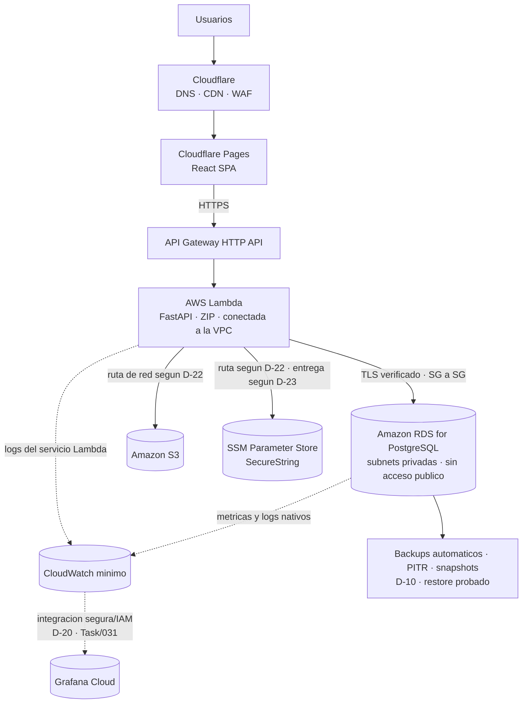
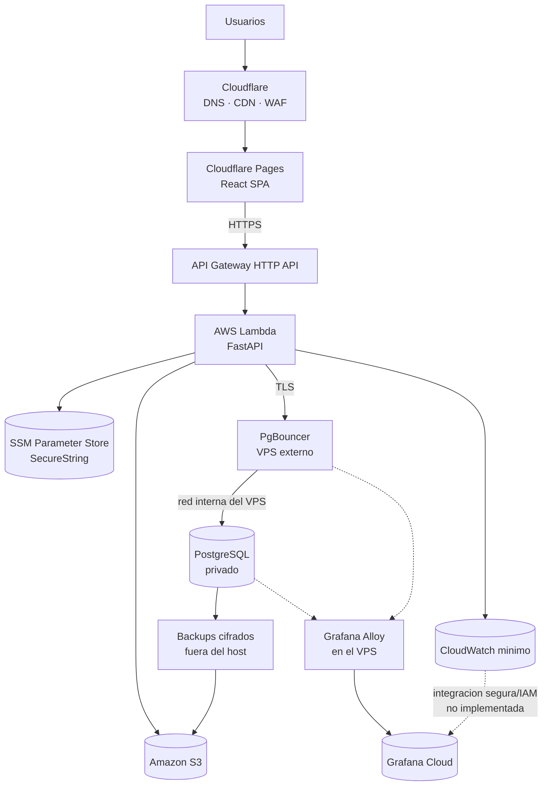

# Arquitectura objetivo de producción

| Campo | Valor |
| --- | --- |
| **Estado** | **Vigente** ✔ — aprobado en `Task/006.2-Formalizar-Arquitectura-Objetivo-Produccion` (2026-08-23). **Enmienda de la capa de datos: Propuesta — pendiente de aprobación** en `Task/028.2-Reconsiderar-PostgreSQL-Produccion-RDS` (2026-09-27) |
| **Fecha** | 2026-08-23 · enmienda propuesta 2026-09-27 |
| **Tipo** | Documento canónico de arquitectura. **Mantenimiento transversal**: no cuenta en las 41 tareas |
| **Qué formaliza** | La contraparte **textual** del diagrama [`images/Infraestructura.png`](../../images/Infraestructura.png), actualizado por el usuario en `main` (commit `d08fe27`). Desde la enmienda propuesta, la imagen y este texto **divergen en la capa de datos** (§2) |
| **Qué NO hace** | **No implementa nada.** 0 recursos AWS, 0 Cloudflare, 0 VPS, 0 Grafana, 0 Terraform nuevo. La enmienda tampoco crea RDS, VPC, endpoints, claves KMS ni secretos |
| **Decisión asociada** | [ADR-008](../adr/ADR-008-observability-grafana-cloud-and-alloy.md) — **Aceptada** ✔ · [ADR-010](../adr/ADR-010-production-postgresql-on-rds.md) — **Propuesta — pendiente de aprobación** |

> **Enmienda propuesta — `Task/028.2`, 2026-09-27, pendiente de aprobación.**
> [ADR-010](../adr/ADR-010-production-postgresql-on-rds.md) propone sustituir el modelo
> PostgreSQL en VPS externo + PgBouncer de [ADR-007](../adr/ADR-007-production-postgresql-on-vps.md)
> por **Amazon RDS for PostgreSQL privado**, con la Lambda conectada a la VPC. Esta enmienda
> reescribe **solo** lo que dependía del VPS: §3, §6, §9, §11, §14, §15 y §17, y las filas
> afectadas de §5, §7, §8, §10, §12, §13, §16 y §18–§26. Cada sección conserva su texto
> anterior en un bloque **«Historia»** plegable o lo cita de forma explícita. El resto del
> documento sigue **Vigente** sin cambios. La enmienda **no es autorización** para crear
> recursos (§24): solo `approved: Task/028.2-Reconsiderar-PostgreSQL-Produccion-RDS` la
> hace vigente, y la instrucción actual del usuario suspende cualquier nueva ejecución del
> modelo VPS. Canónico de la capa de datos propuesta:
> [production-postgresql-rds.md](production-postgresql-rds.md).

> **Vigente** desde el 2026-08-23, al aprobar el usuario `Task/006.2` con la expresión
> exacta requerida por [WORKFLOW.md](../project-management/WORKFLOW.md). Todo lo que este
> documento marca como **decisión cerrada** es de cumplimiento obligatorio. Lo que ya estaba
> **Aceptado** antes —ADR-001 a ADR-007— sigue vigente y **este documento no lo reabre**.
>
> **Vigencia no es autorización.** Este documento describe el objetivo; ejecutarlo requiere
> la tarea propietaria y la autorización explícita del usuario (§24).

Relacionados: [overview.md](overview.md) · [local-to-cloud-mapping.md](local-to-cloud-mapping.md) ·
[production-postgresql-rds.md](production-postgresql-rds.md) (propuesta) ·
[production-postgresql-vps.md](production-postgresql-vps.md) (histórico, reemplazo propuesto) ·
[aws-local-parity.md](aws-local-parity.md) ·
[security-boundaries.md](security-boundaries.md) ·
[open-decisions.md](open-decisions.md)

---

## 1. Propósito

Que la **imagen**, la **documentación**, el **roadmap** y las **decisiones** digan
exactamente lo mismo.

`images/Infraestructura.png` es una **vista humana**: sirve para mirar, no para razonar
sobre ella de forma programática. Este documento es la **fuente textual equivalente**, y
existe para que:

- **Claude Code**, **Codex** u otro agente puedan razonar sobre la arquitectura objetivo
  **sin analizar visualmente la PNG**;
- otro desarrollador entienda hacia dónde evoluciona el proyecto sin reconstruirlo a partir
  de nueve documentos;
- el propio usuario tenga un único sitio donde comprobar qué está cerrado, qué está abierto
  y **quién es el propietario** de cada pieza.

Este documento **no sustituye** a los documentos especializados: los **une**. Cuando haya
detalle, el detalle vive en su documento canónico y aquí solo se enlaza.

**Regla de precedencia.** Si este documento y un documento especializado se contradicen,
manda el especializado —[production-postgresql-rds.md](production-postgresql-rds.md) para la
capa de datos (propuesta; hasta la enmienda era
[production-postgresql-vps.md](production-postgresql-vps.md)),
[aws-local-parity.md](aws-local-parity.md) para el laboratorio de IaC,
[security-boundaries.md](security-boundaries.md) para las comunicaciones permitidas— y **la
contradicción se corrige aquí**, no allí.

---

## 2. Diagrama

Vista visual versionada: [`images/Infraestructura.png`](../../images/Infraestructura.png).

| Campo | Valor |
| --- | --- |
| **Ruta** | `images/Infraestructura.png`, en la raíz de `personal-blog-infra` |
| **Estado** | **Vigente** para el borde, el frontend, la aplicación y la observabilidad central. **Divergente en la capa de datos** desde la enmienda propuesta: muestra el modelo VPS + PgBouncer + Alloy de ADR-007/ADR-008 |
| **Actualizada** | Por el usuario, manualmente, en el commit `d08fe27` sobre `main` |
| **Mantenimiento** | **No se regenera, edita, comprime ni convierte de formato** salvo decisión explícita del usuario |

> **Divergencia declarada — `Task/028.2`, 2026-09-27.** La regla §26.1 exige que imagen y
> texto digan lo mismo y reserva al usuario el cambio de la imagen. Mientras el usuario no
> la actualice, **para la capa de datos mandan este texto, el Mermaid de §3 y
> [production-postgresql-rds.md](production-postgresql-rds.md)**; la imagen conserva la vista
> del modelo VPS. No es una inconsistencia oculta: es una acción pendiente del usuario,
> registrada en el reporte de la tarea.

> **Corrección de un estado documental previo.** Hasta esta tarea, `overview.md` §4 y el
> `README.md` describían la PNG como *«la arquitectura objetivo inicial, anterior a
> `Task/005.3`»* y la conservaban como **registro histórico**. Eso era cierto **hasta** que
> el usuario la actualizó. Desde `d08fe27` la imagen refleja la arquitectura vigente y
> aquellas notas quedaron **obsoletas**; se corrigen en esta tarea.

---

## 3. Arquitectura productiva

> **Enmienda propuesta (ADR-010).** Los diagramas y la tabla de planos de esta sección
> describen la propuesta RDS. Los del modelo VPS se conservan íntegros en el bloque
> «Historia» al final de la sección.

```
USUARIOS
    │
    ▼
CLOUDFLARE
    ├── DNS
    ├── CDN
    └── WAF
         │
         ▼
CLOUDFLARE PAGES
    │
    └── React SPA
         │
         │ HTTPS
         ▼
API GATEWAY HTTP API
         │
         ▼
AWS LAMBDA
FastAPI (ZIP), conectada a la VPC
    │
    ├────────────► Amazon S3                 (ruta de red: D-22)
    │
    ├────────────► SSM Parameter Store SecureString
    │              (entrega a la Lambda: D-23; ruta de red: D-22)
    │
    ├ ─ ─ ─ ─ ─ ─► CloudWatch mínimo         (logs del servicio Lambda)
    │                     │
    │                     └────► Grafana Cloud
    │                            (integración segura/IAM, D-20, Task/031)
    │
    │ TLS con validación de CA y hostname · solo SG → SG
    ▼
AMAZON RDS FOR POSTGRESQL — subnets privadas, sin acceso público
    │
    ├── cifrado en reposo con KMS (D-23)
    ├── backups automáticos · PITR · snapshots (D-10), restore probado
    └── métricas y logs nativos ──► CloudWatch mínimo
```

Equivalente en Mermaid, para lectura en renderizadores que lo soporten:


```mermaid
flowchart TD
    U["Usuarios"] --> CF["Cloudflare<br/>DNS · CDN · WAF"]
    CF --> PAGES["Cloudflare Pages<br/>React SPA"]
    PAGES -->|"HTTPS"| AGW["API Gateway HTTP API"]
    AGW --> LMB["AWS Lambda<br/>FastAPI · ZIP · conectada a la VPC"]
    LMB -->|"TLS verificado · SG a SG"| RDS[("Amazon RDS for PostgreSQL<br/>subnets privadas · sin acceso publico")]
    LMB -->|"ruta de red segun D-22"| S3[("Amazon S3")]
    LMB -->|"ruta segun D-22 · entrega segun D-23"| SSM[("SSM Parameter Store<br/>SecureString")]
    LMB -.->|"logs del servicio Lambda"| CW[("CloudWatch minimo")]
    RDS --> BK["Backups automaticos · PITR · snapshots<br/>D-10 · restore probado"]
    RDS -.->|"metricas y logs nativos"| CW
    CW -.->|"integracion segura/IAM<br/>D-20 · Task/031"| GC[("Grafana Cloud")]
```

Tres proveedores, cuatro planos:

| Plano | Proveedor | Qué contiene |
| --- | --- | --- |
| **Borde y frontend** | **Cloudflare** | DNS, CDN, WAF, Cloudflare Pages |
| **Aplicación y servicios gestionados** | **AWS** | API Gateway HTTP API, Lambda, S3, SSM, CloudWatch, IAM |
| **Capa de datos y su operación** | **AWS** (propuesta ADR-010) | RDS for PostgreSQL privado, VPC/subnets/security groups, KMS, backups/PITR/snapshots |
| **Observabilidad central** | **Grafana Cloud** | Visualización, consulta y alertas |

**Sin NAT Gateway por defecto.** Conectar la Lambda a la VPC **no** exige NAT: NAT solo
resolvería una necesidad **demostrada** de salida IPv4 pública, y el inventario del backend
no encuentra ninguna. S3 y SSM se cubren con rutas específicas (D-22). Ver
[production-postgresql-rds.md](production-postgresql-rds.md) §2.

<details>
<summary>Historia — diagramas del modelo VPS (vigentes del 2026-08-23 hasta la enmienda propuesta)</summary>

```
USUARIOS
    │
    ▼
CLOUDFLARE
    ├── DNS
    ├── CDN
    └── WAF
         │
         ▼
CLOUDFLARE PAGES
    │
    └── React SPA
         │
         │ HTTPS
         ▼
API GATEWAY HTTP API
         │
         ▼
AWS LAMBDA
FastAPI
    │
    ├────────────► Amazon S3
    │
    ├────────────► SSM Parameter Store SecureString
    │
    ├────────────► CloudWatch mínimo
    │                     │
    │                     └────► Grafana Cloud
    │                            (integración segura/IAM, cuando corresponda)
    │
    │ TLS
    ▼
VPS EXTERNO A AWS
    │
    ├── PgBouncer
    │      │
    │      ▼
    │   PostgreSQL
    │
    ├── secretos cifrados
    │
    ├── backups cifrados off-site
    │
    └── Grafana Alloy
             │
             ▼
       Grafana Cloud
```

Equivalente en Mermaid, para lectura en renderizadores que lo soporten:


```mermaid
flowchart TD
    U["Usuarios"] --> CF["Cloudflare<br/>DNS · CDN · WAF"]
    CF --> PAGES["Cloudflare Pages<br/>React SPA"]
    PAGES -->|"HTTPS"| AGW["API Gateway HTTP API"]
    AGW --> LMB["AWS Lambda<br/>FastAPI"]
    LMB --> S3[("Amazon S3")]
    LMB --> SSM[("SSM Parameter Store<br/>SecureString")]
    LMB --> CW[("CloudWatch minimo")]
    LMB -->|"TLS"| PGB["PgBouncer<br/>VPS externo"]
    PGB -->|"red interna del VPS"| PG[("PostgreSQL<br/>privado")]
    PG --> BK["Backups cifrados<br/>fuera del host"]
    BK --> S3
    PG -.-> ALLOY["Grafana Alloy<br/>en el VPS"]
    PGB -.-> ALLOY
    ALLOY --> GC[("Grafana Cloud")]
    CW -.->|"integracion segura/IAM<br/>no implementada"| GC
```

Tres proveedores, cuatro planos:

| Plano | Proveedor | Qué contiene |
| --- | --- | --- |
| **Borde y frontend** | **Cloudflare** | DNS, CDN, WAF, Cloudflare Pages |
| **Aplicación y servicios gestionados** | **AWS** | API Gateway HTTP API, Lambda, S3, SSM, CloudWatch, IAM |
| **Capa de datos y su operación** | **VPS externo** | PgBouncer, PostgreSQL, secretos cifrados, backups, Grafana Alloy |
| **Observabilidad central** | **Grafana Cloud** | Visualización, consulta y alertas |

</details>

---

## 4. Flujo de usuario

1. El visitante resuelve el dominio del blog. **Cloudflare** responde el DNS.
2. La petición del sitio la atiende **Cloudflare Pages**, que sirve los estáticos de la
   **SPA de React** desde el CDN, con TLS gestionado.
3. **WAF y CDN de Cloudflare** son la primera frontera: filtrado y caché antes de que nada
   llegue a AWS.
4. El navegador ejecuta la SPA. **Todo el contenido dinámico llega después**, por llamadas
   al API.

**Consecuencia de diseño:** el sitio **no tiene servidor de frontend permanente**. No hay
proceso que mantener, parchear ni escalar en el lado del sitio público.

---

## 5. Flujo frontend → API

```
React SPA (navegador) ──HTTPS──► API Gateway HTTP API ──► AWS Lambda (FastAPI)
```

- La SPA **nunca** habla con PostgreSQL, con S3 con credenciales, ni con la capa de datos
  —la VPC y RDS en la enmienda propuesta; el VPS en el modelo histórico—. Su **único canal
  de datos** es el API.
- **API Gateway HTTP API** aporta enrutado, TLS gestionado, CORS y *throttling*
  (`Task/033`).
- **AWS Lambda** ejecuta el mismo FastAPI que corre en local, bajo un adaptador fino
  (`Task/023`).
- La URL del API se inyecta en el **build** del frontend como variable de entorno; no está
  quemada en el código.
- La **topología lógica de dominios** —mismo *site* con subdominio de API, o dominios
  separados— y la política de cookies/CORS son **D-15**, y se deciden en `Task/011`. El
  **nombre concreto** del dominio es **D-07**, en `Task/035`.

Restricciones que impone Lambda y que el backend ya respeta desde `Task/005`: sin estado en
memoria entre peticiones, sin procesos de larga duración, límite de duración por invocación
y de tamaño del artefacto.

---

## 6. Flujo Lambda → RDS (propuesta ADR-010)

> Hasta la enmienda propuesta, esta sección se titulaba **«Flujo Lambda → VPS»**; su texto
> se conserva íntegro en el bloque «Historia» siguiente.

```
AWS Lambda (conectada a la VPC) ──TLS verificado · SG → SG──► RDS for PostgreSQL (subnets privadas)
```

| Regla | Detalle |
| --- | --- |
| **RDS nunca es accesible públicamente** | Subnets privadas y sin acceso público. El security group de RDS admite el puerto SQL **solo** desde los security groups autorizados —Lambda y el canal privado de **D-24**—; nunca desde `0.0.0.0/0` ni `::/0` |
| **TLS obligatorio, con validación de CA y *hostname*** | Equivalente a `sslmode=verify-full`; la rotación de la CA de RDS se planifica (**D-23**). Un TLS que no valida no protege frente a un intermediario |
| **Identidades SQL separadas** | El usuario de la aplicación no es el *master* ni el de migraciones. IAM DB authentication es **evaluable, no adoptada** (**D-23**) |
| **La aplicación solo conoce `DATABASE_URL`** | No conoce proveedor, *endpoint* concreto, Docker, Floci, VPC ni RDS Proxy |
| **La Lambda se conecta a la VPC, sin NAT Gateway por defecto** | La conectividad VPC es necesaria para llegar a un RDS privado. **NAT no es consecuencia de RDS**: solo resolvería una salida IPv4 pública demostrada, y exigiría decisión explícita |
| **Una subnet pública no da Internet a la Lambda** | La función no recibe IP pública por estar en una subnet pública |

Detalle completo, incluido el inventario de tráfico de la Lambda y el presupuesto de
conexiones: [production-postgresql-rds.md](production-postgresql-rds.md) §1, §2 y §4.

**Costo técnico asumido:** RDS tiene **costo fijo** aunque la Lambda esté inactiva, y los
*interface endpoints* que se adopten se cobran por AZ y hora (§25). La latencia de conexión
y de consulta `Lambda ↔ RDS` se **mide** con la Lambda real en `Task/032` y bajo carga en
`Task/040` (**R-34**, reformulado).

<details>
<summary>Historia — «Flujo Lambda → VPS», vigente del 2026-08-23 hasta la enmienda propuesta</summary>

```
AWS Lambda ──TLS──► PgBouncer ──red interna del VPS──► PostgreSQL (privado)
```

| Regla | Detalle |
| --- | --- |
| **PgBouncer es el único endpoint de la capa de datos** alcanzable desde fuera del VPS | El SSH administrativo del host es un canal **separado**, ajeno a esta capa |
| **PostgreSQL nunca se expone a Internet** | El *binding* privado y el firewall lo hacen cierto por configuración, no por convención |
| **TLS obligatorio, con validación del certificado del servidor** | Un TLS que no valida no protege frente a un intermediario |
| **SCRAM-SHA-256** preferente | **mTLS** es una mejora evaluable, **no obligatoria todavía** (`Task/029`) |
| **La aplicación solo conoce `DATABASE_URL`** | No conoce proveedor, IP, Docker, Floci ni PgBouncer |
| **La Lambda permanece fuera de VPC** | **No se introduce VPC ni NAT Gateway** solo para llegar al VPS |

Detalle completo, incluido el ciclo de vida del certificado y el dimensionamiento del pool:
[production-postgresql-vps.md](production-postgresql-vps.md) §8, §9 y §10.

**Costo técnico asumido:** la base de datos deja de estar en la misma región que el cómputo
y cada consulta paga el RTT `Lambda ↔ VPS` (**R-34**). Por eso la selección de región de
`Task/029` exige **RTT medido**, no estimado.

</details>

---

## 7. Object storage

| Entorno | Implementación |
| --- | --- |
| **Local** | **MinIO** (API compatible con S3) |
| **Producción** | **Amazon S3** |

- La aplicación **no habla con MinIO ni con S3 directamente**: habla con la interfaz
  **`ObjectStorage`** (`Task/010`), con una implementación por entorno y **pruebas de
  contrato comunes a ambas**.
- El bucket es **privado**. El acceso a archivos usa **URLs prefirmadas** emitidas por el
  backend.
- **La base de datos y el Markdown persisten la clave del objeto (`object_key`), nunca una
  URL prefirmada** — que expira. La URL se genera en el momento de servir.
- Cómo se sirven los medios **públicos** desde un bucket **privado**, y qué URL usa
  `og:image`, es **D-08**, que resuelve `Task/030`.
- **Enmienda propuesta (ADR-010): S3 desde una Lambda en VPC.** `PutObject`, `GetObject`,
  `HeadObject`, `DeleteObject` y la sonda `ListObjectsV2` de `/ready` necesitan una ruta de
  red desde la VPC; **firmar** una URL prefirmada es un cálculo local. La ruta candidata es
  un *gateway endpoint* de S3 (**D-22**). Una política de bucket que exija
  `aws:SourceVpce` **no debe romper** las URLs prefirmadas que usa el navegador desde
  Internet: se valida junto a **D-08** en `Task/030` y con la Lambda real en `Task/032`.

**MinIO no es una tecnología de producción.** Su papel es exclusivamente local y de
paridad por interfaz.

---

## 8. Secretos de Lambda

**Decisión cerrada: SSM Parameter Store, tipo `SecureString`.**

| Qué | Dónde vive |
| --- | --- |
| **Secretos** que necesita la Lambda —`DATABASE_URL`, credenciales, claves de firma— | **SSM Parameter Store `SecureString`** |
| **Configuración no secreta** —nombres, *endpoints* públicos, banderas, niveles de log— | Variables de entorno de la Lambda |

Reglas:

- **Ningún secreto real se versiona**, en ningún repositorio.
- La Lambda lee SSM con **permisos mínimos**, acotados a los parámetros que necesita.
- El código de aplicación **lee variables de entorno**: quién las provee le es indiferente.
  Esa indiferencia es lo que permite que local, laboratorio y producción compartan código.
- En el **laboratorio AWS local (Floci)**, `SecureString` **no cifra**: por eso está
  prohibido poner allí un secreto real (regla S-07 de
  [security-boundaries.md](security-boundaries.md) §8.1).

Propietario de la materialización: `Task/031` (parámetros y permisos) y `Task/032`
(*wiring* de la Lambda).

**Enmienda propuesta (ADR-010).** La decisión SSM `SecureString` **no cambia**: sigue
siendo la base. Lo que se añade:

- La credencial SQL de la **aplicación** es un secreto de Lambda más. La credencial
  ***master*** de RDS **nunca** llega al runtime de la aplicación.
- **D-23** compara **Secrets Manager** por rotación, integración con RDS/RDS Proxy y
  precio. **No se adopta por inercia**, y no sustituye a SSM sin decisión explícita.
- **Cómo llega el secreto a la Lambda** —resuelto en el despliegue o leído en *runtime*
  con su ruta de red y caché— es parte de **D-23**. Hoy el backend **no tiene lector de
  SSM**: si D-23 exige lectura en *runtime*, `personal-blog-backend` participa en
  `Task/032`. Si se resuelve en el despliegue, el valor no puede quedar en claro en
  *outputs*, planes publicados ni logs, y la custodia del *state* debe estar definida:
  `sensitive` no lo elimina del *state*.
- Descifrar un `SecureString` lo hace SSM con KMS; eso exige **autorización** KMS
  adecuada, no una ruta de red de la Lambda hacia KMS.

---

## 9. Credenciales de la base de datos (propuesta ADR-010)

> Hasta la enmienda propuesta, esta sección era **«Secretos del VPS»**. Sin host propio no
> hay secretos de host: **D-17** tiene **cierre por no aplicabilidad propuesto**, efectivo
> solo al aprobar `Task/028.2`. Su texto se conserva en el bloque «Historia» siguiente.

La obligación de fondo **no desaparece**: cambia de plano.

| Regla | Detalle |
| --- | --- |
| **Ningún secreto se versiona en claro.** Nunca | Ni en Git, ni en `.tfvars`, ni en *outputs*, planes publicados o logs |
| **Credenciales separadas por función** | *Master* de RDS, usuario de la aplicación, usuario de migraciones y acceso administrativo son identidades distintas (**D-23**, **D-24**) |
| **La *master* no vive en el runtime** | Se custodia fuera de la aplicación; su generación y carga privada se deciden en `Task/029` y se ejecutan en `Task/031` |
| **Cifrado con KMS** | Dos usos distintos: cifrado de la instancia, backups y snapshots, y descifrado de los secretos de la Lambda. La clave de la instancia se elige **antes** de crearla: cambiarla no es un cambio *in-place* (**D-23**) |
| **El *state* de Terraform tiene custodia** | Si un valor secreto puede entrar en el *state*, su acceso y custodia se definen **antes** del `apply` |

- **Decisión abierta:** **D-23** — TLS, KMS, almacenamiento y rotación de credenciales y
  autenticación SQL. **Owner: `Task/029`**; implementa `Task/031`/`Task/032`.
- **Riesgo asociado:** **R-40**, reformulado de «secretos del host» a credenciales de
  base de datos, KMS y SSM.
- **Los respaldos locales (R-12)** no quedan cubiertos por este cierre: siguen sin cifrar
  en la máquina local; ver §15.

<details>
<summary>Historia — «Secretos del VPS», vigente del 2026-08-23 hasta la enmienda propuesta</summary>

**Decisión cerrada:** el VPS usa **secretos cifrados**, con la **clave fuera del
repositorio** y **descifrado local seguro** en el momento del despliegue o de la ejecución,
según corresponda.

Lo que esa decisión fija, y es lo que importa:

| Regla |
| --- |
| **Ningún secreto del VPS se versiona en claro.** Nunca |
| **La clave de descifrado no vive en el repositorio** |
| El material cifrado **sí puede versionarse**; su seguridad depende de la clave, no de ocultarlo |
| El descifrado ocurre **en el host**, en el momento de usarlo |
| **SSM no sustituye a este mecanismo, ni al revés**: SSM sirve a la Lambda; este mecanismo sirve al VPS. Son dos planos distintos, con dos superficies distintas |

**Lo que NO está decidido: la herramienta.** **SOPS + age** es el **candidato técnico
actual** y el más probable, pero **no se declara todavía tecnología irreversible**: nadie
la ha validado en este proyecto. Elegirla ahora, sin haber provisionado el host ni conocido
su distribución, sería inventar la decisión.

- **Decisión abierta:** **D-17** — herramienta concreta de gestión de secretos cifrados del
  VPS. **Owner: `Task/029`.**
- **Riesgo asociado:** **R-40**.

</details>

---

## 10. Observabilidad AWS — CloudWatch mínimo

**CloudWatch no desaparece.** Sigue siendo la observabilidad **nativa** de AWS y el
diagnóstico de primera línea de la Lambda y de API Gateway.

Qué significa **«mínimo»**:

| Se mantiene | Se evita |
| --- | --- |
| Logs nativos de la Lambda y de API Gateway | Retención larga o indefinida |
| Métricas nativas de AWS (invocaciones, errores, duración, *throttles*) | Métricas personalizadas caras sin necesidad demostrada |
| Errores de Lambda y de API Gateway | *Dashboards* elaborados dentro de CloudWatch |
| Alarmas **mínimas**, las imprescindibles | Funcionalidades avanzadas que no se han justificado |
| Diagnóstico operativo básico cuando algo falla en AWS | Duplicar en CloudWatch lo que ya se verá en Grafana Cloud |

Reglas:

- **Retención corta y explícita**, nunca infinita. La cifra exacta es **D-11**, en
  `Task/031`.
- **CloudWatch no observa el VPS.** Un host externo no aparece en CloudWatch por defecto, y
  el proyecto **no adopta CloudWatch Agent por omisión** en el VPS: eso tendría costo,
  superficie y credenciales propias. *(Regla del modelo VPS. Con la enmienda propuesta la
  capa de datos vive en AWS: RDS publica sus **métricas nativas** en CloudWatch y exporta los
  **logs que se seleccionen** (§11). Enhanced Monitoring y Database Insights solo se adoptan
  con utilidad y costo justificados.)*
- **Costo bajo control**: la ingesta y la retención de logs son la vía habitual por la que
  CloudWatch se vuelve caro (`Task/041`).

Propietario: `Task/031-Desplegar-SSM-y-CloudWatch` — **solo AWS**. *(Enmienda propuesta:
la tarea conserva el ID y pasa a llamarse `Task/031-Desplegar-Red-RDS-SSM-y-CloudWatch`.
Fija la política de retención **D-11** y crea las señales de RDS; `Task/032` y `Task/033`
aplican esa misma política a la Lambda y a API Gateway cuando existen.)*

---

## 11. Telemetría de la base de datos (propuesta ADR-010)

> Hasta la enmienda propuesta, esta sección era **«Observabilidad del VPS — Grafana
> Alloy»**. En RDS no se instala ningún agente: AWS opera el host. La decisión **K**
> (Alloy) y el riesgo **R-41** pierden objeto; su **cierre** es una propuesta, no un hecho.
> El texto anterior se conserva en el bloque «Historia» siguiente.

**Ninguna señal del *baseline* anterior desaparece sin sustituto.** Cada una pasa a una
fuente nativa de AWS. Los umbrales concretos **no** se fijan aquí: los decide `Task/031`
con **D-11**.

| Señal del *baseline* VPS | Equivalente propuesto en RDS |
| --- | --- |
| *Uptime* del host | Disponibilidad y **eventos** de la instancia RDS (reinicios, *failover* si Multi-AZ, mantenimiento) |
| CPU · RAM | Métricas nativas de CPU y memoria libre; créditos de *burst* si la clase es *burstable* |
| Espacio en disco (**R-32**) | Almacenamiento libre, IOPS y *throughput*; crecimiento acotado según **D-22** |
| Estado de PostgreSQL | Conexiones activas, latencia, errores y logs de PostgreSQL seleccionados |
| Estado de PgBouncer | **Sin objeto**, salvo que **D-12** adopte RDS Proxy: entonces, sus métricas propias |
| Fallo del backup | Eventos de backup de RDS y verificación periódica del **restore** (§15) |
| Caducidad del certificado | Calendario de **rotación de la CA** de RDS y confianza del cliente (**D-23**) |

- **Propietario:** `Task/031` crea las señales de RDS y sus alarmas; `Task/032` y `Task/033`
  añaden las de Lambda y API Gateway; `Task/040` verifica que **operan de verdad** —alarmas
  disparadas en una prueba segura—, no que están configuradas.
- **Sigue vigente:** no autohospedar Grafana, Prometheus ni Loki en ninguna parte (§24).

<details>
<summary>Historia — «Observabilidad del VPS — Grafana Alloy», vigente del 2026-08-23 hasta la enmienda propuesta</summary>

**Decisión cerrada: el agente de observabilidad del VPS es Grafana Alloy**, y su destino es
**Grafana Cloud**.

Responsabilidad de Alloy:

- recolectar **logs**, **métricas** y **telemetría** del host y de sus servicios;
- enviarlos a **Grafana Cloud**.

Qué debe cubrir como mínimo —es el *baseline* que `Task/029` ya tenía asignado y que ahora
tiene herramienta—:

`uptime` del host · **CPU** · **RAM** · **espacio en disco** (**R-32**) · estado de
**PostgreSQL** · estado de **PgBouncer** · **fallo del backup** · **caducidad del
certificado** de PgBouncer.

**Lo que explícitamente NO se hace:**

> **No se autohospedan Grafana, Prometheus ni Loki en el VPS** como *stack* completo.

Motivo: la RAM, la CPU y el disco del VPS se reservan **principalmente para PostgreSQL**.
Un *stack* de observabilidad completo en la misma máquina compite por los mismos recursos
con el componente cuyo fallo deja el blog sin contenido — y, además, se cae justo cuando
más falta hace: al caer el host que debía vigilar.

- **Riesgo asociado:** **R-41** (Alloy compite por recursos con PostgreSQL).
- **Propietario:** `Task/029` lo configura; `Task/040` verifica que **opera de verdad**, no
  que está instalado.

</details>

---

## 12. Grafana Cloud — plano central de observabilidad

**Decisión cerrada:** **Grafana Cloud** es el **plano central de visualización, consulta y
alertas** del proyecto.

| Aspecto | Definición |
| --- | --- |
| **Qué es** | El sitio donde se **mira** la telemetría, se **consulta** y se **alerta** |
| **Qué recibe en el diseño actual** | Lo que envía **Grafana Alloy** desde el VPS. *(Enmienda propuesta: sin agente de host, recibe lo que llegue desde **CloudWatch** por la integración **D-20** —señales de RDS, Lambda y API Gateway—.)* |
| **Qué recibirá** | Además, lo que llegue desde **CloudWatch** por una integración segura (§13). *(Con la enmienda, esa integración pasa a ser su **única** fuente de datos de producción.)* |
| **Qué NO es** | **No es el único destino de telemetría**, y **no reemplaza a CloudWatch** |

### Sobre el tier gratuito

**Objetivo inicial: el tier gratuito, si sigue siendo suficiente.**

> **«Grafana Cloud Free» es una preferencia presupuestaria, no una dependencia
> arquitectónica rígida.**

Consecuencias explícitas de esa frase:

- Si el tier gratuito deja de ser suficiente o cambia, **la arquitectura no se rompe**: se
  decide pagar, ajustar el volumen de telemetría o cambiar de destino. Lo que **no** puede
  ocurrir es que el diseño dependa de un límite comercial ajeno.
- **No se persisten aquí límites, cuotas ni precios concretos.** Cualquier cifra comercial
  que se documente en el futuro debe marcarse **«verificar en `Task/041` / antes de
  contratar»**. Las condiciones de un tier gratuito **no son una garantía eterna**.
- **Decisión abierta:** **D-19** — plan, límites y costo reales de Grafana Cloud. **Owner:
  `Task/041`**, con aporte de `Task/027` (presupuesto). *(Enmienda propuesta: Grafana
  empieza a usarse con **D-20** en `Task/031`, no en `Task/029`. Por la regla «verificar
  antes de contratar», `Task/031` verifica plan y límites antes de integrar; `Task/029` lo
  incluye en la estimación de costo frente a **D-13**; `Task/041` sigue revisándolo.)*
- **Riesgo asociado:** **R-38** (dependencia de un tier gratuito de terceros).

### Sobre lo que se envía

Enviar telemetría a un tercero es **exportar datos fuera del proyecto**. Regla vigente:
los logs y las métricas **no contienen contraseñas, tokens, cadenas de conexión ni datos
personales innecesarios** (**O-08**). Aplicada a Alloy, significa que **qué se recolecta es
parte del diseño**, no un detalle de configuración (**R-39**). *(Con la enmienda propuesta,
la misma regla se aplica a la integración **D-20** y a los logs de PostgreSQL que se exporten:
ni consultas con datos sensibles ni *payloads* con secretos.)*

---

## 13. Integración CloudWatch → Grafana Cloud

La arquitectura **contempla** que Grafana Cloud consulte o reciba lo que hay en CloudWatch,
mediante **el mecanismo seguro/IAM que corresponda**.

| Punto | Estado |
| --- | --- |
| **Que exista la integración** | **Contemplado en la arquitectura objetivo** |
| **Con qué mecanismo concreto** —rol IAM asumible, credencial acotada, *push* desde AWS— | **No decidido** |
| **Cuándo se implementa** | **No ahora.** Ninguna tarea en curso lo toca. *(Enmienda propuesta: `Task/031` la **decide e implementa**, porque sin agente de host es la única vía de datos hacia Grafana Cloud)* |

- **Decisión abierta:** **D-20** — mecanismo concreto de integración `CloudWatch → Grafana
  Cloud` y su modelo de permisos. **Owner: `Task/031`** (decide y prepara la base AWS);
  **`Task/040`** valida que funciona. *(Enmienda propuesta: `Task/031` también la
  **implementa**. Si el costo o el mecanismo no encajan, se resuelve con una decisión
  explícita antes de integrar, sin fingir evidencia.)*
- **Restricción de seguridad, ya heredada:** permisos **mínimos**, de **solo lectura** sobre
  lo estrictamente necesario, y **ninguna credencial de larga vida versionada**. Este
  problema es de la **misma familia** que **D-16** (identidad del VPS hacia AWS) y debe
  resolverse con el mismo criterio, **sin fusionarse con ella**: son dos principals
  distintos, con dos superficies distintas. *(D-16 tiene cierre por no aplicabilidad
  propuesto; el criterio de principal dedicado, mínimo y de solo lectura sigue vigente.
  Grafana nunca recibe acceso SQL, permisos de despliegue ni permisos Terraform.)*

---

## 14. PostgreSQL y conexiones (propuesta ADR-010)

> Hasta la enmienda propuesta, esta sección era **«PostgreSQL y PgBouncer»**; su texto se
> conserva en el bloque «Historia» siguiente.

| Elemento | Propuesta |
| --- | --- |
| **Motor** | **PostgreSQL**, el mismo que en local. La compatibilidad de versión, extensiones y privilegios de las migraciones Alembic se revisa en `Task/029` |
| **Modelo** | **Amazon RDS for PostgreSQL**, administrado y **privado** |
| **Entrada** | *Endpoint* privado de RDS, alcanzable solo desde los security groups autorizados. **RDS Proxy: evaluable, no adoptado** (**D-12**) |
| **Exposición** | **PostgreSQL nunca se publica en Internet** |
| **Autenticación** | Usuario SQL de la aplicación con TLS verificado; *master* fuera del runtime; IAM DB authentication evaluable (**D-23**) |
| **Contrato con la aplicación** | Únicamente **`DATABASE_URL`** |
| **Disponibilidad** | **Single-AZ o Multi-AZ se decide en D-22** según RPO/RTO y costo. Single-AZ conserva riesgo de interrupción (**R-29**); Multi-AZ **no** sustituye al backup ni al PITR |

**Por qué las conexiones siguen siendo el riesgo principal:** cada entorno de ejecución de
Lambda puede conservar su propio *engine* y su pool (hoy, en local, 5 + 5 de *overflow* por
proceso). La concurrencia multiplica esas conexiones y puede agotar `max_connections`
(**R-03**, **R-33**). La mitigación se **deriva** —pool por proceso, *Reserved
Concurrency*, *timeouts*, reciclado y reserva para migraciones, administración y
sondas—, y **los números salen de medición, no de intuición**: `Task/029` deriva el
presupuesto preliminar, `Task/032` lo mide y lo aplica, `Task/040` prueba saturación y
recuperación. **RDS Proxy** solo entra con evidencia de carga, *session pinning*,
autenticación y precio. **No se instala PgBouncer por inercia.**

**Sigue abierto** y pertenece a `Task/029`: región, versión, clase, almacenamiento y
disponibilidad (**D-22**); TLS, KMS y credenciales (**D-23**); canal privado de
administración y migraciones (**D-24**); backups y recuperación (**D-10**); presupuesto
preliminar de conexiones (**D-12**).

Documento canónico propuesto: [production-postgresql-rds.md](production-postgresql-rds.md) ·
[ADR-010](../adr/ADR-010-production-postgresql-on-rds.md) — **Propuesta**.

<details>
<summary>Historia — «PostgreSQL y PgBouncer», vigente del 2026-08-23 hasta la enmienda propuesta</summary>

| Elemento | Decisión |
| --- | --- |
| **Motor** | **PostgreSQL**, el mismo que en local |
| **Modelo** | **Autogestionado en un VPS externo a AWS**. **No RDS**, no servicio administrado |
| **Entrada** | **PgBouncer**, único endpoint de la capa de datos alcanzable desde fuera |
| **Exposición** | **PostgreSQL nunca se publica en Internet** |
| **Autenticación** | **SCRAM-SHA-256** preferente; **mTLS** opcional, no obligatorio todavía |
| **Contrato con la aplicación** | Únicamente **`DATABASE_URL`** |
| **Disponibilidad** | **Un solo VPS = SPOF aceptado conscientemente**. No se introduce alta disponibilidad |

**Por qué PgBouncer no es opcional:** Lambda abre conexiones efímeras y numerosas; una
ráfaga de concurrencia agotaría `max_connections` de una máquina económica (**R-03**,
**R-33**). La mitigación es **PgBouncer con pool limitado** más ***Reserved Concurrency***
de Lambda aguas arriba, y **los tres números salen de pruebas, no de intuición**
(`Task/029` los deriva, `Task/032` los aplica).

**Sigue abierto** y pertenece a `Task/029`: proveedor, región, tamaño, versión de
PostgreSQL, `pool_mode`, tamaños de pool, `max_connections` y la adopción o no de mTLS
(**D-01**, en su parte de proveedor).

Documento canónico: [production-postgresql-vps.md](production-postgresql-vps.md) ·
[ADR-007](../adr/ADR-007-production-postgresql-on-vps.md) — **Aceptada**.

</details>

---

## 15. Backups y restore

> **Enmienda propuesta (ADR-010).** La regla de fondo —**un backup que nunca se ha
> restaurado no cuenta como backup**— **no cambia**. Cambia el mecanismo:

| Regla | Propuesta RDS |
| --- | --- |
| **Backups automáticos con retención no nula, PITR y snapshots** | Frecuencia, retención, RPO y RTO: **D-10**, `Task/029` |
| **Cifrados** | Con la clave KMS de la instancia (**D-23**) |
| **El restore debe probarse** | **PITR restaura a una instancia nueva**: *endpoint*, security groups, *parameter group* y KMS se revisan en cada restore (**R-31**) |
| **Protección frente al borrado** | *Deletion protection*, snapshot final y ningún `destroy` automático contra la base real |
| **Pérdida de cuenta o región** | Copia cruzada de snapshots solo si **D-10** la justifica por riesgo y costo |

| Tramo | Owner propuesto |
| --- | --- |
| Estrategia: retención, PITR, snapshots, RPO/RTO, *deletion protection* | **`Task/029`** (**D-10**) |
| Provisión y **restore sintético + PITR demostrados**, con integridad y tiempos | **`Task/031`** |
| Backup previo a las primeras migraciones y su recuperación | **`Task/036`** |
| **Backup reciente y restore vigente**, con el esquema real, en destino aislado | **`Task/040`** |

Los backups administrados **no usan** un bucket del proyecto ni una identidad de host: el
tramo «destino S3 de backups» de `Task/030` y **D-16** pierden objeto (cierre por no
aplicabilidad propuesto). Los **respaldos locales** de `Task/004` (**R-12**) son otro asunto:
siguen sin cifrar en la máquina local; `Task/029` prepara su contrato de custodia y
`Task/031` su revisión.

<details>
<summary>Historia — backups off-host del modelo VPS, vigentes del 2026-08-23 hasta la enmienda propuesta</summary>

**Decisión cerrada:** los backups de PostgreSQL son **cifrados** y **salen del VPS**.

```
PostgreSQL (VPS) ──dump + cifrado──► destino off-site (candidato natural: Amazon S3)
```

| Regla | Por qué |
| --- | --- |
| **El backup debe salir del host** | Una copia que solo vive en el VPS **no protege de perder el VPS**. Un backup dentro del mismo VPS **no satisface el requisito** |
| **El backup va cifrado** | Sale del perímetro del proyecto hacia almacenamiento de terceros |
| **El restore debe probarse** | **Un backup que nunca se ha restaurado no cuenta como backup** (**R-31**) |
| **Retención y *lifecycle* explícitos** | Sin retención definida, el costo crece en silencio |
| **Credencial de mínimo privilegio** | Escritura sobre un **prefijo concreto**; sin lectura ni borrado del resto (regla V-12) |

**Ownership — un solo propietario por tramo, sin duplicar:**

| Tramo | Owner |
| --- | --- |
| Mecanismo, cifrado, retención, RPO/RTO y **restore demostrado** off-host | **`Task/029`** |
| **Destino S3**, política del bucket, permisos, *lifecycle* y retención definitiva | **`Task/030`** |
| **Identidad** con la que el VPS escribe en S3 (**D-16**) | **`Task/029`** decide · **`Task/030`** materializa |
| **Backup reciente y restore vigente** verificados antes del lanzamiento | **`Task/040`** |

**PITR** y *WAL archiving* quedan como evaluación futura, **nunca por delante** de tener un
backup correcto y un restore probado.

</details>

---

## 16. Terraform

**Terraform sigue siendo la fuente de verdad de la infraestructura declarativa.**

| Alcance | Estado |
| --- | --- |
| **AWS** | Gestionado por Terraform |
| **Cloudflare** | Gestionado por Terraform |
| **Creación del VPS** | **Puede** gestionarla, **si** el proveedor elegido en `Task/029` tiene un provider mantenido y adecuado. No se da por hecho. *(Sin objeto con la enmienda propuesta)* |
| **Configuración interna del sistema operativo del VPS** | **No.** Ver §17. *(Sin objeto con la enmienda propuesta)* |
| **Red y RDS** *(enmienda propuesta)* | **Gestionados por Terraform** desde `Task/031`, en el **mismo grafo modular**: sin módulos local/cloud duplicados ni recursos específicos del emulador. Parámetros de la instancia en su *parameter group*, también en Terraform |

Reglas heredadas y vigentes:

- **Una sola definición, un solo grafo de recursos.** Local (Floci) y AWS real son dos
  **destinos** de la misma definición, no dos infraestructuras
  ([aws-local-parity.md](aws-local-parity.md) §4).
- **Ningún recurso Terraform específico del emulador.**
- **Guardas *fail-closed*** antes de cualquier `apply` o `destroy`: un comando pensado para
  el laboratorio **no puede acabar hablando con AWS real**.
- **Ninguna automatización ejecuta `terraform destroy` contra infraestructura real** — AWS,
  Cloudflare ni VPS. Contra el emulador **efímero** de un job de CI sí es legítimo.
- **D-06 Resuelta y Vigente desde Task/025**: S3 privado con lock nativo, sin
  DynamoDB. Task/030 materializa el bucket y migra el estado bootstrap OIDC;
  EX-028-C7 permite temporalmente estado local protegido solo para ese root.
  **EX-028-C7 no se extiende a RDS ni a ningún recurso de aplicación**: su custodia quedó
  cerrada en `Task/028`, su **extinción** es de `Task/030`, y el backend de estado aprobado
  existe **antes** del primer `apply` de aplicación, incluido el de red/RDS de `Task/031`.
- Credenciales, rotación, *scopes* y guardas de destino **para los tres providers** son de
  `Task/039`. **`Task/028` solo resuelve GitHub Actions → AWS.** *(Con la enmienda
  propuesta los providers son **dos**, AWS y Cloudflare. `Task/031` se aplica con una
  identidad operativa humana, mínima y autorizada explícitamente; no espera al rol de CI
  de `Task/039` ni amplía el rol de validación de `Task/028`.)*

---

## 17. Operación administrada de RDS (propuesta ADR-010)

> Hasta la enmienda propuesta, esta sección era **«Configuración interna del VPS»**. En RDS,
> AWS opera el sistema operativo del host y su parcheo: **D-18** tiene **cierre por no
> aplicabilidad propuesto**. El texto anterior se conserva en el bloque «Historia».

Delegar el host **no** delega la responsabilidad de operar la base de datos. El proyecto
conserva:

versión mayor y menor · **ventana de mantenimiento** y actualizaciones menores ·
***parameter group***, incluido el TLS obligatorio · capacidad y almacenamiento ·
usuarios y privilegios SQL · **KMS** · *deletion protection* y snapshot final ·
**restore** y **DR** · canal privado de administración (**D-24**).

- **Decide:** `Task/029` (**D-22**, **D-23**, **D-24**, **D-10**). **Implementa y deja
  runbooks y guardas:** `Task/031`. **Automatiza el plan:** `Task/039`. **Verifica:**
  `Task/040`.
- **Riesgo asociado:** **R-42**, reformulado: el *drift* ya no es del sistema operativo,
  sino de *parameter groups*, security groups y recursos administrados. Se detecta con
  Terraform y revisión de planes.

<details>
<summary>Historia — «Configuración interna del VPS», vigente del 2026-08-23 hasta la enmienda propuesta</summary>

**Decisión cerrada:** la configuración interna del sistema operativo del VPS **está
separada de Terraform**.

> **Terraform no debe convertirse en la herramienta principal para configurar Linux.**
> Terraform provisiona el recurso; lo que ocurre **dentro** del host es otro problema, con
> otro ciclo de vida y otra idempotencia.

**Candidatos** —ninguno elegido—: **Ansible**, **cloud-init**, **scripts idempotentes**.

Lo que ese mecanismo deberá cubrir, sea cual sea:

usuarios · **firewall** · **TLS** y ciclo de vida del certificado · **PostgreSQL** ·
**PgBouncer** · **Grafana Alloy** · **secretos** (§9) · **backups** · ***hardening*** y
parcheo.

- **Decisión abierta:** **D-18** — mecanismo concreto de configuración interna del VPS.
  **Owner: `Task/029`.**
- **Riesgo asociado:** **R-42** (*drift* de configuración del host, que Terraform no ve).

</details>

---

## 18. Papel de Docker

Esta sección existe porque **la imagen de producción no muestra Docker**, y esa ausencia se
malinterpreta con facilidad.

> **Docker SÍ se utiliza en este proyecto.** Lo que no es, es un **runtime obligatorio de
> producción**.

### 18.1 Dónde vive Docker

| Rol | Estado |
| --- | --- |
| **Desarrollo local** | **Sí.** Es el entorno normal de trabajo |
| **Integración local** | **Sí.** Es el alcance de `Task/007` |
| **Build y test reproducibles** | **Sí.** Incluida la compatibilidad Linux/Lambda cuando haga falta |
| **Laboratorio AWS local (Floci)** | **Sí**, y con privilegio de nivel host (C-12) |
| **Runtime de producción** | **No.** Producción **no depende de Docker** |

Objetivo del entorno local con **Docker Compose**, según el alcance canónico de `Task/007`:

```
Docker Compose
    ├── frontend
    ├── backend
    ├── PostgreSQL
    ├── MinIO
    ├── reverse proxy (Traefik v3)
    └── Portainer
```

### 18.2 Correspondencia local → producción

| Local | Producción |
| --- | --- |
| **React** servido tras el proxy local | **Cloudflare Pages** |
| **FastAPI** como proceso o contenedor | **AWS Lambda** |
| **MinIO** | **Amazon S3** |
| **PostgreSQL** en Docker | **PostgreSQL en el VPS**, tras PgBouncer. *(Enmienda propuesta: **Amazon RDS for PostgreSQL privado**)* |
| **Reverse proxy** (Traefik v3) | **Cloudflare + API Gateway** |
| **Portainer** | **Nada.** Herramienta local; **no es un servicio público de producción** |

### 18.3 Qué NO implica

- Que el backend se despliegue como **imagen de contenedor**: **no**. El empaquetado de
  Lambda es **ZIP** (§20, decisión **C**), y **ECR sigue excluido** por
  [ADR-003](../adr/ADR-003-serverless-low-cost-cloud.md).
- Que Docker en el VPS sea obligatorio: **el VPS puede usarlo o no**; si lo usa, será con el
  **mínimo privilegio razonable** (regla V-10). Esa elección es de `Task/029` y no cambia
  esta arquitectura. *(Sin objeto con la enmienda propuesta: RDS no tiene host propio.)*
- Que PostgreSQL en Docker **pruebe** el comportamiento de RDS: valida SQL y lógica de la
  aplicación, **no** red, IAM, KMS, backups administrados ni *failover*.
- Que Portainer llegue a producción: **excluido explícitamente**.

---

## 19. Diferencias local vs producción

| Responsabilidad | Local | Producción |
| --- | --- | --- |
| Frontend | React + Vite tras el proxy | **Cloudflare Pages** |
| Entrada HTTP | **Traefik v3** | **Cloudflare** + **API Gateway HTTP API** |
| Backend | FastAPI (proceso o contenedor) | **AWS Lambda** |
| Base de datos | PostgreSQL en Docker | **Amazon RDS for PostgreSQL privado** *(propuesta; antes: PostgreSQL en VPS tras PgBouncer)* |
| Red | Red de Docker local | **VPC, subnets privadas, security groups** y rutas a S3/SSM según **D-22** *(propuesta)* |
| Pool de conexiones | Pool de SQLAlchemy por proceso | Pool por proceso con presupuesto derivado y medido (**D-12**); **RDS Proxy evaluable** *(propuesta; antes: PgBouncer)* |
| Archivos | **MinIO** | **Amazon S3** |
| Configuración | `.env` (ignorado por Git) | **SSM Parameter Store**; `SecureString` para lo sensible |
| Credenciales de la base de datos | `.env` local, valores ficticios | Credencial de la aplicación como secreto de Lambda; *master* fuera del runtime (§9, **D-23**) *(propuesta; antes: secretos cifrados en el VPS)* |
| Logs y métricas | `stdout` capturado por Docker, visible en Portainer | **CloudWatch mínimo** —Lambda, API Gateway y RDS— + **Grafana Cloud** vía **D-20** *(propuesta; antes: Alloy desde el VPS)* |
| Supervisión | **Portainer** | **Grafana Cloud**. Portainer **no existe** en producción |
| Backups | Scripts locales (`Task/004`) | **Backups administrados de RDS, PITR y snapshots, con restore probado** (§15) *(propuesta; antes: cifrados y fuera del host)* |
| Ejecución | Docker Compose | **Serverless** + **RDS administrado**, con costo fijo *(propuesta; antes: un VPS acotado a la capa de datos)* |
| Infraestructura | Docker Compose | **Terraform** (AWS + Cloudflare) *(antes: y el VPS si procede)* |
| TLS | No hay TLS real | **HTTPS en todo el camino público** y **TLS verificado en `Lambda → RDS`** *(propuesta; antes: `Lambda → PgBouncer`)* |

Correspondencia detallada, incluida la columna del laboratorio de paridad:
[local-to-cloud-mapping.md](local-to-cloud-mapping.md).

---

## 20. Seguridad y trust boundaries

Componentes y reglas completas: [security-boundaries.md](security-boundaries.md). Aquí, la
lectura de conjunto.

Propuesta ADR-010:

```
┌─ INTERNET ─────────────────────────────────────────────────────────────┐
│  Navegador público / administrativo — confianza: NINGUNA               │
└──────────┬─────────────────────────────────────────────────────────────┘
           │ HTTPS
┌──────────▼─ BORDE (Cloudflare) ────────────────────────────────────────┐
│  DNS · CDN · WAF · Pages. Sirve código público: nada es secreto aquí   │
└──────────┬─────────────────────────────────────────────────────────────┘
           │ HTTPS
┌──────────▼─ AWS ───────────────────────────────────────────────────────┐
│  API Gateway → Lambda (única frontera que decide autorización)          │
│  S3 privado · SSM SecureString · CloudWatch · IAM de permisos mínimos   │
│      │ TLS verificado · solo SG → SG                                    │
│  ┌───▼─ VPC · subnets privadas ─────────────────────────────────────┐   │
│  │  RDS for PostgreSQL ← nunca público                               │   │
│  │  backups y snapshots cifrados (KMS)                               │   │
│  │  canal privado de administración y migraciones (D-24)             │   │
│  └───────────────────────────────────────────────────────────────────┘   │
└──────────┬─────────────────────────────────────────────────────────────┘
           │ integración segura/IAM de solo lectura (D-20)
┌──────────▼─ GRAFANA CLOUD (tercero) ───────────────────────────────────┐
│  Visualización, consulta y alertas. Recibe datos que SALEN del proyecto │
└────────────────────────────────────────────────────────────────────────┘
```

<details>
<summary>Historia — fronteras del modelo VPS, vigentes del 2026-08-23 hasta la enmienda propuesta</summary>

```
┌─ INTERNET ─────────────────────────────────────────────────────────────┐
│  Navegador público / administrativo — confianza: NINGUNA               │
└──────────┬─────────────────────────────────────────────────────────────┘
           │ HTTPS
┌──────────▼─ BORDE (Cloudflare) ────────────────────────────────────────┐
│  DNS · CDN · WAF · Pages. Sirve código público: nada es secreto aquí   │
└──────────┬─────────────────────────────────────────────────────────────┘
           │ HTTPS
┌──────────▼─ AWS ───────────────────────────────────────────────────────┐
│  API Gateway → Lambda (única frontera que decide autorización)          │
│  S3 privado · SSM SecureString · CloudWatch · IAM de permisos mínimos   │
└──────────┬─────────────────────────────────────────────────────────────┘
           │ TLS con validación de certificado
┌──────────▼─ VPS (host propio, expuesto a Internet) ────────────────────┐
│  PgBouncer  ← único endpoint de la CAPA DE DATOS                        │
│      │ red interna                                                      │
│  PostgreSQL ← nunca público                                             │
│  secretos cifrados · backups cifrados · Grafana Alloy                    │
│  SSH ← canal administrativo SEPARADO, solo por llave                    │
└──────────┬─────────────────────────────────────────────────────────────┘
           │ telemetría
┌──────────▼─ GRAFANA CLOUD (tercero) ───────────────────────────────────┐
│  Visualización, consulta y alertas. Recibe datos que SALEN del proyecto │
└────────────────────────────────────────────────────────────────────────┘
```

</details>

Reglas transversales que no admiten excepción:

| # | Regla |
| --- | --- |
| 1 | **El frontend no es un límite de seguridad.** La autorización se decide siempre en la API administrativa |
| 2 | **PostgreSQL nunca se expone a Internet**, en ningún entorno productivo |
| 3 | **No hay *security through obscurity***: cambiar el puerto o confiar en que nadie conozca la IP no son controles |
| 4 | **Ningún secreto real se versiona**, en ninguno de los tres repositorios |
| 5 | **El compromiso del VPS se trata como exposición de datos**, no como una incidencia de servicio. *(Enmienda propuesta: lo mismo vale para RDS, sus credenciales, sus snapshots y su clave KMS)* |
| 6 | **Permisos mínimos** en todo principal: Lambda hacia SSM y S3, VPS hacia S3, Grafana hacia CloudWatch. *(Enmienda propuesta: sin principal de VPS; se añaden el ejecutor privado de **D-24** y los roles separados de ejecución, despliegue, Terraform y migración)* |
| 7 | **La telemetría que sale hacia un tercero no lleva secretos ni datos personales innecesarios** (**O-08**, **R-39**) |
| 8 | **El emulador AWS local nunca ve credenciales ni secretos reales**, y nunca se expone |

**Fronteras nuevas que introduce esta arquitectura**, respecto a la anterior a esta tarea:
el **agente Alloy en el VPS** (C-16) y **Grafana Cloud** como destino externo (C-17), ambos
formalizados en [security-boundaries.md](security-boundaries.md) §1 y §10.

**Enmienda propuesta (ADR-010):** retira C-13 (VPS), C-14 (PgBouncer) y C-16 (Alloy)
—sus IDs se conservan y no se reutilizan—, reformula C-15 como **RDS privado** y mantiene
C-17. Reglas nuevas **DB-01 a DB-09** en [security-boundaries.md](security-boundaries.md) §9.

---

## 21. Decisiones cerradas

> Todas son **vigentes** desde el 2026-08-23 (ver cabecera). Las que ya estaban
> **Aceptadas** antes —A, B, C, D, E, F— se **reiteran**, no se reabren.
>
> **Enmienda propuesta (ADR-010):** las filas **E, F, H, K, L, M, N y O** tienen texto
> sustituto propuesto en §21.1. Hasta que el usuario apruebe `Task/028.2`, la tabla
> siguiente conserva el texto aprobado; la instrucción actual del usuario suspende
> ejecutar el modelo VPS que describen E, F, H, K, M y O.

| # | Decisión | Estado previo |
| --- | --- | --- |
| **A** | **Frontend de producción: React SPA en Cloudflare Pages.** **Sin servidor de frontend permanente** | Ya aceptada (ADR-003) |
| **B** | **Backend de producción: FastAPI en AWS Lambda**, expuesto por **API Gateway HTTP API** | Ya aceptada (ADR-003) |
| **C** | **Empaquetado de Lambda: ZIP.** **No se introduce ECR ni imagen de contenedor** para Lambda sin una decisión arquitectónica explícita. Docker **puede** usarse como herramienta de *build*/test si una tarea futura lo justifica | Ya aceptada (ADR-003, `Task/024`) |
| **D** | **Object storage: Amazon S3 en producción, MinIO en local**, siempre tras la abstracción **`ObjectStorage`** | Ya aceptada (`Task/002`, `Task/010`) |
| **E** | **Base de datos: PostgreSQL autogestionado en VPS externo**, con **PgBouncer** delante y **PostgreSQL privado**. **No RDS** | **Aceptada** (ADR-007) |
| **F** | **Conectividad Lambda → VPS: TLS hacia PgBouncer**, con la **Lambda fuera de VPC**. **No se crea VPC + NAT Gateway** solo para esto. El *hardening* exacto es de `Task/029` | **Aceptada** (ADR-007) |
| **G** | **Secretos de Lambda: SSM Parameter Store `SecureString`.** Configuración no secreta por variables de entorno. **Ningún secreto real se persiste en el repositorio** | Refuerza ADR-003 |
| **H** | **Secretos del VPS: cifrados, con la clave fuera del repositorio y descifrado local seguro.** La **herramienta** queda abierta (**D-17**, `Task/029`); **SOPS + age** es candidato, **no** decisión irreversible | **Nueva** |
| **I** | **Observabilidad AWS: CloudWatch se mantiene, en modo mínimo** —logs y métricas nativas, errores, diagnóstico— con **retención corta** y costo controlado | **Nueva** (matiza ADR-003) |
| **J** | **Observabilidad central: Grafana Cloud** como plano de visualización, consulta y alertas. Tier gratuito como **preferencia presupuestaria**, no como dependencia arquitectónica | **Nueva** |
| **K** | **Agente del VPS: Grafana Alloy**, que envía logs, métricas y telemetría a Grafana Cloud. **No se autohospedan Grafana, Prometheus ni Loki** en el VPS | **Nueva** |
| **L** | **La arquitectura contempla la integración `CloudWatch → Grafana Cloud`** por un mecanismo seguro/IAM. **No se implementa ahora**; el propietario futuro queda fijado (**D-20**, `Task/031`) | **Nueva** |
| **M** | **Backups de PostgreSQL cifrados y fuera del VPS**, con retención, *lifecycle* y **restore probado**. S3 es el candidato natural. Un backup dentro del mismo VPS **no cumple** | Refuerza ADR-007 |
| **N** | **Terraform es la fuente de verdad** de la infraestructura declarativa: AWS y Cloudflare, y el VPS si su provider lo permite. **No es la herramienta de configuración del sistema operativo** | Refuerza ADR-006 |
| **O** | **La configuración interna del VPS está separada de Terraform.** Candidatos: Ansible, cloud-init, scripts idempotentes. La herramienta es **D-18**, en `Task/029` | **Nueva** |
| **P** | **Docker es herramienta de desarrollo, integración local y *build*/test reproducible. Producción no depende de Docker como runtime** | Aclaración formal |

Las decisiones **nuevas de observabilidad** —**I**, **J**, **K**, **L**— se registran en
[ADR-008](../adr/ADR-008-observability-grafana-cloud-and-alloy.md).

### 21.1 Enmienda propuesta — ADR-010, pendiente de aprobación

La tabla anterior conserva el texto **aprobado el 2026-08-23**. Si el usuario aprueba
`Task/028.2`, estas filas quedan modificadas; **A, B, C, D, G, I, J y P no cambian**:

| # | Texto propuesto | Estado |
| --- | --- | --- |
| **E** | **Base de datos: Amazon RDS for PostgreSQL privado**, administrado, sin acceso público, con TLS verificado y cifrado en reposo | Propuesta — sustituye ADR-007 |
| **F** | **Conectividad: la Lambda se conecta a la VPC** y llega a RDS solo de SG a SG. **Sin NAT Gateway**, salvo necesidad de salida pública demostrada y decisión explícita | Propuesta — modifica ADR-003 |
| **H** | **Sin secretos de host.** Credenciales de la base de datos, KMS y rotación según **D-23**; la *master* fuera del runtime | Propuesta — D-17 cierre N/A |
| **K** | **Sin agente de host.** Telemetría nativa de RDS en CloudWatch (§11) | Propuesta — modifica ADR-008 |
| **L** | La integración `CloudWatch → Grafana Cloud` **se decide e implementa** en `Task/031` (**D-20**) | Propuesta — modifica ADR-008 |
| **M** | **Backups administrados de RDS** —automáticos, PITR y snapshots—, cifrados, con **restore probado** (§15) | Propuesta |
| **N** | **Terraform** para AWS —incluidas red y RDS— y Cloudflare, sin provider de VPS | Propuesta |
| **O** | **Sin configuración de sistema operativo propia**: *parameter groups* y operación administrada mediante Terraform y runbooks (§17) | Propuesta — D-18 cierre N/A |

---

## 22. Decisiones abiertas

Ninguna se resuelve aquí. **Todas tienen propietario y ninguna crea una tarea nueva.**
Registro vivo completo: [open-decisions.md](open-decisions.md). La tabla siguiente es la
del 2026-08-23; los cambios que propone ADR-010 están en la tabla de enmienda que la sigue.

| # | Decisión abierta | Owner |
| --- | --- | --- |
| **D-01** (resto) | **Proveedor, región y tamaño del VPS** | `Task/029` |
| **D-07** | Dominio concreto y DNS | `Task/035` |
| **D-08** | CDN y acceso a medios públicos | `Task/030` |
| **D-10** | Estrategia exacta de backup: frecuencia, retención, RPO/RTO, PITR | `Task/029` |
| **D-11** | Retención exacta de CloudWatch | `Task/031` |
| **D-12** | Límites de Lambda, incluida la *Reserved Concurrency* | `Task/032` |
| **D-13** | Presupuesto mensual objetivo | `Task/027` |
| **D-15** | Topología lógica de dominios, cookies y CORS | `Task/011` |
| **D-16** | Identidad del VPS hacia AWS para los backups | `Task/029` decide · `Task/030` materializa |
| **D-17** | **Herramienta de secretos cifrados del VPS** (SOPS + age u otra) | **`Task/029`** |
| **D-18** | **Mecanismo de configuración interna del VPS** (Ansible, cloud-init, scripts) | **`Task/029`** |
| **D-19** | **Plan, límites y costo reales de Grafana Cloud** | **`Task/041`**, con aporte de `Task/027` |
| **D-20** | **Mecanismo de integración `CloudWatch → Grafana Cloud`** y su modelo IAM | **`Task/031`** decide · `Task/040` valida |

Además, siguen sin decidirse dentro del alcance ya documentado de `Task/029`: `pool_mode` y
tamaños de pool, `max_connections`, el *sizing* definitivo del VPS y la adopción o no de
**mTLS**.

**Enmienda propuesta (ADR-010)** —el registro vivo es
[open-decisions.md](open-decisions.md)—:

| # | Cambio propuesto | Owner propuesto |
| --- | --- | --- |
| **D-01** (resto) | El proveedor de VPS pierde objeto; lo sustituye **D-22** | — |
| **D-12** | Presupuesto preliminar de conexiones y decisión sobre evaluar RDS Proxy | `Task/029` · `Task/032` mide y fija |
| **D-16**, **D-17**, **D-18** | **Cierre por no aplicabilidad propuesto**; IDs y texto conservados | Efectivo solo al aprobar `Task/028.2` |
| **D-19** | Verificación previa a contratar o integrar | `Task/029` estima · `Task/031` verifica · `Task/041` revisa |
| **D-20** | Decidir **e implementar** | `Task/031` · `Task/040` valida |
| **D-22** *(nueva)* | Red, topología y capacidad de RDS | `Task/029` decide · `Task/031` implementa |
| **D-23** *(nueva)* | TLS, KMS, secretos y autenticación SQL | `Task/029` decide · `Task/031`/`Task/032` implementan |
| **D-24** *(nueva)* | Canal privado de administración y migraciones | `Task/029` decide · `Task/031`/`Task/036`/`Task/038` implementan |

Con la enmienda, `pool_mode`, el *sizing* del VPS y mTLS en PgBouncer pierden objeto. En su
lugar quedan dentro de `Task/029`: Single-AZ o Multi-AZ, evaluación de RDS Proxy, IAM DB
authentication, SSM frente a Secrets Manager y la selección de *endpoints*.

---

## 23. Ownership por Task

Quién es responsable de cada pieza. **No se renumera nada** y **no se crea ninguna tarea.**

| Pieza | Task propietaria | Valida |
| --- | --- | --- |
| Integración **local** que no contradiga este objetivo | `Task/007` | `Task/022` |
| Interfaz `ObjectStorage`, `MinIOStorage` y código de `S3Storage` | `Task/010` | `Task/030`, `Task/040` |
| Topología lógica de dominios y cookies/CORS (**D-15**) | `Task/011` | `Task/018`, `Task/035` |
| **Telemetría portable** de la aplicación: logs JSON, correlation ID, redacción | `Task/017` (local) · `Task/018` (endurecimiento) | `Task/040` |
| Adaptador FastAPI ↔ Lambda | `Task/023` | `Task/032` |
| Artefacto **ZIP** de Lambda | `Task/024` | `Task/032` |
| Terraform portable, guardas *fail-closed*, **D-06** | `Task/025` | ETAPA 10 |
| Runbooks de despliegue y de operación | `Task/026` | `Task/040` |
| Cuentas, MFA, presupuestos (**D-13**) | `Task/027` | `Task/041` |
| GitHub Actions → AWS por OIDC | `Task/028` | `Task/040` |
| **Diseño de la capa de datos RDS** *(propuesta; antes: «VPS completo» —provisión, *hardening*, firewall, TLS, PgBouncer, PostgreSQL, SCRAM, límites de conexión, D-17, D-18, Alloy, backups y D-16—)*: **D-22**, **D-23**, **D-24**, **D-10**, **D-12** preliminar, inventario de tráfico, costo bruto y créditos frente a **D-13**, contratos y planes de prueba. **Cero provisión** | **`Task/029`** | `Task/031`, `Task/032`, `Task/040` |
| **S3**: bucket, políticas, CORS, *lifecycle*, prefirmadas, **D-08**; bootstrap del backend de estado **D-06** *(propuesta: sin «destino de backups» del VPS)* | `Task/030` | `Task/040` |
| **Red, RDS, KMS, SSM `SecureString`, CloudWatch mínimo (D-11) e integración Grafana (D-20)**; acceso privado operativo (**D-24**); **restore sintético y PITR** *(propuesta; antes: SSM + CloudWatch + base de D-20)* | `Task/031` | `Task/040` |
| **Lambda**: función, IAM, configuración no secreta por entorno, **secretos desde SSM**, conexión a la VPC, `DATABASE_URL` hacia RDS con **TLS verificado**, entrega de secretos según **D-23**, *Reserved Concurrency* y pool medidos, logging compatible con la observabilidad elegida, **D-12** *(propuesta; antes: `DATABASE_URL` hacia PgBouncer y TLS hacia el VPS)* | `Task/032` | `Task/040` |
| **API Gateway HTTP API**: rutas, CORS, *throttling*, dominio del API si corresponde | `Task/033` | `Task/040` |
| **Cloudflare Pages**: build, variables, publicación de la SPA | `Task/034` | `Task/040` |
| **DNS, CDN y WAF de Cloudflare**; dominio concreto (**D-07**) | `Task/035` | `Task/040` |
| Primer contenido y primera migración en producción *(propuesta: por el canal privado **D-24**, con backup previo; recuperación del administrador **R-43** y purga **R-44** según el diseño de `Task/029`)* | `Task/036` | `Task/040` |
| Deploy automático del frontend hacia Cloudflare Pages | `Task/037` | `Task/040` |
| Deploy automático del backend y **canal repetible de migraciones** *(propuesta: sobre **D-24**; un *runner* público no alcanza RDS solo por OIDC)* | `Task/038` | `Task/040` |
| **Terraform en CI**: AWS + Cloudflare + VPS; credenciales, rotación, *scopes*, guardas de destino *(propuesta: AWS + Cloudflare, incluidas red y RDS en inventarios y guardas)* | `Task/039` | `Task/040` |
| **Validación final end-to-end**, incluida la capa de datos y la observabilidad | `Task/040` | — |
| **Costos con precios reales del momento**: AWS, Cloudflare, VPS, **Grafana Cloud (D-19)**, backups, transferencia *(propuesta: sin VPS; RDS, snapshots y restores temporales, *endpoints*, KMS; **créditos separados del costo bruto**, vencimiento y escenario poscrédito)* | `Task/041` | — |

**Reglas de ownership que esto preserva:**

- **`Task/017` es observabilidad local.** No es owner del VPS ni de AWS.
- **`Task/031` es solo AWS.** No observa el VPS. *(Con la enmienda propuesta toda la
  producción observada vive en AWS; `Task/031` depende de `Task/030` para que el backend de
  estado **D-06** exista antes de su primer `apply`.)*
- **`Task/029` define y prepara; `Task/030`, `Task/031` y `Task/032` materializan;
  `Task/040` verifica.** Ninguna tarea exige como evidencia final algo que solo existe
  después de ella.
- **Los backups tienen un único owner por tramo** (§15). No se duplica la responsabilidad.

---

## 24. Qué NO debe adelantar un agente

Esta arquitectura es un **objetivo**, no una autorización de trabajo.

**Prohibido sin una tarea que lo autorice explícitamente y sin aprobación del usuario:**

| No hacer |
| --- |
| Crear recursos **AWS** de cualquier tipo |
| Crear recursos **Cloudflare**, zonas, proyectos de Pages o registros DNS |
| Contratar, registrar o configurar **Grafana Cloud** |
| Contratar, provisionar o configurar un **VPS** |
| Crear **buckets S3**, **parámetros SSM**, **roles IAM**, **funciones Lambda** o **API Gateway** |
| Crear **RDS**, **VPC**, **subnets**, **security groups**, **VPC endpoints** o **claves KMS** *(añadido por la enmienda propuesta)* |
| Escribir **Terraform productivo** antes de `Task/025` |
| Instalar **Ansible**, **Alloy**, **SOPS** o **age**, o generar claves de cifrado |
| Introducir **Docker como runtime de producción**, o Lambda por imagen de contenedor |
| Introducir **RDS**, **EC2**, **ECS**, **EKS**, **ECR**, **ALB** o **NAT Gateway** *(enmienda propuesta: RDS solo mediante su tarea propietaria, `Task/031`, y únicamente si se aprueba ADR-010; los demás siguen excluidos)* |
| Autohospedar **Grafana**, **Prometheus** o **Loki** en el VPS *(ni en ningún otro sitio)* |
| Publicar **PostgreSQL** en Internet, o tratar el número de puerto como control de seguridad |
| Versionar cualquier **secreto real**, en cualquier repositorio |
| Convertir `Task/007` en un despliegue cloud, o meter servicios productivos en ella |

**Guardrail canónico para `Task/007-Integracion-Local`:**

> La arquitectura objetivo de producción es **Cloudflare Pages → API Gateway →
> Lambda/FastAPI → TLS → VPS/PgBouncer/PostgreSQL**; **S3** para object storage; **SSM
> `SecureString`** para los secretos de la Lambda; **CloudWatch mínimo + Grafana Cloud**
> para observabilidad; **Alloy** en el VPS.
>
> **`Task/007` NO implementa estos servicios productivos**, pero **tampoco debe crear
> acoplamientos locales que impidan sustituir MinIO, PostgreSQL o el proxy local por sus
> implementaciones productivas.**

Criterio práctico para comprobar que `Task/007` respeta la regla: al terminar, sustituir
MinIO por S3, el proxy local por API Gateway y PostgreSQL local por PgBouncer **debe ser un
cambio de configuración y de adaptador**, nunca una reescritura del dominio.

> *Guardrail histórico de `Task/007`, aprobada.* Con la enmienda propuesta el criterio es
> el mismo con otro destino: sustituir PostgreSQL local por RDS privado es un cambio de
> configuración (`DATABASE_URL`, TLS) y de despliegue (VPC, secretos), **nunca del dominio**.

---

## 25. Supuestos de costo

**Ninguna cifra de este documento es un precio.** No se persiste aquí ningún importe, cuota
ni límite comercial, a propósito.

| Supuesto | Estado |
| --- | --- |
| **Cloudflare Pages** cubre el sitio estático en su plan de entrada | Supuesto — **verificar en `Task/041`** |
| **API Gateway, Lambda, S3, SSM y CloudWatch** cuestan prácticamente cero en reposo con tráfico bajo | Supuesto — **verificar en `Task/041`** |
| El **VPS** es el **único costo fijo mensual asumido conscientemente** de la arquitectura | **Decidido** (ADR-007). Importe: `Task/029`, con **precios actuales**. *(Enmienda propuesta: sustituido por la fila siguiente)* |
| *(Propuesta)* **RDS es costo fijo** aunque no haya tráfico, y los *interface endpoints* se cobran por AZ y hora. **Detener** la instancia no es costo cero: conserva almacenamiento y backups, y AWS la vuelve a arrancar pasado el plazo máximo | Importe, escenarios y compatibilidad con **D-13**: `Task/029`, con **precios actuales**. Una incompatibilidad exige **decisión explícita antes del primer `apply` de aplicación** |
| *(Propuesta)* Los **créditos AWS** reducen el **desembolso** mientras duren y sean elegibles; **no** reducen el **costo bruto** ni cambian **D-13** | Saldo, elegibilidad y vencimiento verificados en privado en `Task/029`; seguimiento y escenario poscrédito en `Task/041` |
| **Grafana Cloud** en tier gratuito es suficiente para este volumen | Supuesto — **verificar en `Task/041` / antes de contratar** (**D-19**) |
| El **almacenamiento y la transferencia de backups** son marginales frente al VPS | Supuesto — **verificar en `Task/041`**. *(Enmienda propuesta: el backup excedente, los snapshots manuales y las instancias temporales de restore **tienen costo**; se estiman en `Task/029`)* |
| El **dominio** y, si aplica, la **IPv4 dedicada** tienen costo propio | Supuesto — `Task/035`, `Task/041`. *(Sin VPS ni NAT no se prevé IPv4 pública propia)* |

**Reglas firmes:**

- **`Task/041` verifica precios reales vigentes en ese momento**, nunca cifras heredadas de
  este documento ni de `Task/029`.
- Debe cubrir **AWS**, **Cloudflare**, **VPS**, **Grafana Cloud**, **almacenamiento y
  backups**, **transferencia** y **observabilidad**. *(Enmienda propuesta: sin VPS; con
  RDS, *endpoints*, KMS y la separación entre costo bruto, crédito consumido, desembolso y
  escenario poscrédito.)*
- Debe **confirmar que los tiers gratuitos siguen siendo aplicables** en ese momento
  (**R-38**).
- **`Task/027`** fija el presupuesto (**D-13**) **antes** de crear el primer recurso.

---

## 26. Regla de mantenimiento de este documento

| # | Regla |
| --- | --- |
| 1 | **Este documento y `images/Infraestructura.png` deben decir lo mismo.** Si divergen, se corrige el que esté desactualizado — y **la imagen solo la cambia el usuario**. *(Divergencia declarada en la capa de datos desde la enmienda propuesta: §2)* |
| 2 | **No se persiste aquí estado transitorio de Git o GitHub** —ramas vivas, PR abiertos, sincronía de `main`/`dev`—. [WORKFLOW §6.1](../project-management/WORKFLOW.md) |
| 3 | **No se persisten precios, cuotas ni límites comerciales** como si fueran permanentes. Si se documentan, se marcan **«verificar en `Task/041` / antes de contratar»** |
| 4 | **Una decisión cerrada solo cambia con un ADR** que reemplace o modifique al vigente, propuesto y **aprobado por el usuario** |
| 5 | **Una decisión abierta solo se cierra en su tarea propietaria**, y el cierre se refleja en [open-decisions.md](open-decisions.md) **y** aquí |
| 6 | **El detalle vive en el documento especializado.** Aquí se enlaza; no se copia. Duplicar es cómo nacen las contradicciones |
| 7 | **Cuando una tarea de las ETAPAS 08–12 materialice una pieza**, se actualiza el ownership (§23) y, si procede, §21 y §22 |
| 8 | **Este documento no autoriza trabajo.** Describe el objetivo; ejecutar requiere la tarea correspondiente y la aprobación del usuario (§24) |
